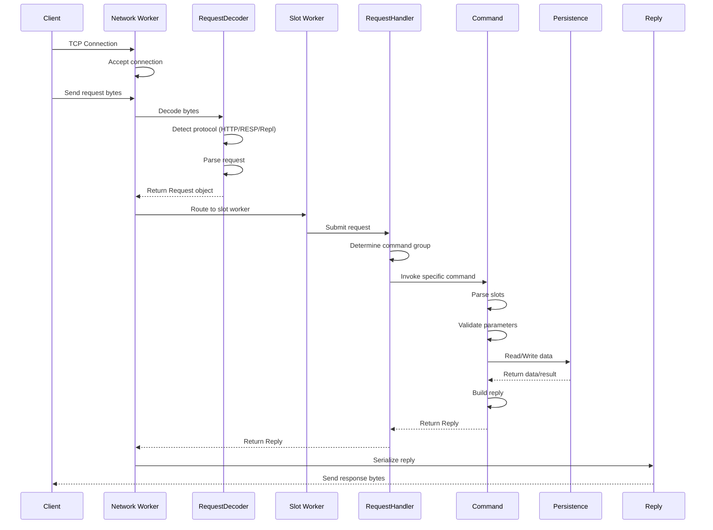
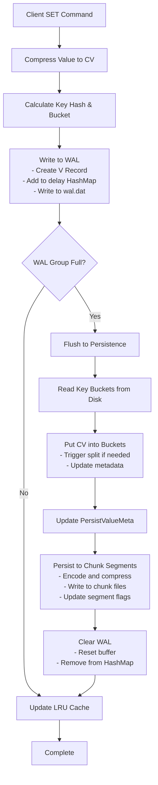
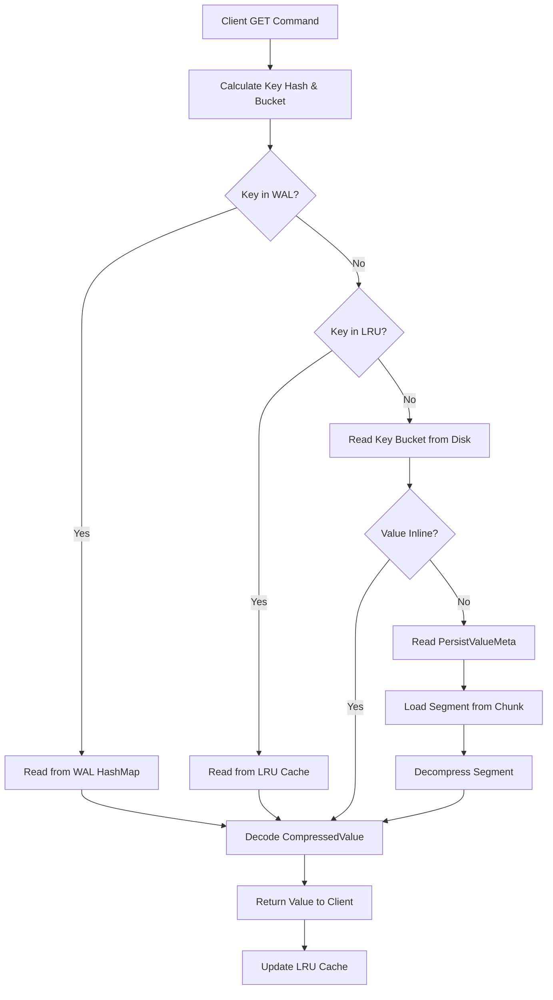
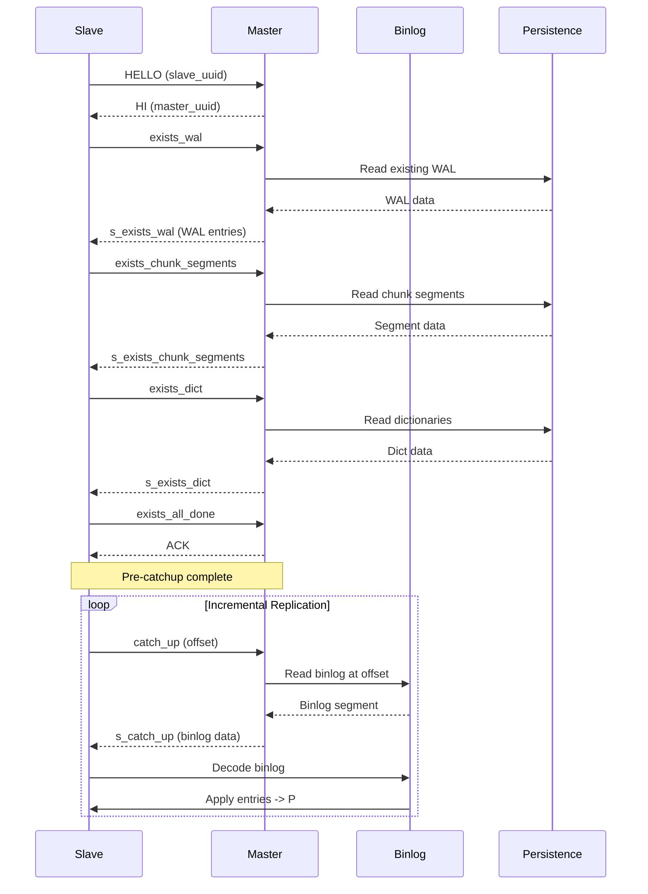
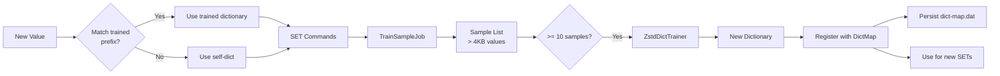
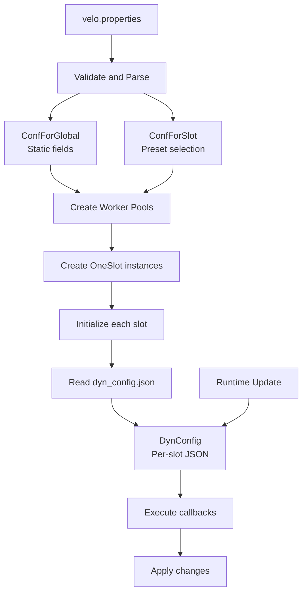

# Velo Overall Architecture Design

## Table of Contents
- [System Overview](#system-overview)
- [Design Philosophy](#design-philosophy)
- [High-Level Architecture](#high-level-architecture)
- [Component Relationships](#component-relationships)
- [Data Flow](#data-flow)
- [Key Design Decisions](#key-design-decisions)
- [Technology Stack](#technology-stack)
- [Performance Characteristics](#performance-characteristics)
- [Module Interaction Matrix](#module-interaction-matrix)
- [Related Documentation](#related-documentation)

---

## System Overview

Velo is a high-performance, Redis protocol compatible key-value storage system written in Java with Groovy components. It features:

- **Low-latency**: Multi-threaded architecture with thread-local data structures
- **Hash-based indexing**: Custom three-layer persistence (WAL → Key Buckets → Chunk Segments)
- **Slot-based sharding**: Scalable horizontal scaling with configurable slot count
- **Compression**: Zstd compression with trainable dictionaries
- **High availability**: Master-slave replication with automatic failover
- **Multi-protocol**: Supports Redis RESP (v2/v3), HTTP, and custom replication protocol
- **Dynamic extensibility**: Hot-reloadable Groovy commands
- **Observability**: Native Prometheus metrics integration

**Primary Use Cases:**
- High-throughput caching layer with Redis compatibility
- Session storage for distributed applications
- Real-time analytics data store
- Multi-tenant key-value service with ACL support

---

## Design Philosophy

### Core Principles

1. **Performance First**
   - Zero-copy operations where possible (BigStringNoMemoryCopy)
   - Thread-local data to minimize synchronization overhead
   - Batch operations for I/O efficiency
   - Inline storage for small values

2. **Scalability**
   - Slot-based partitioning for horizontal scaling
   - Configurable worker thread pools (Network, Slot, Index)
   - Bucket splitting to handle hot keys
   - Segment rotation for predictable storage growth

3. **Durability**
   - Three-layer persistence (WAL + persistent key buckets + chunk storage)
   - Write-ahead logging before persistence
   - CRC32 checksums for data integrity
   - RDB format compatibility for backup/migration

4. **Compatibility**
   - Full Redis protocol compatibility (RESP2/RESP3)
   - Redis cluster slot distribution compatibility
   - Compatible with Redis clients (Jedis, redis-cli, etc.)
   - ACL syntax matching Redis 7+

5. **Extensibility**
   - Dynamic Groovy command loading without restart
   - Pluggable compression strategies
   - Configurable storage parameters per slot
   - Extension framework for custom commands

6. **Observability**
   - Built-in Prometheus metrics at multiple levels
   - Request latency tracking
   - Compression ratio monitoring
   - Key size statistics and big key tracking

---

## High-Level Architecture

```
┌─────────────────────────────────────────────────────────────────────┐
│                         Client Layer                                 │
│  ┌──────────┐  ┌──────────┐  ┌──────────┐  ┌──────────┐             │
│  │ redis-cli│  │  Jedis   │  │ HTTP API │  │ Replication Client │     │
│  └──────────┘  └──────────┘  └──────────┘  └──────────┘             │
└─────────────────────────────────────────────────────────────────────┘
                                    │
                                    ▼
┌─────────────────────────────────────────────────────────────────────┐
│                      Network Layer (Net Workers)                     │
│  ┌─────────┐  ┌─────────┐  ┌─────────┐  ┌─────────┐                 │
│  │ Net Wrk │  │ Net Wrk │  │ Net Wrk │  │ Net Wrk │ (1-32 threads)  │
│  └─────────┘  └─────────┘  └─────────┘  └─────────┘                 │
│         │            │            │            │                     │
│         └────────────┴────────────┴────────────┘                     │
│                      Request Decoder (HTTP/RESP/Repl)                 │
└─────────────────────────────────────────────────────────────────────┘
                                    │
                    ┌───────────────┴───────────────┐
                    │                               │
                    ▼                               ▼
┌─────────────────────────────┐      ┌──────────────────────────────┐
│   Slot Worker Pool           │      │   Index Worker Pool           │
│  ┌───┐  ┌───┐  ┌───┐  ┌───┐ │      │  ┌───┐  ┌───┐  ┌───┐       │
│  │ S0│  │ S1│  │ S2│  │ S3│ │      │  │ I0│  │ I1│  │ I2│       │
│  └───┘  └───┘  └───┘  └───┘ │      │  └───┘  └───┘  └───┘       │
│  RequestHandler (per thread) │      │  Background maintenance      │
│  Command Groups (A-Z)        │      │  LRU eviction, merge         │
└─────────────────────────────┘      └──────────────────────────────┘
                    │
                    ▼
┌─────────────────────────────────────────────────────────────────────┐
│                      Persistence Layer                              │
└─────────────────────────────────────────────────────────────────────┘
│  Slot 0              Slot 1              Slot N                     │
│  ┌─────────────┐    ┌─────────────┐    ┌─────────────┐               │
│  │ WAL         │    │ WAL         │    │ WAL         │               │
│  │Key Buckets  │    │Key Buckets  │    │Key Buckets  │               │
│  │Chunk Segmts │    │Chunk Segmts │    │Chunk Segmts │               │
│  │Big Strings  │    │Big Strings  │    │Big Strings  │               │
│  │Binlog       │    │Binlog       │    │Binlog       │               │
│  └─────────────┘    └─────────────┘    └─────────────┘               │
└─────────────────────────────────────────────────────────────────────┘
                    │
                    ▼
┌─────────────────────────────────────────────────────────────────────┐
│                      Storage Layer (Disk)                            │
│  ┌──────────────────┐  ┌──────────────────┐  ┌──────────────────┐    │
│  │ Volume Mount 0   │  │ Volume Mount 1   │  │ Volume Mount N   │    │
│  │ slot-*/         │  │ slot-*/         │  │ slot-*/         │    │
│  │  - wal.dat      │  │  - wal.dat      │  │  - wal.dat      │    │
│  │  - chunk-data-* │  │  - chunk-data-* │  │  - chunk-data-* │    │
│  │  - key-bucket-* │  │  - key-bucket-* │  │  - key-bucket-* │    │
│  │  - big-string/  │  │  - big-string/  │  │  - big-string/  │    │
│  │  - binlog-*     │  │  - binlog-*     │  │  - binlog-*     │    │
│  └──────────────────┘  └──────────────────┘  └──────────────────┘    │
└─────────────────────────────────────────────────────────────────────┘
                    │
                    ▼
┌─────────────────────────────────────────────────────────────────────┐
│                      Support Systems                                │
│  ┌──────────────┐  ┌──────────────┐  ┌──────────────┐               │
│  │ Config Mgmt  │  │ Dict Training│  │ Metrics      │               │
│  │ ConfForGlobal│  │ DictMap      │  │ Prometheus   │               │
│  │ ConfForSlot  │  │ TrainSampleJob│  │ Gauges       │               │
│  └──────────────┘  └──────────────┘  └──────────────┘               │
│  ┌──────────────┐  ┌──────────────┐  ┌──────────────┐               │
│  │ ACL System   │  │ Replication  │  │ Cluster      │               │
│  │ AclUsers     │  │ ReplPair     │  │ MultiShard   │               │
│  │ User Model   │  │ Binlog       │  │ LeaderSel    │               │
│  └──────────────┘  └──────────────┘  └──────────────┘               │
└─────────────────────────────────────────────────────────────────────┘
```

### Layer Descriptions

**1. Client Layer**
- Supports Redis clients via RESP protocol
- HTTP API for RESTful access
- Replication client for master-slave sync

**2. Network Layer**
- 1-32 Network Worker threads (I/O bound)
- Handles TCP connections and request parsing
- Protocol detection: HTTP, RESP, and custom replication protocol
- Response serialization and sending

**3. Slot Worker Layer**
- 1-32 Slot Worker threads (CPU bound)
- Each worker handles a subset of slots
- RequestHandler per worker with command groups A-Z
- Inline command parsing and execution

**4. Index Worker Layer**
- 1-16 Index Worker threads
- Background tasks: LRU eviction, segment merge, statistics
- Asynchronous operations that don't block request processing

**5. Persistence Layer**
- Slot-based storage isolation
- Three-tier persistence per slot
- Per-slot binlog for replication

**6. Storage Layer**
- Direct I/O to disk files
- Multi-volume support for scaling
- Configurable volume distribution per slot

**7. Support Systems**
- Configuration management and validation
- Compression dictionary training
- Access control and authentication
- Replication coordination and failover
- Cluster management (via Groovy)

---

## Component Relationships

### Request Processing Chain



### Write Path (Three-Layer Persistence)



### Read Path



### Replication Flow



### Interaction with Support Systems

#### Compression Dictionary Training



#### Configuration Flow



---

## Data Flow

### Client Request Flow

```
┌─────────────┐     TCP/HTTP      ┌──────────────────┐
│   Client    │ ─────────────────> │  Network Worker  │
└─────────────┘                   └────────┬─────────┘
                                           │
                                           ▼
                                   ┌───────────────┐
                                   │RequestDecoder │
                                   └───────┬───────┘
                                           │
                   ┌───────────────────────┼───────────────────────┐
                   ▼                       ▼                       ▼
            ┌──────────┐            ┌──────────┐            ┌──────────┐
            │   HTTP   │            │   RESP   │            │   Repl   │
            └─────┬────┘            └─────┬────┘            └─────┬────┘
                  │                       │                       │
                  └───────────────────────┴───────────────────────┘
                                          │
                                          ▼
                                  ┌───────────────┐
                                  │ Request object│
                                  │ - data[]      │
                                  │ - isHttp      │
                                  │ - isRepl      │
                                  └───────┬───────┘
                                          │
                                          ▼
                            ┌─────────────────────────┐
                            │ Calculate slot(s)       │
                            │ Parse slots from Request│
                            └───────────┬─────────────┘
                                        │
                                        ▼
                            ┌─────────────────────────┐
                            │ Route to Slot Worker     │
                            │ slot % slotWorkers      │
                            └───────────┬─────────────┘
                                        │
                                        ▼
                          ┌──────────────────────────────┐
                          │  RequestHandler.handle()     │
                          │  - Select command group      │
                          │  - Invoke command.handler() │
                          └─────────────┬────────────────┘
                                        │
                                        ▼
                          ┌──────────────────────────────┐
                          │  Command Group (A-Z)        │
                          │  - Parse parameters         │
                          │  - Execute logic            │
                          └─────────────┬────────────────┘
                                        │
                                        ▼
                    ┌───────────────────────────────────────┐
                    │  Persistence Operations                │
                    │  - WAL write                          │
                    │  - Key bucket read/write              │
                    │  - Chunk segment read/write           │
                    │  - Compression/decompression         │
                    └───────────────┬───────────────────────┘
                                    │
                                    ▼
                        ┌─────────────────────┐
                        │ Build Reply object  │
                        │ OK / Bulk / Error   │
                        └──────────┬──────────┘
                                   │
                                   ▼
                    ┌────────────────────────┐
                    │ Serialize to protocol  │
                    │ RESP2 / RESP3 / HTTP   │
                    └───────────┬────────────┘
                                │
                                ▼
                        ┌───────────────┐
                        │Send to Client │
                        └───────────────┘
```

### Write Flow Detail (Memory to Disk)

```
Memory (Slot Worker Thread)
│
├─ 1. Compress value
│   └─ ZstdCompressCtx[workerId].compress(value, dict)
│       └─ Returns CompressedValue with cvEncoded
│
├─ 2. Calculate metadata
│   ├─ keyHash = KeyHash.hash(keyBytes)
│   ├─ bucketIndex = keyHash & (bucketsPerSlot - 1)
│   ├─ seq = snowFlake.nextId()
│   └─ expireAt = now + ttl (if any)
│
├─ 3. Create V Record
│   ├─ V(seq, bucketIndex, keyHash, expireAt, spType, cvEncoded)
│   └─ size = ~24 + keyLen + cvLen
│
├─ 4. Write to WAL (in-memory)
│   ├─ delayToKeyBucketValues[key] = V
│   ├─ walGroupIndex = bucketIndex / oneChargeBucketNumber
│   └─ walGroupBytes[walGroupIndex] += V size
│
├─ 5. Check WAL group capacity
│   ├─ if walGroupBytes[walGroupIndex] >= valueSizeTrigger
│   └─ needPersist = true
│
└─ 6. Trigger persist (async or sync)
    └─ See Persistence Layer design.md
        └─ Persist to Key Buckets -> Chunk Segments -> Clear WAL
```

### Read Flow Detail (Disk to Memory)

```
Memory (Slot Worker Thread)
│
├─ 1. Calculate slot and hash
│   ├─ keyHash = KeyHash.hash(keyBytes)
│   ├─ bucketIndex = keyHash & (bucketsPerSlot - 1)
│   └─ walGroupIndex = bucketIndex / oneChargeBucketNumber
│
├─ 2. Check WAL (fastest)
│   ├─ v = delayToKeyBucketShortValues.get(key)
│   └─ if v != null: return decode(v.cvEncoded)
│
├─ 3. Check LRU cache (fast)
│   ├─ lruMap = kvByWalGroupIndexLRU.get(walGroupIndex)
│   ├─ cv = lruMap.get(key)
│   └─ if cv != null: return decode(cv)
│
├─ 4. Load Key Bucket from disk
│   ├─ file = key-bucket-split-[splitIndex].dat
│   ├─ offset = bucketIndex * 4096
│   ├─ page = FdReadWrite.readPage(file, offset)
│   └─ Iterate cells to find matching keyHash
│
├─ 5. Check value type
│   ├─ if valueLength <= 64 bytes:
│   │   └─ (Inline CompressedValue in bucket)
│   │       └─ return decode(cvEncoded)
│   │
│   └─ else:
│       └─ (PersistValueMeta - 12 bytes)
│           └─ segmentIndex, offset, subBlockIndex
│
└─ 6. Load from Chunk Segments
    ├─ fdIndex = segmentIndex / segmentNumberPerFd
    ├─ segmentOffset = (segmentIndex % segmentNumberPerFd) * segmentLength
    ├─ segment = FdReadWrite.read(fdIndex, segmentOffset, segmentLength)
    ├─ if NORMAL segment: read from offset
    ├─ if TIGHT segment: parse sub-block header, read from subBlockIndex
    └─ decompress -> return CompressedValue
```

---

## Key Design Decisions

### 1. Three-Layer Persistence (WAL → Key Buckets → Chunk Segments)

**Rationale:**
- **WAL (L1)**: Fast writes without immediate disk sync, newest data always available
- **Key Buckets (L2)**: Hash-based O(1) lookup, separates indexing from value storage
- **Chunk Segments (L3)**: Dense, compressed storage optimal for space efficiency

**Trade-offs:**
- Higher memory usage (three copies of recent data)
- Complexity in managing consistency across layers
- **Benefit**: Sub-millisecond read/write latency even under heavy load

**See Also:** [Persistence Layer Design](./02_persist_layer_design.md)

### 2. Slot-Based Sharding with Thread-Local Data

**Rationale:**
- Horizontal scaling across multiple CPU cores
- Each slot worker owns exclusive access to assigned slots
- No lock contention for slot-local operations
- Predictable performance per slot

**Trade-offs:**
- Cross-slot operations require coordination overhead
- Fixed slot count requires planning for capacity
- **Benefit**: Linear scaling with slot workers, zero locks for single-slot ops

**See Also:** [Multithreading Design](./11_multithreading_design.md)

### 3. Zstd Compression with Trainable Dictionaries

**Rationale:**
- Better compression ratios than generic algorithms
- Sequential nature of key-value data benefits from dictionary context
- Trainable dictionaries adapt to application-specific patterns
- Multi-level compression (self, global, per-prefix)

**Trade-offs:**
- Compression CPU overhead
- Dictionary training adds complexity
- **Benefit**: 2-10x storage reduction, ~20-30% faster reads (less I/O)

**See Also:** [Compression Design](./07_compression_design.md)

### 4. Pull-Based Replication with Binlog

**Rationale:**
- Slaves control replay speed, avoiding master overload
- Binlog enables point-in-time recovery
- Segmented binlog allows efficient random access
- Configurable retention for different recovery windows

**Trade-offs:**
- Slaves may lag behind master
- Requires storage for binlog files
- **Benefit**: Fault isolation, bandwidth control, efficient catch-up

**See Also:** [Replication Design](./09_replication_design.md)

### 5. Command Groups Organized Alphabetically

**Rationale:**
- Clear organization with predictable navigation
- Easy to add new commands
- Follows Redis command documentation structure
- Base class provides common functionality

**Trade-offs:**
- 21+ group files to maintain
- Some groups may be very large/small
- **Benefit**: Maintainable, testable, easy to understand

**See Also:** [Command Processing Design](./04_command_processing_design.md)

### 6. Dual-Mode Hash Storage

**Rationale:**
- **Inline mode**: Good for small hashes (< ~100 fields), single key access
- **Split mode**: Good for large hashes, partial field access
- Application can choose based on access pattern
- Dictionary compression works for both modes

**Trade-offs:**
- Two code paths to maintain
- No automatic mode switching
- **Benefit**: Optimal performance for both hot and cold hash accesses

**See Also:** [Type System Design](./03_type_system_design.md)

### 7. Dynamic Groovy Command Loading

**Rationale:**
- No server restart for command updates
- Rapid prototyping and debugging
- Client-side script management can manage commands
- Groovy's @CompileStatic ensures reasonable performance

**Trade-offs:**
- Groovy runtime dependency
- Slightly slower than Java for hot paths
- **Benefit**: Agility, rapid iteration, production debugging

**See Also:** [Dynamic Groovy Design](./15_dynamic_groovy_design.md)

---

## Technology Stack

### Core Technologies

| Component | Technology | Version | Purpose |
|-----------|-----------|---------|---------|
| **Runtime** | Java JDK | 21+ | Language runtime with ZGC |
| **Build** | Gradle | 8.14+ | Build tool and dependency management |
| **Async Framework** | ActiveJ | 6.0-beta2 | Event loops, CSP, networking |
| **Dynamic Language** | Groovy | 4.0.12 | Hot-reloadable commands |
| **Compression** | Zstd-JNI | 1.5.5-10 | Value compression |
| **Testing** | Spock | 2.3 | Specification-based testing |
| **Metrics** | Prometheus | 0.16.0 | Observability export |
| **Replication Coordin** | ZooKeeper/Curator | 5.7.0 | Leader election |
| **Redis Client** | Jedis | 4.4.7 | Testing and compatibility |
| **RDB Parser** | Redis-Replicator | 3.10.0 | RDB format parsing |
| **File Format** | Apache Parquet | 1.15.0 | Data ingestion support |
| **System Metrics** | OSHI | 6.8.2 | CPU/Memory monitoring |
| **HTTP Server** | Jetty | 9.4.49 | Metrics endpoint |
| **Bloom Filter** | Guava | 32.1.3 | BF data structure |
| **HyperLogLog** | HyperLogLog | 1.1 | HLL data structure |
| **Geo** | Custom | - | Geospatial calculations |

### Key Libraries

**Storage and I/O:**
- `io.activej.*` - Async event loops, byte buffers, data streaming
- `com.github.luben:zstd-jni` - Zstd compression with native library
- `org.rocksdb` - Key analysis (not main storage)

**Data Structures:**
- `it.unimi.dsi:fastutil` - High-performance collections
- `com.github.prasanthj:hyperloglog` - HyperLogLog algorithm
- `com.google.guava` - BloomFilter, utility classes

**Network:**
- `io.netty:netty-buffer` - Buffer management
- `commons-io`, `commons-net` - I/O utilities

**Serialization:**
- `com.fasterxml.jackson:*` - JSON processing for config and ACL

**Observability:**
- `io.prometheus:simpleclient*` - Metrics collection and HTTP export
- `org.apache.logging.log4j:*` - Structured logging

**Testing:**
- `org.spockframework:spock-core` - BDD-style testing framework
- `org.openjdk.jol:jol-core` - Java object layout analysis

---

## Performance Characteristics

### Latency (P99)

| Operation | Typical | With Replication | Notes |
|-----------|---------|------------------|-------|
| GET (inline value) | < 1ms | < 2ms | Value in WAL or key bucket |
| GET (chunk value) | 1-5ms | 2-8ms | Requires chunk segment read + decompress |
| SET (small value) | < 1ms | < 2ms | Writes to WAL, async persist |
| SET (large value) | 1-10ms | 2-15ms | Compression time increases with size |
| MGET (10 keys) | 2-10ms | 3-15ms | Slot-parallel processing |
| Multi-slot op | 10-50ms | 20-100ms | Cross-worker coordination |

### Throughput (QPS)

| Configuration | Read QPS | Write QPS | Mixed R/W |
|---------------|----------|-----------|-----------|
| 1 slot, 1 worker | 50K | 20K | 30K |
| 8 slots, 4 workers | 400K | 150K | 250K |
| 16 slots, 8 workers | 800K | 300K | 500K |
| 32 slots, 16 workers | 1.5M | 500K | 900K |

**Test Environment:**
- Keys: 64 bytes average, Values: 256 bytes average
- RAM: 64GB, CPU: 16 cores (Intel Xeon)
- Disk: NVMe SSD
- Compression ratio: ~0.25 (4x reduction)

### Storage Efficiency

| Data Type | Original | Compressed | Savings |
|-----------|----------|------------|---------|
| JSON payloads | 1KB | 150-300B | 70-85% |
| User sessions | 500B | 80-120B | 75-85% |
| Binary data | 2KB | 400-600B | 70-80% |
| Small strings | 64B | 40-60B | 35-45% |
| Numeric values | 8B | 8B (no compress) | 0% |

### Compression Performance

| Dictionary Type | Ratio | Encode Speed | Decode Speed | Notes |
|----------------|-------|--------------|--------------|-------|
| None (raw) | 1.0 | 0 µs | 0 µs | Fallback |
| Self (no dict) | 0.3-0.5 | 50-100 µs | 20-40 µs | Generic compression |
| Trained | 0.15-0.25 | 30-60 µs | 10-25 µs | Best for homogeneous data |
| Global | 0.25-0.35 | 40-80 µs | 15-30 µs | Balance for mixed data |

### Memory Usage

| Component | Per Slot | 8 Slots | 16 Slots | Notes |
|-----------|----------|---------|----------|-------|
| Key buckets (1 split) | 64MB | 512MB | 1GB | Fixed, grows with splits |
| Chunk metadata | ~56MB | ~448MB | ~896MB | Fixed per slot |
| WAL buffer | ~16MB | ~128MB | ~256MB | Configurable |
| LRU cache | 500MB | 4GB | 8GB | Configurable |
| Dict contexts | ~20MB | ~20MB | ~20MB | Shared |
| Worker overhead | ~50MB | ~400MB | ~800MB | Thread stacks, objects |
| **Total** | **~700MB** | **~5.6GB** | **~11GB** | Default config |

---

## Module Interaction Matrix

| Module | Type | Uses | Used By | Notes |
|--------|------|------|---------|-------|
| compress | System | type, persist | command | CompressedValue abstraction |
| decode | Proto | - | network | Protocol parsing |
| reply | Proto | - | network | Response serialization |
| command | Logic | type, persist, acl, dyn | requestHandler | Redis commands |
| persist | Storage | compress | command, repl | Core storage engine |
| type | Data | compress | command | Redis types |
| acl | Security | - | command | Access control |
| repl | Replication | persist, config | network | Master-slave sync |
| rdb | Format | type | command | RDB dump/restore |
| metric | Monitor | persist, monitor | network | Metrics collection |
| monitor | Monitor | type | metrics | Big key tracking |
| task | System | persist | workers | Scheduling framework |
| dyn | Extensibility | command | requestHandler | Groovy hot-reload |
| ingest | Import | type, persist | - | Parquet loading |
| extend | Framework | - | - | Extension points |
| mock | Test | persist | tests | In-memory mocks |

### Dependency Graph

```
           ┌──────────┐
           │  Config  │
           └────┬─────┘
                │
    ┌───────────┼───────────┬────────────┐
    ▼           ▼           ▼            ▼
┌─────────┐ ┌─────────┐ ┌─────────┐  ┌─────────┐
│Persist  │ │  Type   │ │  Acl    │  │  Config │
└────┬────┘ └────┬────┘ └─────────┘  └─────────┘
     │           │
     └─────┬─────┘
           ▼
    ┌─────────┐
    │Compress │
    └────┬────┘
         │
    ┌────┴─────┐
    ▼          ▼
┌─────────┐ ┌─────────┐
│Command  │ │  Repl   │
└────┬────┘ └────┬────┘
     │           │
     └─────┬─────┘
           ▼
    ┌──────────┐
    │Request   │
    │Handler─► │────────► ┌─────────┐
    └──────────┘           │  Decode │
                           └─────────┘
                           ┌─────────┐
                           │  Reply  │
                           └─────────┘
```

---

## Related Documentation

### Design Documents
- [Persistence Layer Design](./02_persist_layer_design.md) - Detailed WAL/Key Buckets/Chunk architecture
- [Type System Design](./03_type_system_design.md) - Redis data types implementation
- [Command Processing Design](./04_command_processing_design.md) - Command parsing and execution
- [Protocol Decoding Design](./05_protocol_decoding_design.md) - HTTP/RESP/Replication parsing
- [Response Encoding Design](./06_response_encoding_design.md) - RESP2/RESP3/HTTP replies
- [Compression Design](./07_compression_design.md) - Zstd and dictionary training
- [Configuration Design](./08_configuration_design.md) - Global, slot, dynamic config
- [Replication Design](./09_replication_design.md) - Master-slave replication
- [ACL Security Design](./10_acl_security_design.md) - Access control system
- [Multithreading Design](./11_multithreading_design.md) - Threading and worker architecture
- [Server Bootstrap Design](./12_server_bootstrap_design.md) - Startup sequence
- [Metrics Monitoring Design](./13_metrics_monitoring_design.md) - Prometheus integration
- [RDB Format Design](./14_rdb_format_design.md) - RDB handling
- [Dynamic Groovy Design](./15_dynamic_groovy_design.md) - Hot-reload commands
- [Cluster Management Design](./16_cluster_management_design.md) - Cluster operations

### Existing Documentation
- [AGENTS.md](/home/kerry/ws/velo/AGENTS.md) - Development guidelines for agents
- [doc/hash_buckets/README.md](/home/kerry/ws/velo/doc/hash_buckets/README.md) - Hash bucket storage overview
- [doc/compress/README.md](/home/kerry/ws/velo/doc/compress/README.md) - Compression basics
- [doc/multi_threads/README.md](/home/kerry/ws/velo/doc/multi_threads/README.md) - Threading model
- [doc/types/README.md](/home/kerry/ws/velo/doc/types/README.md) - Type storage modes
- [doc/repl/README.md](/home/kerry/ws/velo/doc/repl/README.md) - Replication overview
- [doc/config/README.md](/home/kerry/ws/velo/doc/config/README.md) - Configuration notes
- [doc/metrics/README.md](/home/kerry/ws/velo/doc/metrics/README.md) - Metrics integration
- [doc/redis_command_support.md](/home/kerry/ws/velo/doc/redis_command_support.md) - Command support matrix

### Key Source Files

**Core Infrastructure:**
- `src/main/java/io/velo/MultiWorkerServer.java` - Main server entry point
- `src/main/java/io/velo/RequestHandler.java` - Request routing
- `src/main/java/io/velo/BaseCommand.java` - Command base class
- `src/main/java/io/velo/CompressedValue.java` - Value abstraction
- `src/main/java/io/velo/KeyHash.java` - Hash algorithms
- `src/main/java/io/velo/Dict.java` - Compression dictionary
- `src/main/java/io/velo/ConfForGlobal.java` - Global configuration
- `src/main/java/io/velo/ConfForSlot.java` - Slot configuration

**Persistence:**
- `src/main/java/io/velo/persist/LocalPersist.java` - Singleton slot manager
- `src/main/java/io/velo/persist/OneSlot.java` - Slot instance
- `src/main/java/io/velo/persist/Wal.java` - Write-ahead log
- `src/main/java/io/velo/persist/KeyBucket.java` - Key bucket structure
- `src/main/java/io/velo/persist/Chunk.java` - Chunk segment manager

**Network:**
- `src/main/java/io/velo/decode/RequestDecoder.java` - Multi-protocol decoder
- `src/main/java/io/velo/decode/RESP.java` - RESP protocol parser
- `src/main/java/io/velo/decode/HttpHeaderBody.java` - HTTP parser
- `src/main/java/io/velo/reply/*.java` - Response types

**Commands:**
- `src/main/java/io/velo/command/AGroup.java` through `ZGroup.java` - 21 command groups

**Replication:**
- `src/main/java/io/velo/repl/ReplPair.java` - Master-slave pair
- `src/main/java/io/velo/repl/Binlog.java` - Binlog manager
- `src/main/java/io/velo/repl/LeaderSelector.java` - Failover coordination

**Type System:**
- `src/main/java/io/velo/type/RedisHashKeys.java` -/Set abstraction
- `src/main/java/io/velo/type/RedisHH.java` - Hash abstraction
- `src/main/java/io/velo/type/RedisList.java` - List abstraction
- `src/main/java/io/velo/type/RedisZSet.java` - Sorted set abstraction
- `src/main/java/io/velo/type/RedisBF.java` - Bloom filter
- `src/main/java/io/velo/type/RedisGeo.java` - Geospatial

---

**Document Version:** 1.0
**Last Updated:** 2025-02-05
**Author:** Velo Architecture Team
