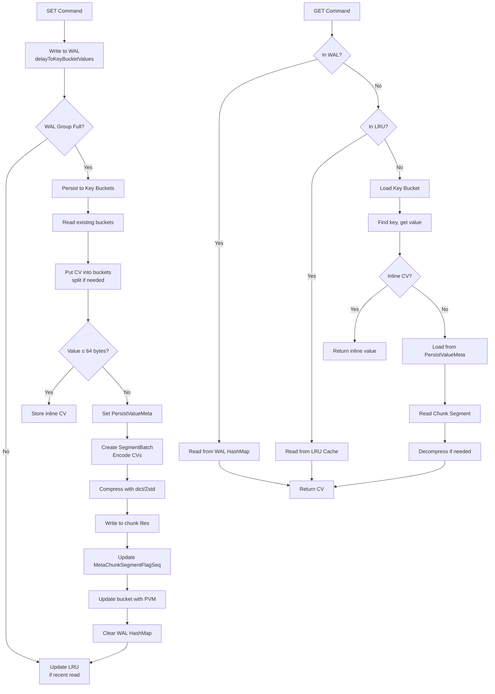
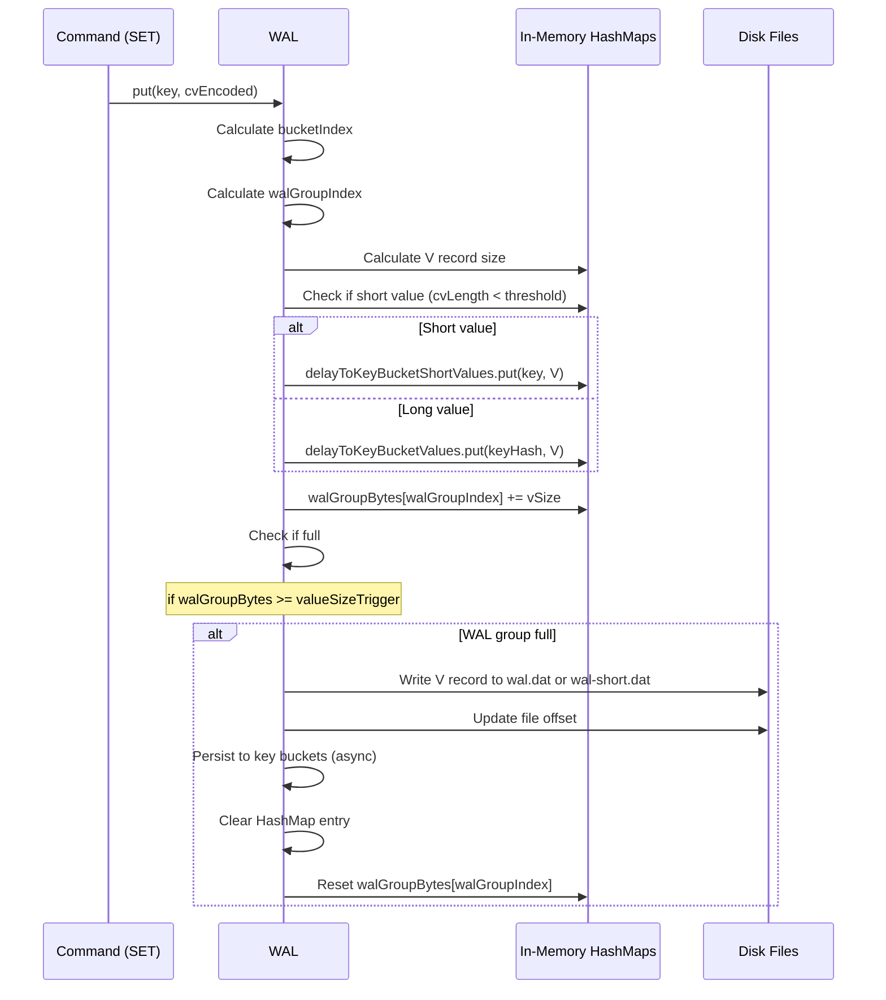
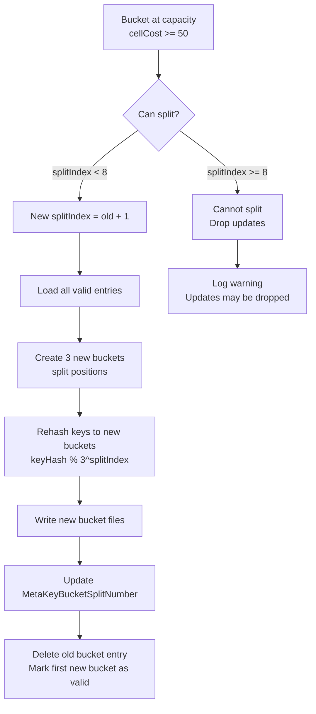
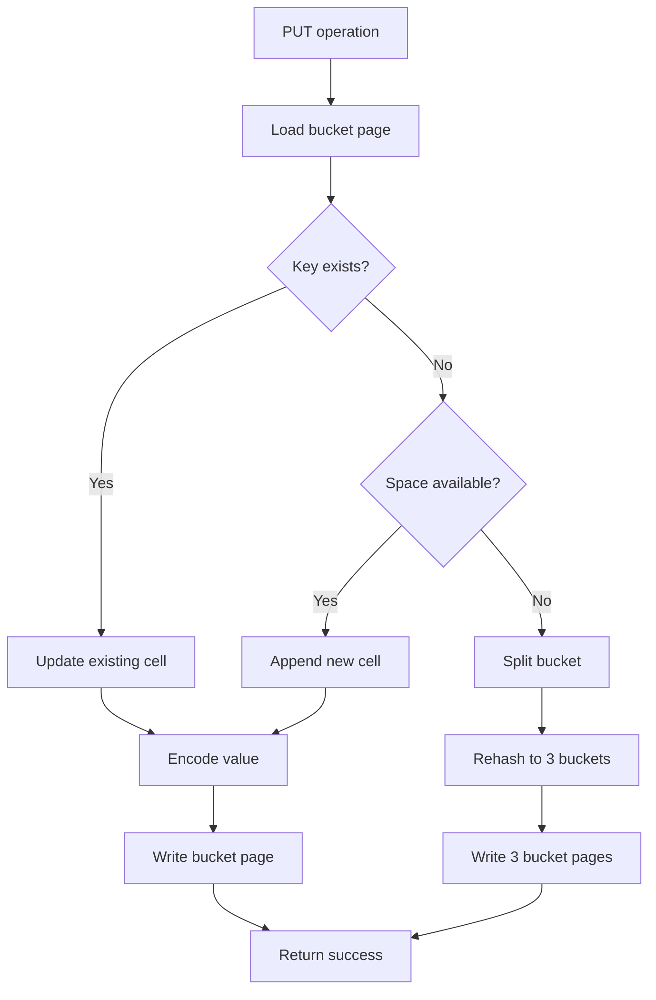
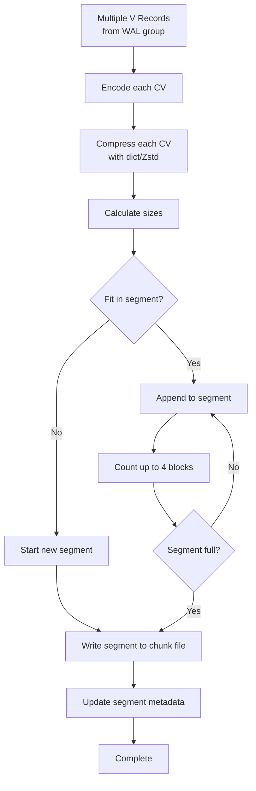
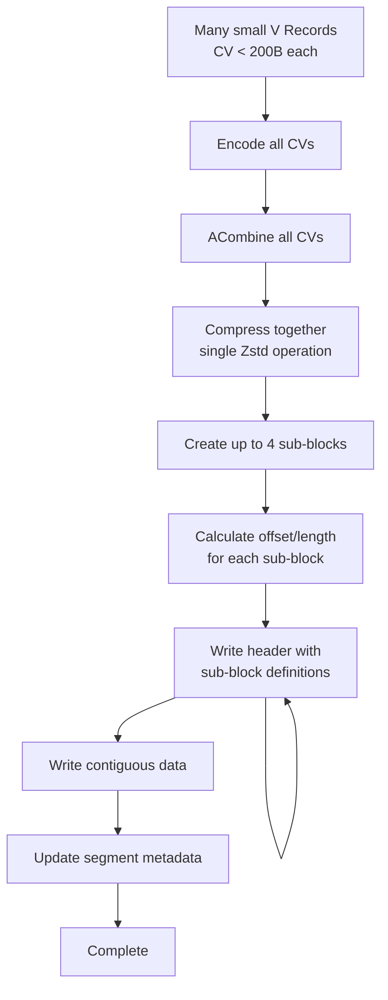
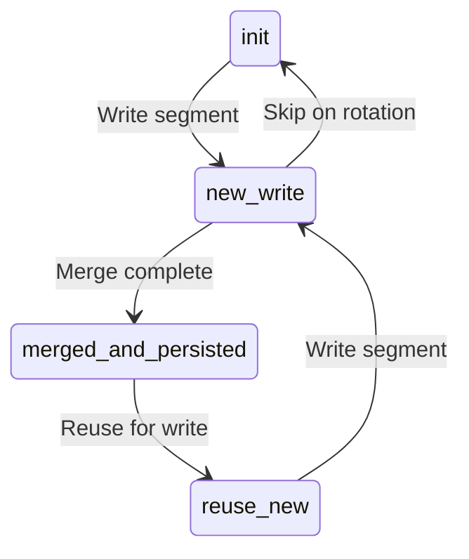
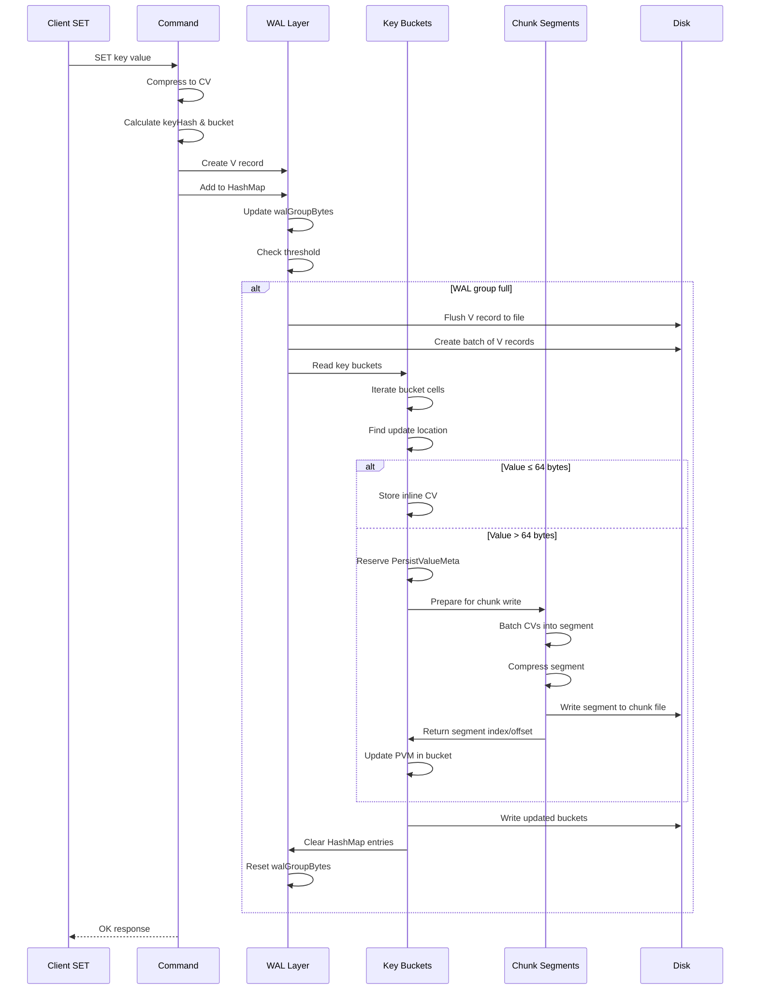
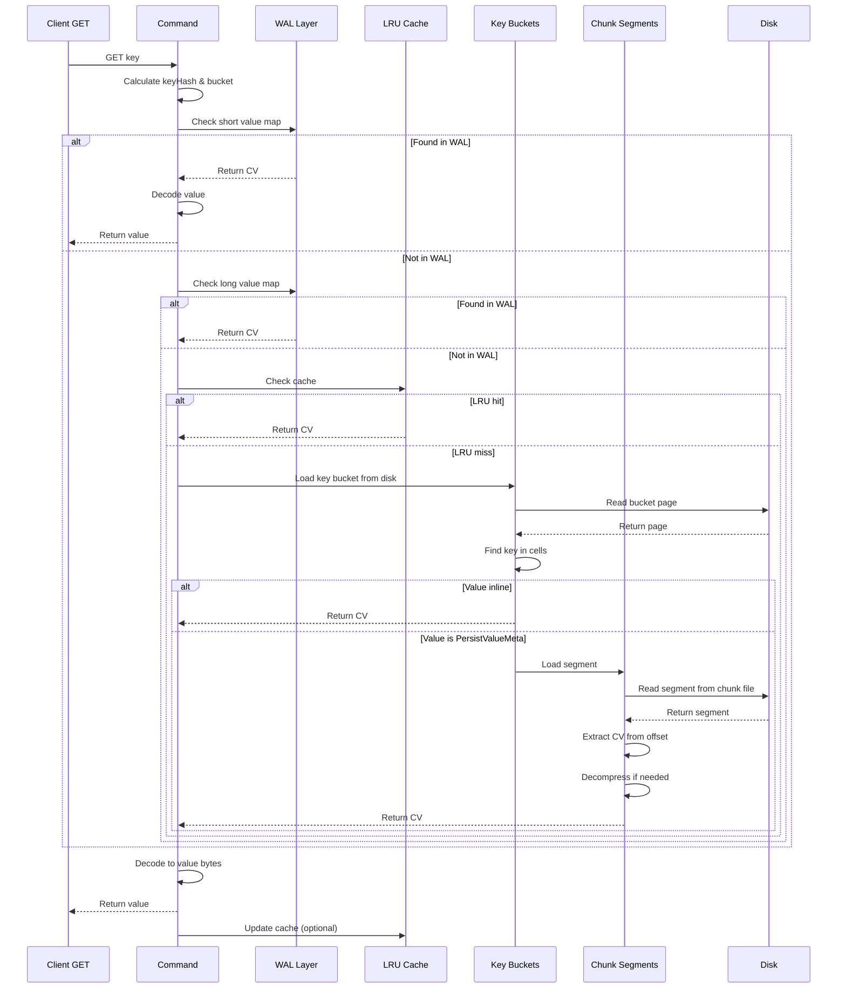
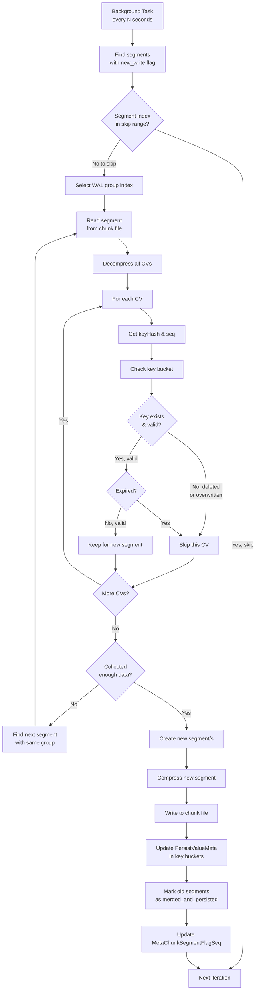

# Velo Persistence Layer Design

## Table of Contents
- [Overview](#overview)
- [Three-Layer Architecture](#three-layer-architecture)
- [Layer 1: Write-Ahead Log (WAL)](#layer-1-write-ahead-log-wal)
- [Layer 2: Key Buckets](#layer-2-key-buckets)
- [Layer 3: Chunk Segments](#layer-3-chunk-segments)
- [Data Persistence Flow](#data-persistence-flow)
- [Segment Merge Process](#segment-merge-process)
- [File Structure On Disk](#file-structure-on-disk)
- [Performance Optimizations](#performance-optimizations)
- [Memory Management](#memory-management)
- [Thread Safety](#thread-safety)
- [Related Documentation](#related-documentation)

---

## Overview

The Velo persistence layer implements a **three-tier storage architecture** designed for low-latency reads and writes while maintaining space efficiency through compression:

```
┌─────────────────────────────────────────────────────────────┐
│                    Application Layer                         │
│                  (Commands: GET, SET, etc.)                  │
└─────────────────────────────┬───────────────────────────────┘
                              │
                    ┌─────────┴─────────┐
                    │                   │
                    ▼                   ▼
        ┌───────────────────┐   ┌───────────────────┐
        │   READ PATH       │   │   WRITE PATH      │
        └─────────┬─────────┘   └─────────┬─────────┘
                  │                       │
      ┌───────────┼───────────┐   ┌───────┴───────┐
      ▼           ▼           ▼   ▼               ▼
  ┌────────┐  ┌────────┐  ┌────────┐      ┌──────────────┐
  │  WAL   │  │  LRU   │  │Key     │      │  WAL         │
  │(Fastest)│  │ (Fast) │  │Bucket │      │  Write       │
  └────────┘  └────────┘  └────┬───┘      │              │
                            │       │     └──────┬───────┘
                            │       │            │
                            │       ▼            ▼
                            │  ┌─────────────────────────────┐
                            │  │  Trigger WAL Group Full     │
                            │  └─────────────────────────────┘
                            │            │
                            │            ▼
                            │  ┌─────────────────────────────┐
                            │  │  Persist to Key Buckets      │
                            │  │  (Update inline values       │
                            │  │   or PersistValueMeta)     │
                            │  └─────────────────────────────┘
                            │            │
                            │            ▼
                            │  ┌─────────────────────────────┐
                            │  │  Flush to Chunk Segments     │
                            │  │  (Encode and compress)      │
                            │  └─────────────────────────────┘
                            │            │
                            ▼            ▼
        ┌───────────────────────────────────────┐
        │           Chunk Segments               │
        │  (Slowest but densest storage)        │
        └───────────────────────────────────────┘
```

### Key Characteristics

- **O(1) key lookup**: Hash-based indexing via key buckets
- **Write optimization**: WAL reduces immediate disk I/O
- **Read optimization**: Multi-tier caching (WAL → LRU → Buckets)
- **Space efficiency**: Zstd compression with trainable dictionaries
- **Predictable growth**: Fixed-size buckets and segments
- **Durability**: Double-write (WAL + persist) with CRC validation

### Module Structure

```
io.velo.persist/
├── LocalPersist.java           # Singleton: manages all slots
├── OneSlot.java                # Per-slot coordinator
├── Wal.java                    # Write-ahead log implementation
├── KeyBucket.java              # Key bucket data structure
├── KeyBucketsInOneWalGroup.java # Manages bucket group
├── KeyLoader.java              # Loads buckets from disk
├── Chunk.java                  # Segment storage manager
├── FdReadWrite.java            # Low-level file I/O
├── BigStringFiles.java         # Large value offloading
├── DynConfig.java              # Per-slot dynamic config
├── SegmentBatch.java           # Segment encoding (v1)
├── SegmentBatch2.java          # Segment encoding (v2)
├── LRUPrepareBytesStats.java   # LRU statistics
├── MetaChunkSegmentFlagSeq.java # Segment metadata
├── MetaChunkSegmentIndex.java  # Current segment index
├── MetaKeyBucketSplitNumber.java # Bucket split metadata
├── PersistValueMeta.java       # Value metadata pointer
└── index/                      # Background indexing
    ├── IndexHandler.java
    ├── IndexHandlerPool.java
    ├── KeyAnalysisHandler.java
    └── KeyAnalysisTask.java
```

---

## Three-Layer Architecture

### Layer Comparison

| Aspect | Layer 1: WAL | Layer 2: Key Buckets | Layer 3: Chunk Segments |
|--------|--------------|----------------------|-------------------------|
| **Purpose** | Fast write buffer | Hash index | Dense value storage |
| **Data Type** | In-memory HashMap | Fixed-size pages | Compressed blocks |
| **Access Time** | < 10µs | 10-100µs | 100-500µs |
| **Capacity** | ~64KB per group | 64MB per split file | Up to 128GB |
| **Persistence** | Volatile (crash tolerant) | Persistent | Persistent |
| **Update** | Immediate | Async (full WAL group) | Async (segment flush) |
| **Compression** | Yes (CV already compressed) | No (metadata only) | Yes (Zstd) |

### Data Lifecycle

```
SET key=value
    │
    ├─> [Instant] Write to WAL (delayToKeyBucketValues)
    │       Status: Unpersisted, newest data
    │
    ├─> [Delay 0-100ms] WAL group full → persist to buckets
    │       Status: Persisted, offset maybe in buckets
    │
    └─> [Delay 100-500ms] Persist to chunk segments
            Status: Dense storage, space optimized
```

### Layer Interactions



---

## Layer 1: Write-Ahead Log (WAL)

### Architecture Overview

```
┌─────────────────────────────────────────────────────────────┐
│                        OneSlot                               │
│                  (Per-slot singleton)                        │
└─────────────────────────────┬───────────────────────────────┘
                              │
                              ▼
┌─────────────────────────────────────────────────────────────┐
│                        WAL                                   │
└─────────────────────┬───────────────────────────────────────┘
                      │
        ┌─────────────┼─────────────┐
        │             │             │
        ▼             ▼             ▼
  ┌──────────┐  ┌──────────┐  ┌──────────┐
  │ wal.dat  │  │ wal-short│  │In-Memory │
  │ (Long)   │  │ .dat     │  │ HashMaps │
  │≤ 2GB max │  │(Short)   │  │          │
  └──────────┘  │≤ 2GB max │  └──────────┘
                └──────────┘         │
        ┌────────────────────────────┼─────────────────────────┐
        │                            │                         │
        ▼                            ▼                         ▼
┌──────────────────────┐  ┌──────────────────┐  ┌──────────────────┐
│delayToKeyBucketValues│  │delayToKeyBucket  │  │walGroupBytes     │
│  HashMap<Long,V>     │  │ShortValues       │  │  long[0-16K]     │
│                      │  │  HashMap<String,V>│  │                  │
│  Key: keyHash (long) │  │                      │  Per-WAL group    │
│  Value: V record     │  │                      │  byte counters    │
└──────────────────────┘  └──────────────────┘  └──────────────────┘

Total WAL groups: bucketsPerSlot / oneChargeBucketNumber
Typical: 256K buckets / 32 = 8,192 groups
```

### V Record Structure

Every write to WAL creates a **V record**:

```
V Record (on-disk format in wal.dat or wal-short-value.dat):
┌─────────────────────────────────────────────────────────┐
│ seq:          long (8 bytes)    - Unique sequence       │
│ bucketIndex:  short (2 bytes)   - Bucket location       │
│ keyHash:      long (8 bytes)    - 64-bit hash           │
│ expireAt:     long (8 bytes)    - Expiration timestamp  │
│ spType:       int (4 bytes)      - Special type (>0) or │
│                                     dict seq (≤0)       │
│ keyLength:    short (2 bytes)    - Key byte length      │
│ keyBytes:     byte[] (variable)  - Actual key           │
│ cvLength:     int (4 bytes)      - CV encoded length    │
│ cvEncoded:    byte[] (variable)  - Compressed value     │
└─────────────────────────────────────────────────────────┘

In-memory V object: V(seq, bucketIndex, keyHash, expireAt, spType,
                      keyBytes, cvEncoded)
```

### WAL Files

**Two separate files:**

1. **wal.dat** (Long values)
   - Values ≥ WAL_SHORT_VALUE_THRESHOLD (default 200 bytes)
   - Format: Concatenated V records
   - Max size: 2GB per file
   - Rotation: Implements circular buffer logic

2. **wal-short-value.dat** (Short values)
   - Values < WAL_SHORT_VALUE_THRESHOLD
   - Format: Same as wal.dat (concatenated V records)
   - Includes delete records (cvLength = 0)
   - Max size: 2GB per file
   - Rotation: Same as wal.dat

### WAL Groups

**Purpose:** Batch small writes to reduce disk I/O overhead

**Configuration:**
- `oneChargeBucketNumber`: Number of buckets per group (16/32/64)
- `valueSizeTrigger`: Total bytes before persist (default 200)
- `shortValueSizeTrigger`: Short value bytes before persist (default 200)

**Index Calculation:**
```java
walGroupIndex = bucketIndex / oneChargeBucketNumber
```

**Example (256K buckets, oneChargeBucketNumber=32):**
- Total WAL groups: 256,000 / 32 = 8,000 groups
- Each group manages 32 buckets
- Typical full group triggers persist

### WAL HashMap State

**Two separate HashMaps:**

#### 1. delayToKeyBucketValues (long → V)

```java
HashMap<Long, V> delayToKeyBucketValues;

Key: keyHash (64-bit long)
Value: V record (see structure above)

Contains:
- Short inline values (≤64B after compression)
- Values that will be persisted to chunk segments
- Updates to existing inline values
```

#### 2. delayToKeyBucketShortValues (String → V)

```java
HashMap<String, V> delayToKeyBucketShortValues;

Key: key as String (UTF-8 encoding)
Value: V record

Contains:
- Short values (< threshold)
- Delete markers (cvLength = 0)
```

### WAL Write Path



### WAL Read Path

```java
// 1. Check short value HashMap first (exact key match)
V v = delayToKeyBucketShortValues.get(key);
if (v != null) {
    if (v.cvLength == 0) {
        return null; // Delete marker
    }
    return decode(v.cvEncoded);
}

// 2. Check long value HashMap (keyHash match)
v = delayToKeyBucketValues.get(keyHash);
if (v != null) {
    // Verify exact key match (hash collision possible but unlikely)
    if (Arrays.equals(v.keyBytes, keyBytes)) {
        return decode(v.cvEncoded);
    }
}

// 3. Not in WAL, proceed to LRU cache and key buckets
```

### WAL Persistence Triggers

**Conditions for persistence:**

1. **Size-based:** `walGroupBytes[walGroupIndex] >= valueSizeTrigger`
2. **Time-based:** `System.currentTimeMillis() - lastPersistTimeMs
                    >= atLeastDoPersistOnceIntervalMs`
3. **Force persist:** Explicit `persist()` call

**What gets persisted:**
- All V records in the WAL group
- Merge with existing key buckets
- Update value offsets or store as inline CV
- Clear WAL HashMap entries

### WAL Rotation

**Logic:**

```java
if (fileOffset > maxFileSize) {
    // Check rotation trigger
    if (isValidToRewrite()) {
        // Reset to beginning
        fileOffset = 0;

        // Append new records from beginning
        // (continue writes)
    }
}
```

**Considerations:**
- Must ensure all data flushed before rotation
- Used records marked for reuse
- Unprocessed records preserved

---

## Layer 2: Key Buckets

### Architecture Overview

Key buckets form the **hash-based index layer** that provides O(1) key lookup:

```
┌─────────────────────────────────────────────────────────────┐
│                     OneSlot                                  │
│                  bucketsPerSlot = 262,144                    │
│                  Per-slot key capacity: ~100M               │
└─────────────────────────────┬───────────────────────────────┘
                              │
                              ▼
┌─────────────────────────────────────────────────────────────┐
│                  KeyLoader                                   │
│            Manages 9 split files                             │
└─────────────────────────────┬───────────────────────────────┘
                              │
        ┌─────┬─────┬─────┬───┴───┬─────┬─────┬─────┐
        ▼     ▼     ▼          ▼     ▼     ▼     ▼
    ┌───────────────────────────────────────────────┐
    │  key-bucket-split-0.dat  (64MB, 16384 buckets)│
    │  key-bucket-split-1.dat  (64MB, 5462 buckets) │
    │  key-bucket-split-2.dat  (64MB, 1821 buckets) │
    │  key-bucket-split-3.dat  (64MB, 607 buckets)  │
    │  key-bucket-split-4.dat  (64MB, 202 buckets)  │
    │  key-bucket-split-5.dat  (64MB, 68 buckets)   │
    │  key-bucket-split-6.dat  (64MB, 23 buckets)   │
    │  key-bucket-split-7.dat  (64MB, 8 buckets)    │
    │  key-bucket-split-8.dat  (64MB, 3 buckets)    │
    └───────────────────────────────────────────────┘

Split factor: 3
Max splits: 9 (3^2)
Total buckets: 262,144 = 3^0 * 16384 + 3^1 * 5462 + ... + 3^8 * 3
```

### Key Bucket Cell Structure

Each key bucket is **exactly one 4096-byte page** containing multiple cells:

```
Key Bucket Page (4096 bytes):

┌─────────────────────────────────────────────────────────────┐
│ Header (12 bytes)                                            │
│ ┌─────────┬─────────┬─────────────────────────────────┐     │
│ │seq (8B) │size (2B)│cellCost (2B)                     │     │
│ └─────────┴─────────┴─────────────────────────────────┘     │
├─────────────────────────────────────────────────────────────┤
│ Cell Array (for 48 cells initially, max 432 with splits)     │
│                                                             │
│ For each cell (metadata + data):                            │
│ ┌────────────────────────────────────────────┐              │
│ │ Cell Metadata (24 bytes)                    │              │
│ │  ┌────────┬──────────┬─────────┐           │              │
│ │  │keyHash │expireAt  │seq      │           │              │
│ │  │(long 8B)│(long 8B) │(long 8B)│          │              │
│ │  └────────┴──────────┴─────────┘           │              │
│ ├────────────────────────────────────────────┤              │
│ │ Cell Data (variable length)                │              │
│ │  ┌──────────┬──────────┬─────────────────┐ │              │
│ │  │keyLength │key bytes │value information│ │              │
│ │  │(short 2B)│(variable)│                 │ │              │
│ │  ├──────────┴──────────┴─────────────────┤ │              │
│ │  │ If inline CV:                          │ │              │
│ │  │   valueLength (byte 1B)                │ │              │
│ │  │   value bytes (variable)               │ │              │
│ │  │ If PersistValueMeta:                   │ │              │
│ │  │   PVM (12 bytes fixed)                 │ │              │
│ │  │     - marker (short 2B) = 0            │ │              │
│ │  │     - shortType (byte 1B)              │ │              │
│ │  │     - subBlockIndex (byte 1B)          │ │              │
│ │  │     - segmentIndex (int 4B)            │ │              │
│ │  │     - segmentOffset (int 4B)           │ │              │
│ │  └─────────────────────────────────────────┘ │              │
│ └────────────────────────────────────────────┘              │
│                                                             │
│ Cells laid out sequentially from offset 12                  │
│ Unused space after last cell                                │
└─────────────────────────────────────────────────────────────┘
```

### Cell Layout Details

**Header (12 bytes):**
```java
struct BucketHeader {
    long   seq;        // Last update sequence number
    short  size;       // Number of valid entries (0-432)
    short  cellCost;   // Total cells used (tracks capacity)
};
```

**Cell Metadata (24 bytes):**
```java
struct CellMetadata {
    long   keyHash;    // Full 64-bit hash for quick comparison
    long   expireAt;   // Expiration timestamp (0 = no expiry)
    long   seq;        // Entry sequence number
};
```

**Cell Data Options:**

#### Option 1: Inline CompressedValue (≤64 bytes)
```
┌─────────────┬────────────────┐
│keyLength (2)│key bytes       │
├─────────────┼────────────────┤
│valueLen (1) │cvEncoded       │
└─────────────┴────────────────┘
```
Used for:
- Small compressed values (< 64B after Zstd)
- Numeric values (byte, short, int, long, double)
- Short strings
- Small BloomFilter, HyperLogLog

#### Option 2: PersistValueMeta (always 12 bytes)
```
┌────────┬───────────┬──────────────────┬─────────────────┐
│marker  │shortType  │subBlockIndex     │segmentIndex    │
│(short) │(byte)     │(byte)            │(int)            │
│   =0   │           │                  │                 │
├────────┼───────────┼──────────────────┼─────────────────┤
│segmentOffset                                             │
│(int)                                                     │
└──────────────────────────────────────────────────────────┘
```
Used for:
- Large values (>64B after compression)
- Hash/List/Set/ZSet/Geo
- Any value requiring chunk storage

### Bucket Indexing

```java
// Calculate bucket index from key
long keyHash = KeyHash.hash(keyBytes);
int bucketIndex = (int) (keyHash & (bucketsPerSlot - 1));

// Calculate split index (for capacity management)
int bucketGlobalIndex = bucketIndex;
int splitIndex = MetaKeyBucketSplitNumber.getSplit(bucketGlobalIndex);

// Actual file and offset
int splitFileIndex = splitIndex; // 0-8
long bucketFileOffset = bucketGlobalIndex * 4096L;
```

### Bucket Splitting

**Trigger:**
- When `cellCost >= 50` (close to 48 cell capacity)
- New data arrives for full bucket

**Split Logic:**



**Split Factor: 3**
- Split 0: 16384 buckets (1×)
- Split 1: 5462 buckets × 3 = 16384 total, 3 positions
- Split 2: 1821 buckets × 9 = 16384 total, 9 positions
- ...
- Split 8: 3 buckets × 19683 = 59049 total capacity

**Capacity Calculation:**
```
Initial capacity: 16384 buckets × 48 cells = 786,432 keys
After 9 splits: 262,144 buckets × 48 cells = 12,582,912 keys
Total with splits: ~100M keys max (per slot)
```

### Bucket Lookup Algorithm

```java
// Step 1: Load bucket page
byte[] page = FdReadWrite.readPage(
    fileIndex = splitIndex,
    offset = bucketGlobalIndex * 4096
);

// Step 2: Parse header
long seq = Utils.readLong(page, 0);
short size = Utils.readShort(page, 8);
short cellCost = Utils.readShort(page, 10);

// Step 3: Iterate cells
int offset = 12;
for (int i = 0; i < size; i++) {
    long keyHashCell = Utils.readLong(page, offset);
    long expireAt = Utils.readLong(page, offset + 8);

    // Quick hash match
    if (keyHashCell != keyHash) {
        // Skip this cell
        offset += calculateCellSize(page, offset);
        continue;
    }

    // Check expiration
    if (expireAt > 0 && expireAt <= System.currentTimeMillis()) {
        // Expired, skip
        offset += calculateCellSize(page, offset);
        continue;
    }

    // Full key comparison (handle hash collision)
    int keyLength = Utils.readShort(page, offset + 24);
    byte[] keyBytes = Arrays.copyOfRange(page, offset + 26, offset + 26 + keyLength);

    if (Arrays.equals(keyBytes, this.keyBytes)) {
        // Found!
        short shortType = page[offset + 26 + keyLength + 1];

        if (shortType >= 0) {
            // Inline CV
            int cvLength = page[offset + 26 + keyLength + 1] & 0xFF;
            byte[] cvEncoded = Arrays.copyOfRange(
                page,
                offset + 26 + keyLength + 2,
                offset + 26 + keyLength + 2 + cvLength
            );
            return decode(cvEncoded);
        } else {
            // PersistValueMeta
            int segmentIndex = Utils.readInt(page, offset + 26 + keyLength + 5);
            int segmentOffset = Utils.readInt(page, offset + 26 + keyLength + 9);

            // Load from chunk segments
            return loadFromChunk(segmentIndex, segmentOffset);
        }
    }

    offset += calculateCellSize(page, offset);
}

// Not found
return null;
```

### Bucket Operations

**PUT (Write/Update):**



**DELETE (Mark for deletion):**

```java
// WAL level: Add delete marker
delayToKeyBucketShortValues.put(key, V(..., cvLength = 0))

// Persistence level: Remove from key bucket
// (During WAL flush)

// Chunk level: Update segment flags (during merge)
```

### Bucket File Format

**Binary Layout (key-bucket-split-N.dat):**

```
File Layout:
┌──────────────┬──────────────┬──────────────┬──────────┐
│ Bucket 0     │ Bucket 1     │ Bucket 2     │ ...      │
│ (4096 bytes) │ (4096 bytes) │ (4096 bytes) │          │
└──────────────┴──────────────┴──────────────┴──────────┘

Each Bucket: 4096 bytes
┌─────────────────────────────────────────┐
│ Header (12)                              │
│ Cell Array (4084)                        │
│ └─ Cell 0                              │
│ └─ Cell 1                              │
│ └─ ...                                 │
│ └─ Cell N                              │
│ Unused space                             │
└─────────────────────────────────────────┘
```

**File Size:**
```
Split 0: 16384 buckets × 4096 bytes = 64,000,000 bytes ≈ 64MB
Split 1-8: Same size, fewer active buckets

Total disk: 9 files × 64MB = 576MB (worst case)
```

### Bucket Statistics

**Tracking:**
```java
// Per-bucket statistics (optional)
struct BucketStats {
    int keyCount;
    long totalKeyBytes;
    long totalValueBytes;
    int splitCount;
};
```

**Used For:**
- Capacity planning
- Split trigger tracking
- Monitoring hot buckets
- SCAN command statistics

---

## Layer 3: Chunk Segments

### Architecture Overview

Chunk segments provide **dense, compressed value storage** as the final persistence layer:

```
┌─────────────────────────────────────────────────────────────┐
│                      Chunk                                   │
│                  fdPerChunk = 8 files                        │
│                  segmentLength = 4096 bytes                 │
│                  segmentNumberPerFd = 16384                 │
└─────────────────────────────┬───────────────────────────────┘
                              │
        ┌─────────┬───────────┼───────────┬─────────┐
        ▼         ▼           ▼           ▼         ▼
    ┌─────────┐ ┌─────────┐ ┌─────────┐ ┌──────┐ ┌──────┐
    │ chunk-  │ │ chunk-  │ │ chunk-  │ │...   │ │chunk-│
    │ data-0  │ │ data-1  │ │ data-2  │ │      │ │data-7│
    │         │ │         │ │         │ │      │ │      │
    │Seg 0-16383│ │Seg0-16383│ │Seg0-16383│ │      │ │Seg0  │
    └─────────┘ └─────────┘ └─────────┘ └──────┘ └──────┘

    ┌────────────────────────────────────────────────────┐
    │  Segment Structure (4096 bytes)                     │
    │  ┌──────────────────────────────────────────────┐  │
    │  │ Header (13-29 bytes)                         │  │
    │  │   seq (8) | type (1) | totalLen (4)          │  │
    │  │   [TIGHT: up to 4 sub-block definitions]     │  │
    │  └──────────────────────────────────────────────┘  │
    │  ┌──────────────────────────────────────────────┐  │
    │  │ Data Blocks                                   │  │
    │  │  ┌─────────┐ ┌─────────┐ ... ┌─────────┐    │  │
    │  │  │Block 0  │ │Block 1  │     │Block N  │    │  │
    │  │  └─────────┘ └─────────┘     └─────────┘    │  │
    │  │  (Compressed CVs)                           │  │
    │  └──────────────────────────────────────────────┘  │
    │  Padding to 4096 bytes                              │
    └────────────────────────────────────────────────────┘
```

### Segment Types

#### Type 1: NORMAL Segment

```
┌─────────────────────────────────────────────────────────┐
│ Header (13 bytes)                                        │
│ seq:        long (8 bytes)                               │
│ type:       byte (1 byte) = 0 (NORMAL)                   │
│ totalLen:   int (4 bytes) = total compressed bytes       │
├─────────────────────────────────────────────────────────┤
│ Data Block 0                                             │
│ CV 0 (compressed)                                        │
│ CV 1 (compressed)                                        │
│ ...                                                      │
├─────────────────────────────────────────────────────────┤
│ Data Block 1                                             │
│ CV N+1 (compressed)                                      │
│ CV N+2 (compressed)                                      │
│ ...                                                      │
├─────────────────────────────────────────────────────────┤
│ ... (up to 4 data blocks)                                │
├─────────────────────────────────────────────────────────┤
│ Padding (zeros to 4096 bytes)                            │
└─────────────────────────────────────────────────────────┘

Used for: Large CVs, batch writes
Compression: Per-CV Zstd compression
```

**Compression:**
- Each CV compressed independently
- May use specialized dictionary (dictSeq)
- Compression ratio: ~0.2-0.5 typical

#### Type 2: TIGHT Segment

```
┌─────────────────────────────────────────────────────────┐
│ Header (29 bytes)                                        │
│ seq:        long (8 bytes)                               │
│ type:       byte (1 byte) = 1 (TIGHT)                    │
│ totalLen:   int (4 bytes) = total compressed bytes       │
│ Sub-block 0: offset (short 2) | length (short 2)         │
│ Sub-block 1: offset (short 2) | length (short 2)         │
│ Sub-block 2: offset (short 2) | length (short 2)         │
│ Sub-block 3: offset (short 2) | length (short 2)         │
├─────────────────────────────────────────────────────────┤
│ Data Block (contiguous)                                  │
│ [All CVs compressed together, tightly packed]            │
│                                                           │
│ Sub-block boundaries defined by offset/length in header  │
├─────────────────────────────────────────────────────────┤
│ Padding (zeros to 4096 bytes)                            │
└─────────────────────────────────────────────────────────┘

Used for: Multiple small CVs, batch flush
Compression: Combined Zstd compression
Feature: Sub-block indexing for random access
```

**Example Layout:**
```
Header Block 0 Block 1 Block 2 Block 3 Padding
   ↓      ↓       ↓       ↓       ↓      ↓
29B   500B    300B    400B    200B   ... -> 4096B

Sub-block 0: offset=29, length=500
Sub-block 1: offset=529, length=300
Sub-block 2: offset=829, length=400
Sub-block 3: offset=1229, length=200
```

### Segment Formation

#### NORMAL Segment Flow



#### TIGHT Segment Flow



### Segment Indexing

**Global Index Calculation:**
```java
// Segment number (0 to segmentNumberPerFd * fdPerChunk - 1)
long segmentNumber = // Assigned incrementally

// Calculate chunk file index
int fdIndex = (int) ((segmentNumber / segmentNumberPerFd) % fdPerChunk);

// Calculate offset within file
long segmentOffset = (segmentNumber % segmentNumberPerFd) * segmentLength;
```

**Example (segmentNumber=50000, fdPerChunk=8, segmentNumberPerFd=16384):**
```
fdIndex = (50000 / 16384) % 8 = 3
segmentOffset = (50000 % 16384) * 4096 = 108,339,200
```

**PersistValueMeta Mapping:**
```java
PersistValueMeta refers to:
int segmentIndex = 50000; // Global segment number
int offsetWithinSegment = 150; // Byte offset within segment

// Actual location calculation:
int fdIndex = (segmentIndex / 16384) % 8;
long fileOffset = (segmentIndex % 16384) * 4096 + offsetWithinSegment;
```

### Segment Rotation

**Circular Buffer Logic:**

```
File Layout (chunk-data-N.dat):
┌──────────────────────────────────────────────────────────────────┐
│ Seg 0          │ Seg 1          │ Seg 2    ...    │ Seg 16383    │
│ (4096 bytes)   │ (4096 bytes)   │                       │
├────────────────┴────────────────┴─────────┬─────────┴────────────┤
│  Segment Index = 0 - 16383             │  Segment Index = 16384 - 32767 │
└────────────────────────────────────────┴──────────────────────────┘

Write Pattern:
  1. Start at segment index 0, file offset 0
  2. Increment segment number for each write
  3. When segmentNumber >= segmentNumberPerFd * fdPerChunk:
     - Wrap to beginning
     - Skip half of segments (for catch-up by merger)
  4. Continue writing from skip point
```

**Skip Logic:**
```java
if (segmentNumber >= totalSegments) {
    segmentNumber = 0;
    // Skip half for merger to catch up
    segmentNumber += segmentNumberPerFd / 2;
}
```

**Reason:** Background merge tasks need time to process segments before reuse.

### Segment Metadata

**MetaChunkSegmentFlagSeq:**

```
┌─────────────────────────────────────────────────────────┐
│ per segment array (size = segmentNumberPerFd * fdPerChunk)│
│ For each segment:                                       │
│   ┌──────────┬──────────┬──────────────────────────┐    │
│   │available │lruSeq    │walGroupIndex            │    │
│   │   byte   │  long    │   short                 │    │
│   └──────────┴──────────┴──────────────────────────┘    │
└─────────────────────────────────────────────────────────┘

available values:
  10   init (initialized, never written)
   0   new_write (just written, needs merge)
   100  merged_and_persisted (merged, safe for reuse)
  -10  reuse_new (reused segment, needs merge)
```

**Segment Lifecycle:**



**Usage:**
- Prevents rewriting segments before merger processes them
- Enables safe circular buffer rotation
- Tracks merge completion state

---

## Data Persistence Flow

### Complete Write Path



### Complete Read Path



---

## Segment Merge Process

### Purpose

The merge process:
1. **Reclaims space** from deleted/overwritten data
2. **Defragments** chunks by removing invalid data
3. **Compacts** multiple segments into fewer segments
4. **Enables** circular buffer rotation safely

### Merge Algorithm



### Merge Strategy

**Two Modes:**

#### Mode 1: WAL Group-Based Merge
```
Goal: Merge segments from same WAL group together

Process:
1. Select WAL group (0 to maxWalGroups - 1)
2. Find all segments with that group's metadata
3. Merge valid CVs into 1-2 new segments
4. Update key bucket references
5. Mark old segments as merged
```

#### Mode 2: Random Segment Merge
```
Goal: Compact any segments to reclaim space

Process:
1. Scan MetaChunkSegmentFlagSeq for new_write segments
2. Skip segments in "skip range" (for rotation safety)
3. Merge selected segments
4. Update metadata
```

### Merge Trigger Conditions

```java
// Condition 1: Segment count threshold
int segmentCount = countSegmentsWithType(new_write);
if (segmentCount >= mergeTriggerSegmentCount) {
    // Start merge
}

// Condition 2: Full chunk file utilization
if (segmentNumberChunk >= segmentNumberPerFd * fullThreshold) {
    // Force merge to free space
}

// Condition 3: Time-based (periodic)
if (now - lastMergeTimeMs >= mergeIntervalMs) {
    // Periodic merge
}
```

### Merge Performance Considerations

**Read Phase:**
- Read segment(s) from chunk file (I/O bound)
- Decompress CVs (CPU bound)

**Validation Phase:**
- Check key buckets for each CV (fast, in-memory)
- Verify sequence numbers (fast)

**Write Phase:**
- Compress new segments (CPU bound)
- Write to disk (I/O bound)
- Update key buckets (fast, in-memory)

**Optimizations:**
- Merge only necessary segments (WAL group based)
- Limit merge batch size (1-2 segments at a time)
- Use background index workers (doesn't block requests)

---

## File Structure On Disk

### Per-Slot Directory Layout

```
slot-{N}/
│
├── conf-*.json                                  # Legacy config files
│
├── meta_chunk_segment_flag_seq.dat              # ~56MB
│   Format: Per-segment metadata
│   Size: (segmentNumberPerFd * fdPerChunk) * 13 bytes
│   Example (16384 * 8) * 13 = 1,705,920 bytes per slot file
│
├── meta_chunk_segment_index.dat                 # 28 bytes
│   Format: current_segment_number (long 8) + padding
│   Size: 28 bytes (fixed)
│
├── meta_key_bucket_split_number.dat            # ~524KB
│   Format: Per-bucket split numbers
│   Size: bucketsPerSlot * 1 byte
│   Example (262144 * 1) = 262,144 bytes
│
├── stat_key_count_in_buckets.dat                # ~1MB
│   Format: Per-bucket key count (short 2 bytes)
│   Size: bucketsPerSlot * 2 bytes
│   Example (262144 * 2) = 524,288 bytes
│
├── dyn_config.json                              # ~1KB
│   Format: JSON dynamic configuration
│   Size: Variable, typically < 10KB
│
├── wal.dat                                      # ≤2GB
│   Format: Concatenated long-value V records
│   Usage: Circular buffer, resets when full
│
├── wal-short-value.dat                          # ≤2GB
│   Format: Concatenated short-value V records
│   Usage: Same circular buffer pattern as wal.dat
│
├── key-bucket-split-0.dat                       # 64MB
│   key-bucket-split-1.dat                       # 64MB
│   key-bucket-split-2.dat                       # 64MB
│   ...
│   key-bucket-split-8.dat                       # 64MB
│   Format: 4096-byte bucket pages
│   Size: 16384 buckets * 4096 bytes = 64MB per file
│   Total: 9 * 64MB = 576MB (max with all splits)
│
├── chunk-data-0                                 # Up to 128GB
│   chunk-data-1
│   chunk-data-2
│   ...
│   chunk-data-7
│   Format: 4096-byte segments
│   Size: segmentNumberPerFd * segmentLength per file
│        Example: 16384 * 4096 = 67,108,864 bytes = 64MB
│        Can grow to 128GB with segment rotation
│
├── big-string/                                  # Dynamic size
│   ├── 0/                                       # Grouped by bucket index
│   │   ├── uuid_keyHash.dat                     # Large value files
│   │   ├── uuid_keyHash.dat
│   │   └── ...
│   ├── 1/
│   │   └── ...
│   ...
│   └── N/
│       └── ...
│   Format: Individual files per large string
│   Size: Variable, depends on data
│
└── binlog/                                      # Replication logs
    ├── binlog-0
    ├── binlog-1
    └── ...
    Format: Replication binlog segments
    Size: binlogOneFileMaxLength per file
```

### File Layout Diagram (ASCII)

```
slot-0/
│
├── meta_chunk_segment_flag_seq.dat
│   ┌────────────────────────────────────────┐
│   │ Segment[0]: avail=100, seq=0, group=0 │
│   │ Segment[1]: avail=100, seq=0, group=0 │
│   │ Segment[2]: avail=0,   seq=123, group=1│
│   │ ...                                     │
│   │ Segment[131071]: avail=10, seq=...,   │
│   └────────────────────────────────────────┘
│
├── key-bucket-split-0.dat
│   ┌──────────┬──────────┬──────────┬─────┐
│   │ Bucket 0 │ Bucket 1 │ Bucket 2 │ ... │
│   │ (4096B)  │ (4096B)  │ (4096B)  │     │
│   └──────────┴──────────┴──────────┴─────┘
│
├── chunk-data-0
│   ┌─────────┬─────────┬─────────┬─────┐
│   │ Seg 0   │ Seg 1   │ Seg 2   │ ... │
│   │(4096B)  │(4096B)  │(4096B)  │     │
│   └─────────┴─────────┴─────────┴─────┘
│
└── big-string/
    └── 0/
        ├── 550e8400-e29b-41d4-a716-446655440000_123456789.dat (64KB)
        └── ...
```

---

## Performance Optimizations

### 1. Zero-Copy for Large Strings

**Problem:** Large >1MB values cause memory pressure in byte buffers

**Solution:** `BigStringNoMemoryCopy` wrapper

```java
class BigStringNoMemoryCopy {
    ByteBuf buffer;      // Original ByteBuf (not copied)
    int bufferIndex;     // Which buffer in CompositeByteBuf
    int offset;          // Start offset
    int length;          // Length of value

    // Avoid copying large bytes during SET
    // Compress directly from buffer
}

// Usage in WAL
if (cvEncoded.length >= bigStringNoMemoryCopySize) {
    V v = new V(..., bigStringNoMemoryCopyRef);
} else {
    V v = new V(..., Arrays.copyOf(cvEncoded));
}
```

**Benefit:** Reduces GC pressure for large values

### 2. Batched Persist Operations

**Problem:** Individual disk writes for each key are slow

**Solution:** Batch persist by WAL group

```java
// Collect all V records in WAL group
List<V> vRecords = collectVRecordsForWalGroup(walGroupIndex);

// Batch compress into segments
SegmentBatch batch = SegmentBatch.create(vRecords);

// Single disk write for multiple keys
FdReadWrite.write(fdIndex, segmentOffset, batch.bytes);

// Update key buckets in single file operation
FdReadWrite.write(keyBucketFile, bucketOffset, bucketPage);
```

**Benefit:** Fewer I/O operations, better disk utilization

### 3. Compressed Value Caching

**Problem:** Frequent decompression overhead for hot keys

**Solution:** LRU cache of decompressed CVs

```java
class LRUCache {
    LruCache<String, byte[]> kvByWalGroupIndexLRU;
    // Key: walGroupIndex
    // Value: LRU cache of (key, CV) pairs

    // Cache hit: return CV directly
    // Cache miss: load from chunk, update cache
}

// Update cache on write
kvByWalGroupIndexLRU[walGroupIndex].put(key, cvEncoded);

// Check cache on read
byte[] cv = kvByWalGroupIndexLRU[walGroupIndex].get(key);
if (cv != null) {
    return decode(cv);
}
```

**Benefit:** 10-100x faster for hot keys

### 4. Sequential I/O for Chunks

**Problem:** Random reads for segment loading

**Solution:** Readahead for same WAL group segments

```java
// Pre-read multiple segments likely to be accessed together
List<Segment> segments = readSegmentsForWalGroup(walGroupIndex, count=2);

// Decompress once, cache CVs
for (Segment seg : segments) {
    for (CV cv : seg.decompressAll()) {
        addDecompressedFromChunkGroup(walGroupIndex, key, cv);
    }
}
```

**Benefit:** Better disk throughput for sequential access

### 5. Inline Short Values

**Problem:** Chunk overhead for small values

**Solution:** Store small values directly in key buckets

```java
if (cvEncoded.length <= SHORT_VALUE_INLINE_THRESHOLD) {
    // Store directly in bucket cell
    bucketCell.valueLength = cvEncoded.length;
    bucketCell.valueBytes = cvEncoded;
    // No PersistValueMeta needed
} else {
    // Use PersistValueMeta reference to chunk
    bucketCell.pvm = new PersistValueMeta(segmentIndex, offset);
}
```

**Benefit:** Avoid chunk I/O for small keys (~common use case)

### 6. Split-Aware Lookup

**Problem:** Linear scan of bucket cells (up to 48)

**Solution:** Early hash comparison, binary search hint

```java
// Fast hash comparison first
if (cell.keyHash == keyHash) {
    // Then check full key (only on hash match)
    if (Arrays.equals(cell.keyBytes, keyBytes)) {
        return cell.value;
    }
}

// Expired key skip (no full comparison needed)
if (cell.expireAt > 0 && cell.expireAt <= now) {
    continue; // Skip expensive comparison
}
```

**Benefit:** Reduces average comparison from 24 to 2-3

---

## Memory Management

### Per-Slot Memory Breakdown

```
┌─────────────────────────────────────────────────────────────┐
│ OneSlot Memory Usage                                        │
├─────────────────────────────────────────────────────────────┤
│                                                             │
│ Key Buckets (in-memory buffers)                            │
│   - KeyBucketsInOneWalGroup: 32 × 2KB = 64KB                │
│                                                             │
│ WAL HashMaps                                                │
│   - delayToKeyBucketValues: ~2-10MB (varies)                │
│   - delayToKeyBucketShortValues: ~1-5MB (varies)           │
│                                                             │
│ LRU Cache (optional)                                        │
│   - kvByWalGroupIndexLRU (32 groups): 32 × 100MB = 3.2GB    │
│   - Configurable via DynConfig.lru.maxSize                   │
│                                                             │
│ Read Buffers (FdReadWrite)                                  │
│   - Key bucket read: 4KB × concurrent reads = ~1MB          │
│   - Segment read: 4KB × concurrent reads = ~1MB             │
│                                                             │
│ Temporary Encoding Buffers                                   │
│   - SegmentBatch encoding: ~16MB                             │
│                                                             │
│ Compression Contexts (thread-local)                         │
│   - ZstdCompressCtx: ~1MB per worker                        │
│   - ZstdDecompressCtx: ~1MB per worker                      │
│                                                             │
│ Metadata Structures                                         │
│   - MetaChunkSegmentFlagSeq: ~56MB                           │
│   - MetaKeyBucketSplitNumber: ~256KB                        │
│   - StatKeyCountInBuckets: ~512KB                           │
│                                                             │
│ Big String Offloading References                             │
│   - UUID map: ~100MB (varies by data)                       │
│                                                             │
├─────────────────────────────────────────────────────────────┤
│ Total Typical: 3.5 - 5GB per slot                           │
│ Total Max: 10 - 15GB per slot (with large LRU)              │
├─────────────────────────────────────────────────────────────┤
│ 8 Slots (typical): 28 - 40GB                                │
│ 16 Slots (large): 80 - 120GB                                │
└─────────────────────────────────────────────────────────────┘
```

### Memory Management Strategies

#### 1. WAL HashMap Sizing

```java
// Initialize HashMap with appropriate capacity
delayToKeyBucketValues = new HashMap<>(estimateKeyNumber / bucketsPerSlot);

// Auto-expansion handles growth
// Periodic cleanup removes stale entries

// Cleanup on persist:
delayToKeyBucketValues.clear(); // Free memory
```

#### 2. LRU Cache Eviction

```java
class LRUCache extends LinkedHashMap<String, byte[]> {
    private final int maxSize;

    protected boolean removeEldestEntry(Map.Entry eldest) {
        return size() > maxSize;
    }
}

// Soft/hard limits
if (currentSize >= maxSize) {
    evict(percentage = 20); // Random eviction
}
```

#### 3. Read Buffer Pool

```java
class BufferPool {
    private final Queue<byte[]> freeBuffers;

    byte[] allocate(int size) {
        byte[] buf = freeBuffers.poll();
        if (buf == null || buf.length < size) {
            return new byte[size];
        }
        return buf;
    }

    void release(byte[] buf) {
        freeBuffers.offer(buf); // Reuse
    }
}

// Reuse buffers for disk reads
byte[] buf = bufferPool.allocate(4096);
FdReadWrite.read(fd, offset, buf);
// ... use buffer ...
bufferPool.release(buf);
```

#### 4. Object Pool for Small Objects

```java
class ObjectPool<T> {
    private final Queue<T> pool = new ConcurrentLinkedQueue<>();
    private final Supplier<T> factory;

    T borrow() {
        T obj = pool.poll();
        return obj != null ? obj : factory.get();
    }

    void release(T obj) {
        // Reset state if needed
        pool.offer(obj);
    }
}

// Used for frequent allocations
ObjectPool<PersistValueMeta> pvmPool;
ObjectPool<V> vRecordPool;
```

---

## Thread Safety

### Slot Isolation Model

Velo uses **slot-level isolation** to minimize synchronization:

```
Slot Worker Thread 0          Slot Worker Thread 1
┌──────────────────────┐   ┌──────────────────────┐
│ Handles Slot 0, 8, 16│   │ Handles Slot 1, 9, 17│
│                      │   │                      │
│ OneSlot[0] (owned)   │   │ OneSlot[1] (owned)   │
│   - WAL HashMaps     │   │   - WAL HashMaps     │
│   - Key Buckets      │   │   - Key Buckets      │
│   - Chunk Manager    │   │   - Chunk Manager    │
│                      │   │                      │
│ No locks needed      │   │ No locks needed      │
│ for slot-local ops  │   │ for slot-local ops  │
└──────────────────────┘   └──────────────────────┘
        │                          │
        │    (Shared resources)    │
        └──────────┬───────────────┘
                   ▼
        ┌──────────────────────┐
        │  Shared Resources    │
        │                      │
        │  DictMap             │
        │  - Global dictionaries│
        │  - Thread-local ctx   │
        │                      │
        │  LocalPersist        │
        │  - Slot array        │
        │  - Index workers     │
        └──────────────────────┘
```

### Thread-Safe Patterns

#### 1. Thread-Local Compression Contexts

```java
class Dict {
    @ThreadNeedLocal("slot")
    private static ZstdCompressCtx[] ctxCompressArray;

    @ThreadNeedLocal("slot")
    private static ZstdDecompressCtx[] ctxDecompressArray;

    // Each slot worker has its own compress context
    // No need for synchronization
    byte[] compress(byte[] data, Dict dict) {
        int workerId = Thread.currentThread().getId();
        return ctxCompressArray[workerId].compress(data, dict);
    }
}
```

#### 2. Thread-Local RequestHandler

```java
@ThreadNeedLocal("slot")
RequestHandler[] requestHandlerArray;  // Per slot worker

// Each slot worker has its own command groups
// No cross-thread sharing needed
RequestHandler rh = requestHandlerArray[workerId];
rh.handle(request);
```

#### 3. Synchronized for Shared Resources

```java
class LocalPersist {
    private final OneSlot[] oneSlots;

    // Read-only after initialization
    public OneSlot oneSlot(short slot) {
        return oneSlots[slot];
    }

    // No synchronization needed for reads
}
```

#### 4. ConcurrentHashMap for Shared Maps

```java
class DictMap {
    // Thread-safe dictionary map
    private final ConcurrentHashMap<Integer, Dict> dictBySeq;

    // ConcurrentHashMap provides thread-safe ops
    Dict getDict(int seq) {
        return dictBySeq.get(seq);
    }

    void putDict(int seq, Dict dict) {
        dictBySeq.put(seq, dict);
    }
}
```

### Cross-Slot Operations

**Problem:** Commands like MGET with keys across multiple slots

**Solution:** Coordinator thread with promises

```java
// Cross-slot request handling
if (isCrossRequestWorker) {
    List<Promise<Reply>> promises = new ArrayList<>();
    for (SlotWithKeyHash skh : slotWithKeyHashList) {
        // Submit to appropriate worker
        Promise<Reply> p = slotWorkers[skh.slot % slotWorkers]
            .asyncCall(() -> executeCommand(key));
        promises.add(p);
    }

    // Wait for all promises
    Promises.all(promises).whenComplete(replies -> {
        // Combine results and send reply
        sendReply(combine(replies));
    });
}
```

### WAL Persistence Safety

**Problem:** Concurrent writes to same bucket

**Solution:** Batched persistence, atomic updates

```java
// WAL persistence is synchronized per WAL group
synchronized (walGroupLocks[walGroupIndex]) {
    // Read existing buckets
    byte[] bucketPage = readBucket(bucketIndex);

    // Update bucket with all V records
    for (V v : vRecordsInGroup) {
        updateBucketCell(bucketPage, v);
    }

    // Atomic write
    writeBucket(bucketIndex, bucketPage);

    // Clear WAL
    delayToKeyBucketValues.clear();
}
```

---

## Related Documentation

### Design Documents
- [Overall Architecture](./01_overall_architecture.md) - System overview and module relationships
- [Type System Design](./03_type_system_design.md) - How Redis types integrate with persistence
- [Command Processing Design](./04_command_processing_design.md) - How commands use persistence layer
- [Compression Design](./07_compression_design.md) - Compression strategies and dictionaries

### Existing Documentation
- [doc/hash_buckets/README.md](/home/kerry/ws/velo/doc/hash_buckets/README.md) - Hash bucket storage overview
- [doc/hash_buckets/compress_value.md](/home/kerry/ws/velo/doc/hash_buckets/compress_value.md) - CompressedValue details

### Key Source Files
**Core Persistence:**
- `src/main/java/io/velo/persist/LocalPersist.java` - Singleton manager
- `src/main/java/io/velo/persist/OneSlot.java` - Per-slot coordinator
- `src/main/java/io/velo/persist/Wal.java` - Write-Ahead Log
- `src/main/java/io/velo/persist/KeyBucket.java` - Key bucket structure

**Chunk Storage:**
- `src/main/java/io/velo/persist/Chunk.java` - Chunk segment manager
- `src/main/java/io/velo/persist/SegmentBatch.java` - Segment encoding
- `src/main/java/io/velo/persist/FdReadWrite.java` - File I/O

**Metadata:**
- `src/main/java/io/velo/persist/MetaChunkSegmentFlagSeq.java` - Segment metadata
- `src/main/java/io/velo/persist/MetaKeyBucketSplitNumber.java` - Bucket split metadata
- `src/main/java/io/velo/persist/PersistValueMeta.java` - Value metadata pointer

**Support:**
- `src/main/java/io/velo/persist/BigStringFiles.java` - Large value offloading
- `src/main/java/io/velo/persist/KeyLoader.java` - Bucket loading
- `src/main/java/io/velo/persist/DynConfig.java` - Dynamic configuration

---

**Document Version:** 1.0
**Last Updated:** 2025-02-05
**Author:** Velo Architecture Team
