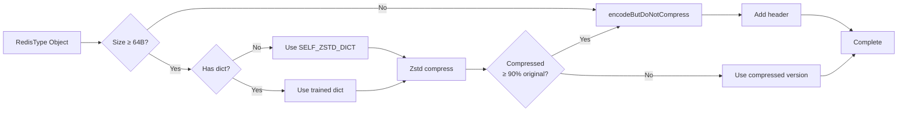

# Velo Type System Design

## Table of Contents
- [Overview](#overview)
- [Type Abstraction Pattern](#type-abstraction-pattern)
- [String Type](#string-type)
- [Number Types](#number-types)
- [Hash Type](#hash-type)
- [List Type](#list-type)
- [Set Type](#set-type)
- [ZSet Type](#zset-type)
- [Geo Type](#geo-type)
- [HyperLogLog Type](#hyperloglog-type)
- [Bloom Filter Type](#bloom-filter-type)
- [HashTag Support](#hashtag-support)
- [Binary Safety](#binary-safety)
- [Related Documentation](#related-documentation)

---

## Overview

Velo implements a **complete Redis type system** with optimized storage strategies for each data type. Unlike Redis's in-memory storage, Velo persists values to disk with compression, requiring careful serialization and deserialization strategies.

### Supported Types

| Redis Type | Velo Implementation | Storage Mode | Operations |
|-----------|---------------------|-------------|------------|
| String | CompressedValue | Inline / Chunk | GET, SET, APPEND, INCR, etc. |
| Hash | RedisHH / Key+Field | Compact / Split | HGET, HSET, HMGET, etc. |
| List | RedisList | Single Key | LPUSH, LPOP, LRANGE, etc. |
| Set | RedisHashKeys | Single Key | SADD, SMEMBERS, SINTER, etc. |
| ZSet | RedisZSet | Single Key | ZADD, ZRANGE, ZSCORE, etc. |
| Geo | RedisGeo | Single Key | GEOADD, GEORADIUS, etc. |
| HyperLogLog | CompressedValue (12KB) | Inline | PFADD, PFCOUNT, PFMERGE |
| Bloom Filter | RedisBF | Single Key | BF.ADD, BF.EXISTS, etc. |
| Stream | Not implemented | - | - |

### Type Encoding

All types are encoded into **CompressedValue** format:

```
CompressedValue Format:
┌─────────────────────────────────────────────────────┐
│ seq:         long (8 bytes)                          │
│ expireAt:    long (8 bytes)                          │
│ keyHash:     long (8 bytes)                          │
│ dictSeqOrSpType: int (4 bytes)                       │
│   > 0: Dictionary sequence for compression          │
│   < 0: Special type marker (see below)              │
│ encodedLength: int (4 bytes)                         │
│ encodedData: byte[] (variable)                       │
└─────────────────────────────────────────────────────┘
```

**Special Type Markers (Negative Values):**

```
SP_TYPE_NUM_BYTE      = -1   // Byte numeric
SP_TYPE_NUM_SHORT     = -2   // Short numeric
SP_TYPE_NUM_INT       = -4   // Int numeric
SP_TYPE_NUM_LONG      = -8   // Long numeric
SP_TYPE_NUM_DOUBLE    = -16  // Double numeric

SP_TYPE_SHORT_STRING  = -32  // Short string ≤ 16 bytes
SP_TYPE_BIG_STRING    = -64  // Big string (separate file)

SP_TYPE_HH            = -512 // Hash (compact storage)
SP_TYPE_LIST          = -2048 // List
SP_TYPE_SET           = -4096 // Set
SP_TYPE_ZSET          = -8192 // Sorted Set
SP_TYPE_GEO           = -8193 // Geospatial
SP_TYPE_HLL           = -96   // HyperLogLog (fixed 12KB)
SP_TYPE_BF_BITMAP     = -200  // Bloom Filter bitmap
```

---

## Type Abstraction Pattern

### Common Interface

All complex types follow a **consistent pattern**:

```java
public abstract class RedisType {
    // Public fields for quick access (for compatibility)
    public int size;           // Number of elements
    public int dictSeq;        // Dictionary used for compression
    public int bodyLength;     // Length of encoded body
    public int checksum;       // CRC32 of encoded data

    // Encoding methods
    public abstract byte[] encode(Dict dict);
    public abstract byte[] encodeButDoNotCompress();

    // Decoding methods
    public abstract static RedisType decode(byte[] data, boolean checkCrc32);
    public abstract static int getSizeWithoutDecode(byte[] data);

    // Iteration (efficient for large data)
    public abstract void iterate(IterateCallback callback);

    // CRC computation
    protected int computeCrc32(byte[] body);
}

interface IterateCallback<T> {
    void onElement(int index, T element) throws Exception;
    void onError(Exception e);
}
```

### Binary Format

All complex types share a **common header structure**:

```
Compressed Value Header (14 bytes):
┌─────────────────────────────────────────────────────────┐
│ size:           short (2 bytes)     - Element count     │
│ dictSeq:        int (4 bytes)       - Compression dict  │
│ bodyLength:     int (4 bytes)       - Body byte length  │
│ checksum:       int (4 bytes)       - CRC32 validation  │
└─────────────────────────────────────────────────────────┘
Body:            byte[] (variable)    - Encoded data      │

Total:           14 + bodyLength bytes

Note: Geo uses 10-byte header (no dictSeq field)
```

### Encoding Flow



### Decoding Flow

```mermaid
graph LR
    Start[byte[] from storage] --> CheckSize{Size ≥ 14B?}
    CheckSize -->|No| Error[Invalid format]
    CheckSize -->|Yes| ParseHeader[Parse 14-byte header]
    ParseHeader --> ExtractBody[Extract body bytes]
    ExtractBody --> CheckCRC{Check CRC?}
    CheckCRC -->|Yes| VerifyCRC[Compute & compare CRC32]
    CheckCRC -->|No| SkipCRC
    VerifyCRC --> CRCOK{CRC match?}
    CRCOK -->|No| Error
    CRCOK -->|Yes| SkipCRC
    SkipCRC --> Decode[Decode body to RedisType]
    Decode --> Done[Complete]
```

---

## String Type

Strings are the most fundamental Redis type, stored as **CompressedValue** objects.

### Storage Modes

#### Mode 1: Inline Short String (≤16 bytes)

```
SP_TYPE_SHORT_STRING = -32
No compression, stored directly in key bucket cell

Format in bucket cell:
┌─────────┬────────────────┬───────────┬────────────┐
│type byte│ seq (8 bytes) │expire (8) │value bytes│
│  = -32  │               │           │    ≤ 16B   │
└─────────┴────────────────┴───────────┴────────────┘
Total: 17 - 33 bytes (including header)
```

**Advantages:**
- Fast: No disk I/O beyond key bucket
- Simple: Direct memory access
- Low overhead: Minimal encoding

**Used For:**
- Flags, counters, small IDs
- Lock keys
- Session tokens

#### Mode 2: Numeric Types

```
SP_TYPE_NUM_BYTE    = -1    // Value fits in byte (-128 to 127)
SP_TYPE_NUM_SHORT   = -2    // Fits in short (-32768 to 32767)
SP_TYPE_NUM_INT     = -4    // Fits in int
SP_TYPE_NUM_LONG    = -8    // Fits in long
SP_TYPE_NUM_DOUBLE  = -16   // Double precision

Format in bucket cell:
┌─────────┬────────────────┬───────────┬────────────┐
│type byte│ seq (8 bytes) │expire (8) │ number     │
│  = -1   │               │           │  (varies)  │
└─────────┴────────────────┴───────────┴────────────┘
Byte:   1 byte
Short:  2 bytes
Int:    4 bytes
Long:   8 bytes
Double: 8 bytes
```

**Number Detection:**
```java
// Try numeric encoding first
if (value.length() <= 12 && value.matches("^-?\\d+$")) {
    long n = Long.parseLong(value);
    if (n >= Byte.MIN_VALUE && n <= Byte.MAX_VALUE) {
        return encodeAsByte((byte)n);
    } else if (n >= Short.MIN_VALUE && n <= Short.MAX_VALUE) {
        return encodeAsShort((short)n);
    } else if (n >= Integer.MIN_VALUE && n <= Integer.MAX_VALUE) {
        return encodeAsInt((int)n);
    } else {
        return encodeAsLong(n);
    }
} else if (value.matches("^-?\\d+\\.\\d+$")) {
    double d = Double.parseDouble(value);
    return encodeAsDouble(d);
}
```

#### Mode 3: Compressed String

```
dictSeq > 0: Use trained dictionary
dictSeq = 1: Use self-dict (default Zstd)
dictSeq = 0: No compression

CompressedValue format:
┌────────┬──────┬────────┬────────────┬────────────┐
│seq 8B  │expir8│type 4B │encLen 4B  │encBytes[] │
│        │      │dictSeq│            │compressed │
└────────┴──────┴────────┴────────────┴────────────┘
Total: 28 + encLen bytes
```

**Compression Decision:**
```java
int originalSize = valueBytes.length;
int compressedSize = Zstd.compress(valueBytes, dict);

// Only compress if it helps
if (dictSeq == 0 || compressedSize >= originalSize * 0.9) {
    return encodeUncompressed(valueBytes);
} else {
    return encodeCompressed(compressedBytes, dictSeq);
}
```

#### Mode 4: Big String (>1MB after compression)

```
SP_TYPE_BIG_STRING = -64

Storage:
┌────────────────┬────────────────────────────────────┐
│ Bucket cell     │ Separate file in big-string/       │
├────────────────┼────────────────────────────────────┤
│ type = -64      │ big-string/<bucketIndex>/          │
│ seq (8 bytes)   │   <uuid>_<keyHash>.dat             │
│ expire (8)      │                                     │
│ dictSeq (4)     │ File contains:                      │
│ uuid (36)       │   Full CompressedValue with data    │
│ keyHash (8)     │                                     │
│                 │ (Can be 1MB to 100MB+)             │
└────────────────┴────────────────────────────────────┘

Bucket cell size: 56 bytes (fixed)
File size: Variable (1MB - many GB)
```

**Big String Management:**
```java
class BigStringFiles {
    Map<String, FileMetadata> uuidToFile; // Track big string files

    void storeBigString(byte[] cvEncoded, int bucketIndex, long keyHash) {
        String uuid = UUID.randomUUID().toString();
        File file = getBigStringFile(bucketIndex, uuid, keyHash);
        Files.write(file.toPath(), cvEncoded);

        // Update metadata
        uuidToFile.put(uuid, new FileMetadata(bucketIndex, keyHash));
    }

    byte[] loadBigString(String uuid, int bucketIndex, long keyHash) {
        File file = getBigStringFile(bucketIndex, uuid, keyHash);
        return Files.readAllBytes(file.toPath());
    }
}
```

### String Operations

**Update Operations:**
```
APPEND: Append bytes to existing string
SETNX:   Set only if not exists
SETEX:   Set with expiration
PSETEX:  Set with millisecond expiration
GETRANGE: Slice operation (no decoding)
STRLEN:  Get length (no decoding)
```

**Increment/Decrement:**
```
INCR:     Number +1
INCRBY:   Number +N
DECR:     Number -1
DECRBY:   Number -N
INCRBYFLOAT: Number +N (float)
```

**Special Operations:**
```
GETDEL:   Get then delete
GETEX:    Get and set expiration
```

---

## Number Types

Numbers are stored as **special type markers** to enable fast arithmetic operations without parsing.

### Binary Format

```
SP_TYPE_NUM_BYTE:   ┌───┬───┐  (13 bytes total)
                   │-1│b8│  marker + byte value

SP_TYPE_NUM_SHORT:  ┌───┬───┬───┐  (14 bytes)
                   │-2│b8│b16│ marker + short value

SP_TYPE_NUM_INT:    ┌───┬───┬────────┐  (16 bytes)
                   │-4│b8│b32       │ marker + int value

SP_TYPE_NUM_LONG:   ┌───┬───┬────────┐  (20 bytes)
                   │-8│b8│b64       │ marker + long value

SP_TYPE_NUM_DOUBLE: ┌──┬───┬────────┐  (20 bytes)
                   │-16│b8│d64      │ marker + double value
```

### Operations

**Integer Arithmetic:**
```java
// INCR operation
long increment(byte[] typeBytes, long delta) {
    int marker = typeBytes[0];

    switch (marker) {
        case SP_TYPE_NUM_BYTE:
            byte b = Utils.readByte(typeBytes, 1);
            return (b + delta); // Automatic promotion to long

        case SP_TYPE_NUM_SHORT:
            short s = Utils.readShort(typeBytes, 1);
            return (s + delta);

        case SP_TYPE_NUM_INT:
            int i = Utils.readInt(typeBytes, 1);
            return (i + delta);

        case SP_TYPE_NUM_LONG:
            long l = Utils.readLong(typeBytes, 1);
            return (l + delta);

        default:
            throw new TypeMismatchException("ERR value is not an integer");
    }
}
```

**Floating-Point Arithmetic:**
```java
// INCRBYFLOAT operation
Double incrementFloat(byte[] typeBytes, double delta) {
    if (typeBytes[0] == SP_TYPE_NUM_DOUBLE) {
        double d = Utils.readDouble(typeBytes, 1);
        return d + delta;
    }
    throw new TypeMismatchException("ERR value is not a float");
}
```

**Range Checking:**
```java
// Check for overflow/underflow
void checkLongRange(long value) {
    if (value > Long.MAX_VALUE || value < Long.MIN_VALUE) {
        throw new ArithmeticException("ERR increment would overflow");
    }
}
```

### Optimization Benefits

**Before Numeric Types:**
```
SET counter "100"
GET counter   → Parse "100" to long
INCR counter  → Parse to long, add 1, format "101", compress
Total: 3 operations
```

**With Numeric Types:**
```
SET counter "100"  → Store as SP_TYPE_NUM_LONG (20 bytes fixed)
GET counter       → Read 20 bytes, extract long value (1 operation)
INCR counter      → Read 20 bytes, add 1, rewrite (2 operations)
Total: 3 operations, but faster (no string parsing/formatting)
```

---

## Hash Type

Hashes store **field-value pairs** and support two storage modes for flexibility.

### Storage Modes

#### Mode 1: Split Storage (Key + Field)

```
Each field is a separate key:

Key format: h_f_{original-key-base}.field-name
Example:  User profile
  Key pattern: h_f_{user:12345}.username
  Key pattern: h_f_{user:12345}.email
  Key pattern: h_f_{user:12345}.age

Advantages:
  - Partial access: HGET user:12345 email (single key read)
  - Atomic field updates: HSET user:12345 age 25 (single key write)
  - Fine-grained expiration: HPEXPIRE user:12345 email 3600

Disadvantages:
  - Multiple keys for single hash
  - Slower HGETALL (multiple key reads)
  - No single-key HLEN count
```

**Implementation via RedisHashKeys:**
```java
class RedisHashKeys {
    TreeSet<String> keys;
    int dictSeq;

    static String fieldKey(String originalKey, String field) {
        // Use hash tags for slot consistency
        if (hasHashTag(originalKey)) {
            String tag = extractHashTag(originalKey);
            return "h_f_{" + tag + "}." + field;
        }
        return "h_f_" + originalKey + "." + field;
    }

    static String keysKey(String originalKey) {
        // Key storing all field names
        if (hasHashTag(originalKey)) {
            String tag = extractHashTag(originalKey);
            return "h_k_{" + tag + "}";
        }
        return "h_k_" + originalKey;
    }
}
```

**Hash Operations (Split Mode):**
```
HGET key field     → GET h_f_key.field
HSET key field val → SET h_f_key.field val
HDEL key field     → DEL h_f_key.field
HKEYS key          → SMEMBERS h_k_key  (set of field names)
HGETALL key        → Multiple GETs + merge
HLEN key           → SCARD h_k_key
```

#### Mode 2: Compact Storage (Single Key)

```
All fields and values in single CompressedValue (RedisHH)

Type marker: SP_TYPE_HH = -512

CompressedValue format (Header + Body):
┌────────────────────────────────────────────────────────┐
│ Header (14 bytes)                                      │
│  size:        short 2)  - Number of fields            │
│  dictSeq:     int (4)   - Compression dictionary      │
│  bodyLength:  int (4)   - Body length                 │
│  checksum:    int (4)   - CRC32                       │
├────────────────────────────────────────────────────────┤
│ Body (variable)                                        │
│  For each field-value pair:                           │
│    expireAt (long 8)  - Field expiration (optional)   │
│    keyLength (short 2) - Field name length            │
│    keyBytes (var)      - Field name bytes             │
│    valueLength (int 4) - Value length                 │
│    valueBytes (var)     - Value bytes (compressed)    │
└────────────────────────────────────────────────────────┘

Example (3 fields):
Field 1: email (expire=0, value="user@example.com")
Field 2: age (expire=0, value="25")
Field 3: name (expire=0, value="John Doe")
```

**RedisHH Encoding:**
```java
class RedisHH {
    private final HashMap<String, FieldValue> map;
    private static final int MAX_SIZE = 4096; // Max fields per hash

    static class FieldValue {
        long expireAt;
        byte[] valueBytes; // Already compressed
    }

    byte[] encode(Dict dict) {
        ByteArrayOutputStream baos = new ByteArrayOutputStream();
        DataOutputStream dos = new DataOutputStream(baos);

        // Encode each field-value pair
        for (Map.Entry<String, FieldValue> entry : map.entrySet()) {
            FieldValue fv = entry.getValue();

            dos.writeLong(fv.expireAt);
            dos.writeShort(entry.getKey().length());
            dos.write(entry.getKey().getBytes());
            dos.writeInt(fv.valueBytes.length);
            dos.write(fv.valueBytes);
        }

        byte[] body = baos.toByteArray();

        // Apply compression if beneficial
        if (body.length >= 64 && dict != null) {
            byte[] compressed = dict.compress(body);
            if (compressed.length < body.length * 0.9) {
                body = compressed;
            }
        }

        // Add header
        return addHeader(size, dict.seq, body);
    }
}
```

**Advantages:**
- Single key: Easy to manage and delete
- Fast HGETALL: Single read operation
- Good for small hashes (< ~100 fields)
- Compression benefits similar fields

**Disadvantages:**
- Slower individual field access (must decode entire hash)
- Atomic field updates require rewrite
- Field expiration requires full decode/encode

### Hash Operations

**Read Operations:**
```
HGET key field       → Decode, find field, return value
HMGET key f1 f2 ...  → Decode, find multiple fields
HKEYS key            → Return field names
HVALS key            → Return all values
HGETALL key          → Return all field-value pairs
HLEN key             → Return field count
HEXISTS key field    → Check if field exists
```

**Write Operations:**
```
HSET key field val   → Encode/rewrite entire hash (compact mode)
HSETNX key f v       → Set only if field doesn't exist
HMSET key f1 v1 f2 v2 → Bulk set
HDEL key field       → Remove field
HINCRBY key field N   → Increment numeric field value
HINCRBYFLOAT key f N  → Increment float field value
```

**Expirations:**
```
HEXPIRE key field seconds   → Set field expiration
HPEXPIRE key field ms       → Set field expiration in ms
HEXPIREAT key field ts      → Set expire at timestamp
HPEXPIREAT key field ts     → Set expire at timestamp (ms)
HTTL key field              → Get TTL
HPTTL key field             → Get TTL in ms
```

### Mode Selection Criteria

| Hash Size | Access Pattern | Recommended Mode |
|-----------|---------------|------------------|
| < 20 fields | Mostly individual reads/writes | Split |
| < 20 fields | Mostly HGETALL/HGETALL | Compact |
| 20-200 fields | Balanced | Compact |
| > 200 fields | Mostly individual reads/writes | Split |
| > 200 fields | Mostly HGETALL | Deprecated (too large) |

### Size Limits

```
Max fields per hash: 4096 (HASH_MAX_SIZE)
Max field name length: 256 bytes (from config)
Max value length: 1MB (after compression)

Total hash size (compact mode):
  4096 fields × (avg field name 16B + avg value 100B)
  = ~475KB uncompressed
  = ~100KB compressed (typical)
```

---

## List Type

Lists store **ordered sequences of elements** and are stored as a single key.

### Storage Format

```
Type marker: SP_TYPE_LIST = -2048

CompressedValue format:
┌────────────────────────────────────────────────────────┐
│ Header (14 bytes)                                      │
│  size:        short 2)  - Number of elements           │
│  dictSeq:     int (4)   - Compression dictionary      │
│  bodyLength:  int (4)   - Body length                 │
│  checksum:    int (4)   - CRC32                       │
├────────────────────────────────────────────────────────┤
│ Body (variable)                                        │
│  For each element:                                     │
│    elementLength (short 2) - Element byte length       │
│    elementBytes (var)      - Element bytes             │
└────────────────────────────────────────────────────────┘

Example: List ["a", "b", "c"]
┌─────┬────┬────┬────┬────┐
│ 1,97│ 1 │ 97 │ 1 │ 98 │ a | b | c
│     │    │    │    │    │
│size │  a │    │  b │    │ c
└─────┴────┴────┴────┴────┴─────────
```

**RedisList Implementation:**
```java
class RedisList {
    private LinkedList<byte[]> elements;
    private static final int MAX_SIZE = Short.MAX_VALUE; // 32767

    byte[] encode(Dict dict) {
        ByteArrayOutputStream baos = new ByteArrayOutputStream();
        DataOutputStream dos = new DataOutputStream(baos);

        for (byte[] element : elements) {
            dos.writeShort(element.length);
            dos.write(element);
        }

        byte[] body = baos.toByteArray();

        // Compress if beneficial
        byte[] compressed = compressIfWorthwhile(body, dict);

        return addHeader(size, dict.seq, compressed);
    }

    static RedisList decode(byte[] data, boolean checkCrc32) {
        ByteArrayInputStream bais = new ByteArrayInputStream(data);
        DataInputStream dis = new DataInputStream(bais);

        ParserHeader header = parseHeader(data);
        verifyCrc(header, checkCrc32);

        RedisList list = new RedisList();
        for (int i = 0; i < header.size; i++) {
            short len = dis.readShort();
            byte[] element = new byte[len];
            dis.readFully(element);
            list.elements.add(element);
        }

        return list;
    }
}
```

### List Operations

**Head Operations:**
```
LPUSH key val1 [val2 ...]  → Add to head
LPOP key                   → Remove from head
LINDEX key index           → Get element at index
```

**Tail Operations:**
```
RPUSH key val1 [val2 ...]  → Add to tail
RPOP key                   → Remove from tail
LRANGE key start stop      → Get range (inclusive)
```

**Modification:**
```
LSET key index val         → Replace element at index
LTRIM key start stop       → Keep only range
LINSERT key BEFORE|AFTER pivot val → Insert before/after
LREM key count val         → Remove first N occurrences
```

**Blocking Operations:**
```
BLPOP key1 [key2 ...] timeout
BRPOP key1 [key2 ...] timeout
BRPOPLPUSH src dest timeout
```

### Position Indexing

```
Index 0:        Head (first element)
Index -1:       Tail (last element)
Index positive: From head (0, 1, 2, ...)
Index negative: From tail (-1, -2, -3, ...)

Example: List [A, B, C, D]
  Index 0 or -4 → A
  Index 1 or -3 → B
  Index 2 or -2 → C
  Index 3 or -1 → D
```

### Size Limits

```
Max elements: 32767 (Short.MAX_VALUE)
Max element size: 1MB (after compression)
Max list size: 32767 × 1MB ≈ 32GB uncompressed
```

---

## Set Type

Sets store **unique, unordered collections** and use similar encoding to RedisHashKeys.

### Storage Format

```
Type marker: SP_TYPE_SET = -4096

CompressedValue format (same as RedisHashKeys):
┌────────────────────────────────────────────────────────┐
│ Header (14 bytes)                                      │
│  size:        short 2)  - Number of members            │
│  dictSeq:     int (4)   - Compression dictionary      │
│  bodyLength:  int (4)   - Body length                 │
│  checksum:    int (4)   - CRC32                       │
├────────────────────────────────────────────────────────┤
│ Body (variable)                                        │
│  For each member:                                      │
│    memberLength (short 2) - Member byte length         │
│    memberBytes (var)     - Member bytes                │
└────────────────────────────────────────────────────────┘

Example: Set {"apple", "banana", "orange"}
┌─────┬────┬─────────┼────┬──────────┼────┬─────────┐
│ 3,97│ 5 │ apple   │ 6 │ banana   │ 6 │ orange  │
│     │    │         │    │          │    │         │
│size │apple│ bytes   │banana│ bytes    │orange│ bytes  │
└─────┴────┴─────────┴────┴──────────┴────┴─────────┘
```

**RedisHashKeys for Sets:**
```java
class RedisHashKeys {
    private TreeSet<String> keys; // Internal storage (sorted)

    static RedisHashkeys forSet(Collection<byte[]> members) {
        RedisHashKeys set = new RedisHashKeys();
        for (byte[] member : members) {
            set.keys.add(new String(member)); // UTF-8
        }
        return set;
    }

    byte[] encode(Dict dict) {
        ByteArrayOutputStream baos = new ByteArrayOutputStream();
        DataOutputStream dos = new DataOutputStream(baos);

        for (String member : keys) {
            byte[] bytes = member.getBytes();
            dos.writeShort(bytes.length);
            dos.write(bytes);
        }

        byte[] body = baos.toByteArray();
        byte[] compressed = compressIfWorthwhile(body, dict);

        return addHeader(size, dict.seq, compressed);
    }
}
```

### Set Operations

**Basic Operations:**
```
SADD key member1 [member2 ...]  → Add members
SREM key member1 [member2 ...]  → Remove members
SPOP key [count]                → Remove and return random
SMOVE source dest member        → Move member between sets
SISMEMBER key member            → Check if member exists
SMISMEMBER key m1 m2 ...        → Check multiple members
SMEMBERS key                    → Return all members
SCARD key                       → Return member count
```

**Set Operations:**
```
SINTER key1 [key2 ...]          → Intersection
SINTERCARD numkeys key1 [key2]  → Intersection size
SINTERSTORE dest key1 [key2]    → Store intersection
SUNION key1 [key2 ...]          → Union
SUNIONSTORE dest key1 [key2]    → Store union
SDIFF key1 [key2 ...]           → Difference
SDIFFSTORE dest key1 [key2]     → Store difference
```

**Random Operations:**
```
SRANDMEMBER key [count]         → Return random members
```

### Size Limits

```
Max members: 4096 (HASH_MAX_SIZE)
Max member length: 255 bytes (SET_MEMBER_MAX_LENGTH)
```

---

## ZSet Type

Sorted Sets store **ordered collections with scores** using a dual-index structure for O(log n) operations.

### Storage Format

```
Type marker: SP_TYPE_ZSET = -8192

CompressedValue format:
┌────────────────────────────────────────────────────────┐
│ Header (14 bytes)                                      │
│  size:        short 2)  - Number of members            │
│  dictSeq:     int (4)   - Compression dictionary      │
│  bodyLength:  int (4)   - Body length                 │
│  checksum:    int (4)   - CRC32                       │
├────────────────────────────────────────────────────────┤
│ Body (variable)                                        │
│  For each member-score pair:                           │
│    entryLength (short 2) - Entry length               │
│    score (double 8)    - Member score                  │
│    memberBytes (var)   - Member bytes                  │
└────────────────────────────────────────────────────────┘

Example: ZSet {("apple": 1.0), ("banana": 2.0), ("orange": 1.5)}
┌─────┬────┬────────┬────┬─────────┬────┬──────────┬────┬─────────┐
│ 3,97│16  │ apple  │16  │ banana  │17  │ orange   │
│     │    │ 8:1.0  │    │ 8:2.0  │    │ 8:1.5    │
│size │apple│ bytes  │banana│ bytes  │orange│ bytes    │
└─────┴────┴────────┴────┴─────────┴────┴──────────┴─────────┘
```

**Dual-Index Structure (In-Memory):**
```java
class RedisZSet {
    private static final int MAX_SIZE = 4096;
    private static final int MAX_MEMBER_LENGTH = 255;

    // Primary index: Sorted by score, then member
    private TreeSet<ScoreValue> setByScore;

    // Secondary index: O(log n) member lookup
    private TreeMap<String, ScoreValue> mapByMember;

    static class ScoreValue implements Comparable<ScoreValue> {
        double score;
        String member;

        @Override
        public int compareTo(ScoreValue other) {
            // Sort by score first, then member name
            int scoreCompare = Double.compare(this.score, other.score);
            if (scoreCompare != 0) return scoreCompare;
            return this.member.compareTo(other.member);
        }
    }

    void add(double score, String member) {
        ScoreValue sv = new ScoreValue(score, member);
        setByScore.add(sv);
        mapByMember.put(member, sv);
    }

    double getScore(String member) {
        ScoreValue sv = mapByMember.get(member);
        return sv != null ? sv.score : Double.NaN;
    }
}
```

### ZSet Operations

**Basic Operations:**
```
ZADD key score member [score member ...]  → Add/update member
ZREM key member [member ...]             → Remove members
ZSCORE key member                        → Get member score
ZCARD key                                → Get member count
ZMSCORE key m1 m2 ...                    → Get scores for multiple members
ZINCRBY key increment member            → Increment/ decrement score
```

**Range Operations:**
```
ZRANGE key start stop [WITHSCORES]       → Get range by rank
ZREVRANGE key start stop [WITHSCORES]   → Get range by rank (reverse)
ZRANGEBYSCORE key min max [WITHSCORES]   → Get range by score
ZREVRANGEBYSCORE key min max [WITHSCORES] → Get range (reverse)
```

**Lexicographic Operations:**
```
ZRANGEBYLEX key min max                  → Get range by member name
ZREVRANGEBYLEX key min max              → Get range (reverse)
ZLEXCOUNT key min max                    → Count members in range
ZREMRANGEBYLEX key min max               → Remove members in range
```

**Rank Operations:**
```
ZRANK key member                         → Get member rank (ascending)
ZREVRANK key member                      → Get member rank (descending)
```

**Aggregate Operations:**
```
ZUNION numkeys key1 [key2...] [WEIGHTS w1 w2...] [AGGREGATE SUM|MIN|MAX] dest
ZINTER numkeys key1 [key2...] [WEIGHTS w1 w2...] [AGGREGATE SUM|MIN|MAX] dest
ZUNIONSTORE dest numkeys key1 [key2...] [WEIGHTS w1 w2...] [AGGREGATE SUM|MIN|MAX]
ZINTERSTORE dest numkeys key1 [key2...] [WEIGHTS w1 w2...] [AGGREGATE SUM|MIN|MAX]
```

**Pop Operations:**
```
ZPOPMIN key [count]                      → Pop N lowest-scoring members
ZPOPMAX key [count]                      → Pop N highest-scoring members
ZPOPMIN dest key [count]                 → Pop and copy to another key
ZPOPMAX dest key [count]                 → Pop and copy to another key
```

**Random Operations:**
```
ZRANDMEMBER key [count] [WITHSCORES]    → Return random member(s)
```

### Size Limits

```
Max members: 4096 (ZSET_MAX_SIZE)
Max member length: 255 bytes (ZSET_MEMBER_MAX_LENGTH)
Score precision: Double (IEEE 754, ~15 decimal digits)
```

---

## Geo Type

Geospatial data stores **geographic coordinates** with support for distance and radius queries.

### Storage Format

```
Type marker: SP_TYPE_GEO = -8193

CompressedValue format:
┌────────────────────────────────────────────────────────┐
│ Header (10 bytes) - NO DICT SEQ                        │
│  size:        short 2)  - Number of points             │
│  bodyLength:  int (4)   - Body length                  │
│  checksum:    int (4)   - CRC32                        │
├────────────────────────────────────────────────────────┤
│ Body (variable)                                        │
│  For each member-point:                                │
│    memberLength (short 2)    - Member name length      │
│    memberBytes (var)         - Member name bytes       │
│    longitude (double 8)      - X coordinate            │
│    latitude (double 8)       - Y coordinate            │
└────────────────────────────────────────────────────────┘

Example: Geo {"Paris": (2.35, 48.85), "London": (-0.12, 51.50)}
┌─────┬────┬─────────┬────────┬────────┼────┬──────────┬────┬──────────┐
│ 2,97│ 5 │ Paris   │ -0.12  │ 48.85   │ 6   │ London   │ 2.35     │
│     │    │ bytes   │ lon(B) │ lat(B)  │     │ bytes    │ lon(B)   │
│size │Paris│         │        │         │ │London│          │ lat(B)   │
└─────┴────┴─────────┴────────┴────────┴─────┴──────────┴────┴──────────┘
```

**RedisGeo Implementation:**
```java
class RedisGeo {
    private HashMap<String, Point> points;

    static class Point {
        double longitude; // X coordinate (-180 to 180)
        double latitude;  // Y coordinate (-85.05 to 85.05)
    }

    private static final double EARTH_RADIUS = 6372795.560856; // meters

    static double distance(double lon1, double lat1,
                           double lon2, double lat2) {
        // Haversine distance formula
        double dLat = Math.toRadians(lat2 - lat1);
        double dLon = Math.toRadians(lon2 - lon1);

        double a = Math.sin(dLat/2) * Math.sin(dLat/2) +
                   Math.cos(Math.toRadians(lat1)) *
                   Math.cos(Math.toRadians(lat2)) *
                   Math.sin(dLon/2) * Math.sin(dLon/2);

        double c = 2 * Math.atan2(Math.sqrt(a), Math.sqrt(1-a));
        return EARTH_RADIUS * c;
    }
}
```

### Geo Operations

**Basic Operations:**
```
GEOADD key longitude latitude member [long lat member ...]
                              → Add geospatial point(s)
GEOPOS key member [member ...] → Get coordinates
GEODESTBYMEMBER key member1 member2 [unit m|km|mi|ft]
                              → Get distance between members
```

**Radius Operations:**
```
GEORADIUS key longitude latitude radius [unit m|km|mi|ft]
              [WITHCOORD] [WITHDIST] [WITHHASH] [COUNT count] [ASC|DESC]
              → Find points within radius
GEORADIUSBYMEMBER key member radius [unit m|km|mi|ft]
              [WITHCOORD] [WITHDIST] [WITHHASH] [COUNT count] [ASC|DESC]
              → Find points within radius from member
```

**Search Operations:**
```
GEOSEARCH key FROMMEMBER member BYRADIUS radius [unit]
             [FROMCOORD lon lat] BYBOX width height [unit]
             [BYRADIUS radius [unit]] [WITHCOORD] [WITHDIST]
             [WITHHASH] [ASC|DESC] [COUNT count]
             → Search points
GEOSEARCHSTORE dest key FROMMEMBER member ...
             → Store search results in another key
```

### Geohash Encoding

```
52-bit signed integer encoding:
- Interleaves longitude and latitude bits
- Each coordinate uses 26 bits
- Precision: ~0.6 meters at the equator

Encoding:
1. Map coordinates to 0-180 (lon) and 0-180 (lat) ranges
2. Convert to integers with appropriate scale
3. Interleave bits: lon_lat_lon_lat_...
4. Convert to signed 52-bit integer

Example: London (-0.12, 51.50)
  Longitude bits:  0 | 0 | 1 | 1 | 0 | 0 | 1 | ...
  Latitude bits:   0 | 1 | 1 | 0 | 0 | 1 | 0 | ...
  Geohash:        00 11 10 10 ...
```

### Size Limits

```
Max points: Unlimited (practically limited by memory/disk)
Max member length: 256 bytes
Coordinate precision: Double (~15 decimal digits)
Distance precision: ~1 meter with double precision
```

---

## HyperLogLog Type

HyperLogLog is a **probabilistic data structure** for estimating cardinality with fixed memory.

### Storage Format

```
Type marker: SP_TYPE_HLL = -96
FIXED SIZE: 12,288 bytes (12KB)

CompressedValue format:
┌────────┬──────┬────────┬────────────┐
│seq 8B  │expir8│type 4B │encLen 4B  │
│        │      │ = -96  │ = 12288   │
├────────┴──────┴────────┴────────────┤
│ encodedData: 12KB HyperLogLog bytes │
│                                     │
│  16,384 registers × 6 bits each    │
└─────────────────────────────────────┘

Format: Raw HyperLogLog register array (no header compression)
```

**HyperLogLog Implementation (via Guava/HyperLogLog):**
```java
// Uses com.github.prasanthj:hyperloglog library
class HyperLogLog {
    private final int precision = 14; // 2^14 = 16,384 registers
    private final byte[] registers;  // 12KB

    void add(String element) {
        // Hash element using 64-bit hash
        long hash = hash64(element);

        // Extract leading zeros + 1
        int leadingZeros = Long.numberOfLeadingZeros(hash) + 1;

        // Determine register index (low 14 bits)
        int registerIndex = (int) (hash & 0x3FFF);

        // Update register if larger
        if (leadingZeros > getRegister(registerIndex)) {
            setRegister(registerIndex, leadingZeros);
        }
    }

    long cardinality() {
        // HyperLogLog cardinality estimation formula
        // Alpha * registerCount / m
        // ... (complex formula with bias correction)

        return estimatedCount;
    }
}
```

### HyperLogLog Operations

```
PFADD key element [element ...]    → Add element(s) to HLL
PFCOUNT key [key ...]               → Get estimated cardinality
                                    → Merge multiple HLLs for count
PFMERGE destkey sourcekey [sourcekey ...]
                                    → Merge multiple HLLs into one
```

### Cardinality Estimation Error

```
Register count: 16,384 (2^14)
Standard error: < 1% (at typical sizes)
Memory: 12KB per key (regardless of cardinality)

Example correlations:
- 100,000 elements → Estimated: 100,203 (error 0.2%)
- 1,000,000 elements → Estimated 998,451 (error 0.15%)
- 10,000,000 elements → Estimated: 10,023,401 (error 0.23%)
```

### Size Limits

```
Memory: Fixed 12KB per key
Max cardinality: Limited by 64-bit hash range
Min cardinality: Accurate for counts > ~100
```

---

## Bloom Filter Type

Bloom Filter is a **probabilistic data structure** for set membership testing with automatic scaling.

### Storage Format

```
Type marker: SP_TYPE_BF_BITMAP = -200

CompressedValue format:
┌────────────────────────────────────────────────────────┐
│ Header (14 bytes)                                      │
│  size:        short 2)  - Number of sub-filters       │
│  dictSeq:     int (4)   - Compression dictionary      │
│  bodyLength:  int (4)   - Body length                 │
│  checksum:    int (4)   - CRC32                       │
├────────────────────────────────────────────────────────┤
│ Body (variable)                                        │
│  expansion (byte 1)    - Expansion factor (1-10)     │
│  nonScaling (byte 1)   - Auto-scaling disabled flag   │
│  fpp (double 8)        - Target false positive rate  │
│  listSize (int 4)      - Number of sub-filters       │
│  For each sub-filter:                                  │
│    filterLength (int 4)  - Filter bytes length        │
│    filterBytes (var)    - Filter bit array bytes      │
│    itemInserted (int 4) - Items inserted in filter    │
│    capacity (int 4)     - Filter capacity             │
└────────────────────────────────────────────────────────┘

Example: BloomFilter with 2 sub-filters, fpp=1%
┌────────────────────────────────────────────────────┐
│ 2,97 │ 1 │ 0 │ 0.01 │ 2 │ 1024 │ ... │ 2048 │ ... │
│      │exp │non │      │cnt │len   │bits │len   │bits │
size │factor│scal│fpp   │list│filter│     │filter│     │
└────────────────────────────────────────────────────┘
```

**RedisBF Implementation (via Guava):**
```java
class RedisBF {
    private static final int DEFAULT_CAPACITY = 100;
    private static final double DEFAULT_FPP = 0.01;
    private static final int DEFAULT_EXPANSION = 2;

    private ArrayList<BloomFilter<CharSequence>> filters;
    private final int capacity;
    private final double fpp;
    private final int expansion;

    void add(String item) {
        // Try to add to latest filter
        BloomFilter<CharSequence> lastFilter = filters.get(filters.size() - 1);

        double currentFpp = 1.0 - Math.pow(1.0 - 1.0/capacity, lastFilter.approximateElementCount());

        if (currentFpp >= fpp * 0.9) {
            // Expand: Create new larger filter
            BloomFilter<CharSequence> newFilter = BloomFilter.create(
                Funnels.stringFunnel(),
                capacity * expansion,
                fpp
            );
            filters.add(newFilter);
            filters.get(filters.size() - 1).put(item);
        } else {
            lastFilter.put(item);
        }
    }

    boolean mightContain(String item) {
        // Check all filters
        for (BloomFilter<CharSequence> filter : filters) {
            if (filter.mightContain(item)) {
                return true;
            }
        }
        return false;
    }
}
```

### Bloom Filter Operations

```
BF.RESERVE key capacity [EXPANSION expansion] [NONSCALING]
                                   → Create empty BloomFilter

BF.ADD key item [item ...]          → Add item(s) to filter
BF.MADD key item [item ...]         → Add and return success for each
BF.EXISTS key item                  → Check if item might exist
BF.MEXISTS key item [item ...]      → Check multiple items

BF.INFO key                         → Get filter information
                                   (capacity, size, num_filters, etc.)

BF.SCANDUMP key iterator            → Dump filter state (for backup)
BF.LOADCHUNK key iterator data      │ Load filter state

BF.CARD key                         → Count items added (informational)
```

### Auto-Expansion

```
Trigger: Filter fill rate reaches 90% of target FPP

Strategy:
  1. Create new filter with capacity × expansion
  2. Insert new item into new filter
  3. Old filters remain for queries
  4. Up to 4 filters (configurable)

Example:
  Filter 0: 100 items, 1% FPP → 90% full
  Filter 1: 200 items, 1% FPP → 1% full
  Total: 300 items maintained

  Query for item X:
    - Check Filter 0 (exists → return true)
    - Check Filter 1 (not exists)
    - Return false (no false positive from Filter 1)
```

### Size Limits

```
Max sub-filters: 4
Expansion factor: 2-10 (default 2)
Target FPP: 0.01 (1%) default
Memory: Grows with insertions (auto-scalable)
```

---

## HashTag Support

Hash tags enable **forcing multiple keys to the same slot** for cluster compatibility.

### Hash Tag Syntax

```
Format: key{tag}

Example: {user:1000}.following
         user:1000{profile}
         tweets:{user:1000}

Rules:
  - Tag is the content inside {}
  - Empty {} uses entire key as tag
  - Only first {} is used (ignored in rest)
  - Hash tag affects slot calculation
```

### Slot Calculation with Hash Tags

```java
short calculateSlot(byte[] key, int slotNumber) {
    // Check for hash tag
    String keyStr = new String(key, StandardCharsets.UTF_8);
    int tagStart = keyStr.indexOf('{');
    int tagEnd = keyStr.indexOf('}', tagStart);

    if (tagStart != -1 && tagEnd != -1 && tagEnd > tagStart + 1) {
        // Extract tag
        String tag = keyStr.substring(tagStart + 1, tagEnd);

        // Calculate slot based on tag only
        long slotInPositiveKey = JedisClusterCRC16.getSlot(tag.getBytes());
        ...
    } else {
        // Calculate slot based on entire key
        long slotInPositiveKey = JedisClusterCRC16.getSlot(key);
        ...
    }

    return slotIndex;
}
```

### When to Use Hash Tags

```
1. Multi-key operations within same slot:
   - SINTER key1 key2 key3
   - SUNION keyA keyB
   - MGET k1 k2 k3

2. Atomic operations across related keys:
   - Transactions (MULTI/EXEC)
   - Lua scripts

3. Cross-slot constraints:
   - FANOUT operations that need consistency
   - Migration operations

Example:
  # Without hash tags - not guaranteed same slot
  user:12345:profile
  user:12345:posts
  user:12345:friends

  # With hash tags - guaranteed same slot
  {user:12345}:profile
  {user:12345}:posts
  {user:12345}:friends
```

### Hash Tag Application

```
1. Hash split storage:
   Keys:
     - hash keys: h_k_{tag}      (field names)
     - field keys: h_f_{tag}.field

   Example:
     HMGET user:12345 name age email
     → Keys:
       - h_k_{user:12345}      (field names: name, age, email)
       - h_f_{user:12345}.name
       - h_f_{user:12345}.age
       - h_f_{user:12345}.email

2. Multi-key sets:
   Keys:
     - set: {article:12345}:tags
     - bloom: {article:12345}:categories

3. Transactions:
   MULTI
     HSET user:12345 name "John"
     LPUSH user:12345:orders "order:001"
     SADD user:12345:roles "admin"
   EXEC
```

---

## Binary Safety

All Velo types are **binary safe**, supporting arbitrary byte sequences including null bytes.

### Binary Safe Operations

```
All commands accept binary data:
  GET key            → Returns bytes[] as BULK reply
  SET key value     → Accepts bytes[] as argument
  APPEND key value  → Binary concatenation
  GETRANGE key 0 -1 → Binary slicing (not UTF-8)

Type-specific operations:
  HSET key field value        → field and value are binary
  SADD key member              → member is binary
  ZADD key score member        → member is binary
  GEOADD key lon lat member    → member is binary
```

### Encoding for Binary Data

```
Binary-safe length prefix encoding:
┌─────────────┬──────────────────────┐
│ Length (int) │ Bytes[]              │
└─────────────┴──────────────────────┘
│  4 bytes     │ variable              │

Example: Value containing null bytes
  String: "hello\0world"
  Bytes: [104,101,108,108,111,0,119,111,114,108,100]
  Length: 11

Encoded:
  [0,0,0,11, 104,101,108,108,111,0,119,111,114,108,100]
  │  length  │  actual bytes
```

**Binary Safety Implementation:**
```java
class CompressedValue {
    static byte[] encodeBinary(byte[] data) {
        ByteArrayOutputStream baos = new ByteArrayOutputStream();
        DataOutputStream dos = new DataOutputStream(baos);

        // Write length
        dos.writeInt(data.length);

        // Write raw bytes (no UTF-8 conversion)
        dos.write(data);

        return baos.toByteArray();
    }

    static byte[] decodeBinary(byte[] encoded) {
        ByteArrayInputStream bais = new ByteArrayInputStream(encoded);
        DataInputStream dis = new DataInputStream(bais);

        int length = dis.readInt();
        byte[] data = new byte[length];
        dis.readFully(data);

        return data;
    }
}
```

### Binary-Safe Commands

```
Generic:
  GET, SET, APPEND, GETRANGE, STRLEN

Hash:
  HGET, HSET, HMGET, HGETALL, HKEYS, HVALS

List:
  LPUSH, RPUSH, LPOP, RPOP, LRANGE

Set:
  SADD, SMEMBERS, SPOP, SRANDMEMBER

ZSet:
  ZADD, ZRANGE, ZSCORE

Geo:
  GEOADD, GEOPOS

Bloom Filter:
  BF.ADD, BF.EXISTS, BF.MADD, BF.MEXISTS

All return BULK replies with binary content
```

### Binary Safety Limitations

```
Maximum value size: 1MB (after compression)
Maximum key size: 512 bytes (KEY_MAX_LENGTH)
Maximum element size in collection: 512 bytes

Binary data with null bytes fully supported in:
  - String values
  - Hash field names and values
  - List elements
  - Set members
  - ZSet members
  - Geo member names
  - HLL elements (hashed)
  - Bloom Filter elements (hashed)
```

---

## Related Documentation

### Design Documents
- [Overall Architecture](./01_overall_architecture.md) - System overview
- [Persistence Layer Design](./02_persist_layer_design.md) - How types are stored
- [Command Processing Design](./04_command_processing_design.md) - Type-specific commands
- [Compression Design](./07_compression_design.md) - Value compression strategies

### Existing Documentation
- [doc/types/README.md](/home/kerry/ws/velo/doc/types/README.md) - Type storage modes overview

### Key Source Files
**Core Types:**
- `src/main/java/io/velo/type/RedisHH.java` - Hash (compact storage)
- `src/main/java/io/velo/type/RedisList.java` - List
- `src/main/java/io/velo/type/RedisZSet.java` - Sorted set
- `src/main/java/io/velo/type/RedisHashKeys.java` - Set / Hash split storage
- `src/main/java/io/velo/type/RedisGeo.java` - Geospatial
- `src/main/java/io/velo/type/RedisBF.java` - Bloom filter
- `src/main/java/io/velo/type/RedisBitSet.java` - Bitmap operations

**Decoders:**
- `src/main/java/io/velo/type/encode/ZipList.java` - Redis ziplist decoder
- `src/main/java/io/velo/type/encode/ListPack.java` - Redis listpack decoder

**Support:**
- `src/main/java/io/velo/CompressedValue.java` - Value representation
- `src/main/java/io/velo/BFSerializer.java` - Bloom filter serialization

---

**Document Version:** 1.0
**Last Updated:** 2025-02-05
**Author:** Velo Architecture Team
