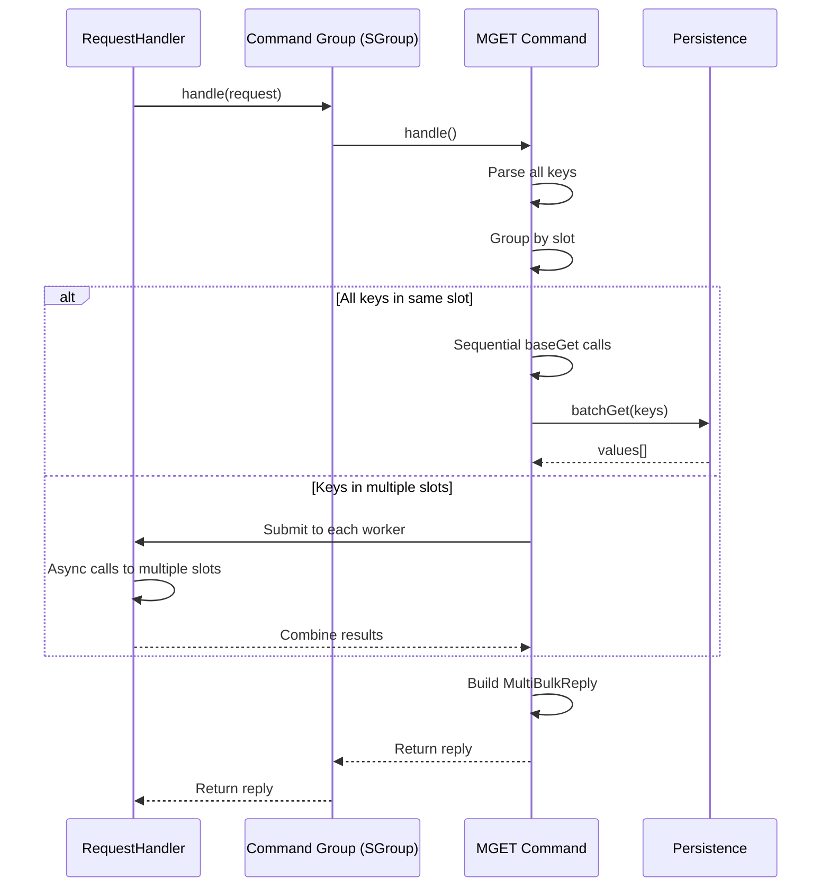
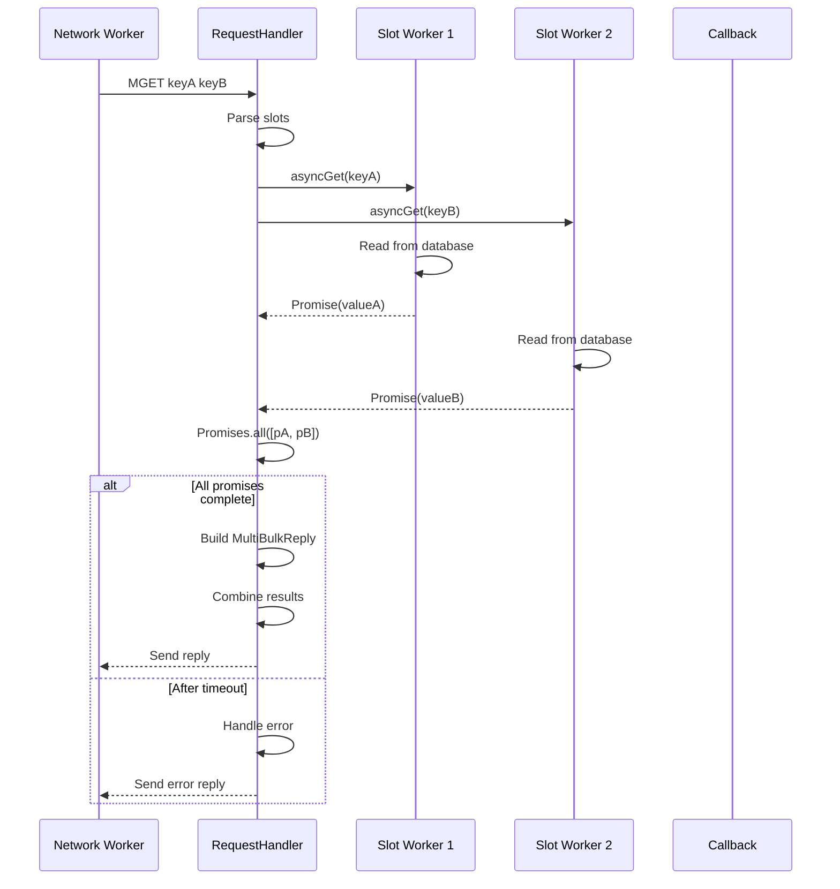

# Velo Command Processing Design

## Table of Contents
- [Overview](#overview)
- [Command Group Organization](#command-group-organization)
- [BaseCommand Interface](#basecommand-interface)
- [Slot Parsing and Routing](#slot-parsing-and-routing)
- [Command Execution Flow](#command-execution-flow)
- [Command Implementation Patterns](#command-implementation-patterns)
- [Multi-Key Operations](#multi-key-operations)
- [Error Handling](#error-handling)
- [Cross-Worker Coordination](#cross-worker-coordination)
- [Command Dispatch Optimization](#command-dispatch-optimization)
- [Related Documentation](#related-documentation)

---

## Overview

Velo implements **300+ Redis commands** organized into 21 alphabetical command groups. The command processing pipeline maps Redis protocol requests to Java implementations, handles slot-based routing, and executes operations on the persistence layer.

### Command Statistics

**Supported Redis Commands:** ~290 commands
**Total Command Files:** 21 groups (AGroup through ZGroup)
**Commands Per Group:** 5-25 commands (varies by letter density)

**Command Distribution:**

| Group | Command Count | Examples |
|-------|--------------|----------|
| AGroup | 8 | ACL, APPEND, ASKING |
| BGroup | 15 | BITCOUNT, BF.*, BGSAVE, BLPOP |
| CGroup | 20 | CLIENT, CLUSTER, CONFIG |
| ... | ... | ... |
| ZGroup | 25 | ZADD, ZCARD, ZRANGE, ZUNION |

### Processing Pipeline

```
Client Request
    │
    ├─> RESP/HTTP Decoder
    │       │
    │       ├─> Parse command: String, byte[][]
    │       ├─> Extract arguments
    │       └─> Create Request object
    │
    ├─> RequestHandler
    │       │
    │       ├─> Parse slots (parseSlots)
    │       │   ├─> Extract keys from arguments
    │       │   ├─> Calculate key hashes
    │       │   └─> Determine target slots
    │       │
    │       └─> Route to slot worker
    │           ├─> Single slot: Direct submission
    │           └─> Multi-slot: Cross-worker coordination
    │
    ├─> Slot Worker
    │       │
    │       ├─> Select command group
    │       │   Group = Groups[firstByte - 'a']
    │       │
    │       └─> Execute command
    │           ├─> Parse parameters
    │           ├─> Validate inputs
    │           ├─> Execute logic (persistence)
    │           └─> Build reply
    │
    └─> Reply encoding
            │
            ├─> Serialize to RESP2/RESP3
            ├─> Serialize to HTTP (if applicable)
            └─> Send to client
```

---

## Command Group Organization

### Alphabetical Grouping

Commands are organized by **first letter** into 21 group files:

```
src/main/java/io/velo/command/
├── BaseCommand.java              # Abstract base class
├── SlotWithKeyHash.java          # Slot calculation record
├── ErrorReplyException.java      # Exception wrapper
├── BlockingList.java             # BLPOP/BRPOP blocking
├── RDBImporter.java              # Redis RDB import
├── AGroup.java                   # Commands starting with 'A'
├── BGroup.java                   # Commands starting with 'B'
├── CGroup.java                   # Commands starting with 'C'
├── DGroup.java                   # Commands starting with 'D'
├── EGroup.java                   # Commands starting with 'E'
├── FGroup.java                   # Commands starting with 'F'
├── GGroup.java                   # Commands starting with 'G'
├── HGroup.java                   # Commands starting with 'H'
├── IGroup.java                   # Commands starting with 'I'
├── JGroup.java                   *Empty* (no commands)
├── KGroup.java                   *Empty* (no commands)
├── LGroup.java                   # Commands starting with 'L'
├── MGroup.java                   # Commands starting with 'M'
├── NGroup.java                   *Empty* (no commands)
├── OGroup.java                   # Commands starting with 'O'
├── PGroup.java                   # Commands starting with 'P'
├── QGroup.java                   # Commands starting with 'Q'
├── RGroup.java                   # Commands starting with 'R'
├── SGroup.java                   # Commands starting with 'S'
├── TGroup.java                   # Commands starting with 'T'
└── ZGroup.java                   # Commands starting with 'Z'
```

### Command Group Structure

Each group extends `BaseCommand` and implements command handlers:

```java
public class XGroup extends BaseCommand {

    // Command parsing: extract slots from arguments
    @Override
    public ArrayList<SlotWithKeyHash> parseSlots(
        String cmd, byte[][] data, int slotNumber
    ) {
        ArrayList<SlotWithKeyHash> list = new ArrayList<>();

        if ("xcommand1".equals(cmd)) {
            // Parse command-specific key structure
            if (data.length >= 2) {
                list.add(slot(data[1], slotNumber));
            }
            return list;
        }

        if ("xcommand2".equals(cmd)) {
            // Multi-key command
            if (data.length >= 3) {
                // Keys at positions 2, 3, 4...
                for (int i = 2; i < data.length; i++) {
                    list.add(slot(data[i], slotNumber));
                }
            }
            return list;
        }

        return list; // Command without keys
    }

    // Command execution: implement logic
    @Override
    public Reply handle() {
        if ("xcommand1".equals(cmd)) {
            return handleXCommand1();
        }

        if ("xcommand2".equals(cmd)) {
            return handleXCommand2();
        }

        ...
    }

    // Specific command implementations
    private Reply handleXCommand1() {
        // Validate arguments
        if (data.length < 2) {
            return ErrorReply.FORMAT;
        }

        // Extract parameters
        byte[] key = data[1];
        byte[] value = data.length >= 3 ? data[2] : new byte[0];

        // Execute operation
        ...

        // Return reply
        return OKReply.INSTANCE;
    }
}
```

### Group Examples

**AGroup (Administration):**
```java
public class AGroup extends BaseCommand {
    // Commands:
    // - ACL (ACLCAT, ACLDELUSER, ACLGETUSER, ACLSETUSER, etc.)
    // - APPEND
    // - ASKING
}
```

**BGroup (Bitmap, Bloom Filter, Blocking):**
```java
public class BGroup extends BaseCommand {
    // Commands:
    // - BITCOUNT, BITPOS, BITFIELD, BITFIELD_RO, BITOP
    // - BF.ADD, BF.EXISTS, BF.INFO, etc.
    // - BGSAVE
    // - BLPOP, BRPOP
}
```

**ZGroup (Sorted Sets):**
```java
public class ZGroup extends BaseCommand {
    // Commands:
    // - ZADD, ZCARD, ZCOUNT, ZDIFF, ZINCRBY
    // - ZINTER, ZINTERSTORE, ZRANGE, ZRANGE...
    // - ZSCORE, ZUNION, ZUNIONSTORE
    // - (25+ commands total)
}
```

---

## BaseCommand Interface

### Abstract Methods

```java
public abstract class BaseCommand {
    // Core methods
    public abstract ArrayList<SlotWithKeyHash> parseSlots(
        String cmd, byte[][] data, int slotNumber
    );

    public abstract Reply handle();

    // Optional context methods
    public void from(BaseCommand other);        // Share context between commands
    public void resetContext(...);             // Reset for reuse

    protected Reply baseGet(short slot);        // Common GET logic
    protected Reply baseSet(short slot);        // Common SET logic

    protected byte[] getCv(short slot);         // Get CompressedValue
    protected byte[] getValueBytesByCv(byte[]cv,...); // Decompress

    public static BaseCommand mockAGroup();     // Testing helpers
}
```

### SlotWithKeyHash Record

```java
public record SlotWithKeyHash(
    short slot,              // Internal Velo slot index (0-N)
    short toClientSlot,      // Redis cluster slot number (0-16383)
    int bucketIndex,         // Bucket within slot
    long keyHash,            // 64-bit hash
    String rawKey            // Original key string
) {
    // Special constant for commands needing slot resolution
    public static final short TO_FIX_FIRST_SLOT = Short.MIN_VALUE;
}
```

### Protected State Variables

```java
public abstract class BaseCommand {
    // Input
    protected String cmd;                           // Command name (lowercase)
    protected byte[][] data;                         // Command arguments
    protected VeloUserDataInSocket socket;          // TCP socket connection

    // Precomputed slot information
    protected ArrayList<SlotWithKeyHash> slotWithKeyHashListParsed;

    // Multi-threading flags
    protected boolean isCrossRequestWorker;         // Cross-slot operation

    // Service access
    protected LocalPersist localPersist;             // Persistence layer
    protected DictMap dictMap;                       // Compression dictionaries
    protected AclUsers aclUsers;                     // Access control

    // Constants
    public static final int KEY_MAX_LENGTH = 512;
    public static final int VALUE_MAX_LENGTH = 1024 * 1024;
}
```

### Key Indexing Patterns

```java
class FromToKeyIndex {
    // Key extraction patterns for multi-key commands

    // All arguments from index 1 are keys
    static final FromToKeyIndex KeyIndexBegin1 =
        new FromToKeyIndex(1, Integer.MAX_VALUE, 1, true);

    // Every other argument from index 1 (skip values)
    static final FromToKeyIndex KeyIndexBegin1Step2 =
        new FromToKeyIndex(1, Integer.MAX_VALUE, 2, true);

    // All arguments from index 2
    static final FromToKeyIndex KeyIndexBegin2 =
        new FromToKeyIndex(2, Integer.MAX_VALUE, 1, true);

    int start;              // Start argument index
    int end;                // End argument index
    int step;               // Step (for key-value pairs)
    boolean isRandomAccess; // Random access support
}
```

---

## Slot Parsing and Routing

### Parse Phase

The `parseSlots` method determines **which keys** the command operates on and calculates their slots:

```java
@Override
public ArrayList<SlotWithKeyHash> parseSlots(
    String cmd, byte[][] data, int slotNumber
) {
    ArrayList<SlotWithKeyHash> slotWithKeyHashList = new ArrayList<>();

    // 1. Identify command
    String normalizedCmd = cmd.toLowerCase();

    // 2. Extract keys based on command pattern
    if (normalizedCmd.startsWith("get")) {
        // Single key at index 1
        if (data.length >= 2) {
            slotWithKeyHashList.add(slot(data[1], slotNumber));
        }
    } else if (normalizedCmd.startsWith("mget")) {
        // Multiple keys from index 1
        addToSlotWithKeyHashList(
            slotWithKeyHashList,
            KeyIndexBegin1,
            data,
            slotNumber
        );
    } else if (normalizedCmd.startsWith("zrange")) {
        // Key at index 1, then start/stop parameters
        if (data.length >= 4) {
            slotWithKeyHashList.add(slot(data[1], slotNumber));
        }
    } else if (normalizedCmd.startsWith("rename")) {
        // Source and destination keys
        if (data.length >= 3) {
            slotWithKeyHashList.add(slot(data[1], slotNumber));
            slotWithKeyHashList.add(slot(data[2], slotNumber));
        }
    }

    // 3. Set request flags
    if (slotWithKeyHashList.isEmpty()) {
        // Command without keys (e.g., PING, ECHO)
        return slotWithKeyHashList;
    }

    // Check for cross-slot keys
    if (hasMultipleSlots(slotWithKeyHashList)) {
        isCrossRequestWorker = true;
    }

    return slotWithKeyHashList;
}
```

### Slot Calculation Algorithm

```java
protected SlotWithKeyHash slot(byte[] key, int slotNumber) {
    // 1. Hash the key
    long keyHash = KeyHash.hash(key);

    // 2. Calculate bucket index (power-of-2)
    int bucketsPerSlot = ConfForSlot.global.confBucket.bucketsPerSlot;
    int bucketIndex = Math.abs((int) (keyHash & (bucketsPerSlot - 1)));

    // 3. Calculate slot (cluster-aware)
    short toClientSlot = 0;
    short slot = 0;

    if (MultiShard.isEnabled()) {
        // Clustering mode: use CRC16 slot
        toClientSlot = JedisClusterCRC16.getSlot(key);
        slot = MultiShard.asInnerSlotByToClientSlot(toClientSlot);
    } else {
        // Standalone mode: use sign-based slot distribution
        boolean splitSign = false;
        if (MultiShard.isSplitSignEnabled()) {
            splitSign = (keyHash >= 0);
        }

        int halfSlotNumber = slotNumber / 2;
        slotPositive = Math.abs((int) ((keyHash / halfSlotNumber) & (halfSlotNumber - 1)));

        if (splitSign) {
            // Positive hash: first half of slots
            slot = (short) slotPositive;
        } else {
            // Negative hash: second half of slots
            slot = (short) (slotPositive + halfSlotNumber);
        }

        toClientSlot = slot; // No cluster mapping
    }

    return new SlotWithKeyHash(
        slot,
        toClientSlot,
        bucketIndex,
        keyHash,
        new String(key, StandardCharsets.UTF_8)
    );
}
```

### Routing to Slot Workers

```
┌─────────────────────────────────────────┐
│  RequestHandler (slot worker)          │
└────────────┬────────────────────────────┘
             │
             ├─> Check slotWithKeyHashList
             │    │
             │    ├─> Empty (no keys)
             │    │       → Execute locally (any worker)
             │    │
             │    └─> Single slot
             │            → Execute locally (this worker's slot?)
             │
             └─> Multiple slots
                  → Cross-worker coordination
```

**Routing Logic:**

```java
// In RequestHandler
public Reply handle(Request request) {
    // Parse slots
    ArrayList<SlotWithKeyHash> slotList = parseSlots(request);

    if (slotList.isEmpty()) {
        // Command without keys: execute locally
        return executeCommandLocally(request);
    }

    if (slotList.size() == 1) {
        SlotWithKeyHash skh = slotList.getFirst();
        short targetSlot = skh.slot();

        // Check if this worker owns the slot
        if (isMySlot(targetSlot, workerId)) {
            return executeCommandLocally(request);
        } else {
            // Route to appropriate worker
            return routeToOtherWorker(request, targetSlot);
        }
    }

    // Multiple slots: cross-worker coordination
    return executeCrossWorker(request, slotList);
}
```

---

## Command Execution Flow

### Single-Slot Execution

```mermaid
sequenceDiagram
    participant RH as RequestHandler
    participant CG as Command Group
    participant CMD as Specific Command
    participant P as Persistence
    participant R as Reply

    RH->>CG: handle(request)
    CG->>CMD: resetContext(cmd, data)
    CG->>CMD: handle()

    CMD->>CMD: Validate arguments
    CMD->>CMD: Extract keys and parameters

    CMD->>CMD: Check slot
    CMD->>CMD: Get SlotWithKeyHash

    CMD->>P: baseGet(slot)
    P->>P: CompressValue lookup
    P->>CMD: Return CV data

    CMD->>CMD: Decode value

    CMD->>CMD: Execute operation logic
    | Note: read operation, just return |
    | Note: write operation, call baseSet |

    CMD->>R: Build reply (OKReply, BulkReply, etc.)
    CMD-->>CG: Return reply
    CG-->>RH: Return reply
    RH-->>Client: Send reply
```

**Example: SET Command**

```java
public class SGroup extends BaseCommand {
    @Override
    public Reply handle() {
        if ("set".equals(cmd)) {
            return setCommand();
        }
        ...
    }

    private Reply setCommand() {
        // 1. Validate arguments
        if (data.length < 3) {
            return ErrorReply.FORMAT;
        }

        byte[] key = data[1];
        byte[] value = data[2];

        if (key.length > KEY_MAX_LENGTH) {
            return ErrorReply.KEY_TOO_LONG;
        }

        if (value.length > VALUE_MAX_LENGTH) {
            return ErrorReply.VALUE_TOO_LONG;
        }

        // 2. Parse options
        long expireSeconds = 0;
        int expireMilliseconds = 0;
        boolean nx = false;  // Only set if not exists
        boolean xx = false;  // Only set if exists

        for (int i = 3; i < data.length; i++) {
            String option = new String(data[i]).toLowerCase();

            if (option.equals("ex")) {
                if (i + 1 >= data.length) return ErrorReply.SYNTAX;
                expireSeconds = Long.parseLong(new String(data[++i]));
            } else if (option.equals("px")) {
                if (i + 1 >= data.length) return ErrorReply.SYNTAX;
                expireMilliseconds = Integer.parseInt(new String(data[++i]));
            } else if (option.equals("nx")) {
                nx = true;
            } else if (option.equals("xx")) {
                xx = true;
            }
        }

        // 3. Get slot
        SlotWithKeyHash skh = slotWithKeyHashListParsed.getFirst();

        // 4. Check NX/XX conditions
        if (nx || xx) {
            byte[] existing = getCv(skh.slot());
            if (nx && existing != null) {
                return NilReply.INSTANCE;
            }
            if (xx && existing == null) {
                return NilReply.INSTANCE;
            }
        }

        // 5. Compress value
        String keyString = new String(key);
        Dict dict = dictMap.getBestDict(keyString);
        byte[] cvEncoded = CompressedValue.encode(
            value,
            dict,
            null,  // expireAt is set separately
            System.currentTimeMillis(),
            skh.keyHash()
        );

        // 6. Calculate expiration
        long expireAt = 0;
        if (expireSeconds > 0) {
            expireAt = System.currentTimeMillis() + expireSeconds * 1000;
        }
        if (expireMilliseconds > 0) {
            expireAt = System.currentTimeMillis() + expireMilliseconds;
        }

        // 7. Persist
        baseSet(skh.slot(), key, cvEncoded, expireAt, skh.bucketIndex(), skh.keyHash(),
                dict == null ? 0 : dict.seq);

        // 8. Return reply
        return OKReply.INSTANCE;
    }
}
```

### Multi-Key Read Execution



**Example: MGET Command**

```java
public class SGroup extends BaseCommand {
    @Override
    public Reply handle() {
        if ("mget".equals(cmd)) {
            return mgetCommand();
        }
        ...
    }

    private Reply mgetCommand() {
        // 1. Validate
        if (data.length < 2) {
            return ErrorReply.FORMAT;
        }

        // 2. Group keys by slot
        Map<Short, List<SlotWithKeyHash>> keysBySlot = new HashMap<>();
        for (SlotWithKeyHash skh : slotWithKeyHashListParsed) {
            keysBySlot.computeIfAbsent(skh.slot(), k -> new ArrayList<>()).add(skh);
        }

        // 3. Execute per slot
        ArrayList<Reply> replies = new ArrayList<>();

        if (keysBySlot.size() == 1) {
            // Single slot: local read
            short targetSlot = slotWithKeyHashListParsed.getFirst().slot();
            for (SlotWithKeyHash skh : slotWithKeyHashListParsed) {
                byte[] cv = getCv(targetSlot);
                if (cv == null) {
                    replies.add(NilReply.INSTANCE);
                } else {
                    byte[] value = getValueBytesByCv(cv, skh.keyHash());
                    replies.add(BulkReply.bulkReply(value));
                }
            }
        } else {
            // Multiple slots: cross-worker coordination
            for (Map.Entry<Short, List<SlotWithKeyHash>> entry : keysBySlot.entrySet()) {
                short slot = entry.getKey();
                List<SlotWithKeyHash> skhList = entry.getValue();

                // Submit async request to slot worker
                Promise<Reply> p = localPersist.oneSlot(slot)
                    .asyncCall(() -> executeMgetForSlot(skhList));

                replies.add(new AsyncReply(p));
            }
        }

        // 4. Flatten results (handle async replies)
        return buildMgetReply(replies);
    }
}
```

---

## Command Implementation Patterns

### Read-Modify-Write Pattern

Common for operations like INCR, APPEND:

```java
private Reply incrCommand() {
    // 1. Read existing value
    SlotWithKeyHash skh = slotWithKeyHashListParsed.getFirst();
    byte[] cv = getCv(skh.slot());

    if (cv == null) {
        return ErrorReply.NOT_INTEGER; // Or return 0 if default
    }

    // 2. Decode
    byte[] valueBytes = getValueBytesByCv(cv, skh.keyHash());
    TypeAndValue tv = CompressedValue.getTypeAndValue(valueBytes);

    if (tv.type != SP_TYPE_NUM_LONG && tv.type != SP_TYPE_NUM_INT) {
        return ErrorReply.NOT_INTEGER;
    }

    // 3. Modify
    long delta = Long.parseLong(new String(data[2]));
    long newValue = tv.longValue + delta;

    // 4. Encode modified value
    byte[] newCv = CompressedValue.encodeNumber(newValue);

    // 5. Write back
    baseSet(skh.slot(), skh.rawKey(), newCv, tv.expireAt,
            skh.bucketIndex(), skh.keyHash(), 0);

    // 6. Return new value
    return IntegerReply.of(newValue);
}
```

### Delete Pattern

```java
private Reply delCommand() {
    if (data.length < 2) {
        return IntegerReply.of(0);
    }

    int deletedCount = 0;

    if (!isCrossRequestWorker) {
        // Single slot: local deletions
        for (int i = 1; i < data.length; i++) {
            // Get key hash
            String key = new String(data[i]);
            SlotWithKeyHash skh = slotWithKeyHashListParsed.get(i - 1);

            // Delete from storage
            boolean deleted = baseDelete(skh.slot(), skh.rawKey(),
                    skh.bucketIndex(), skh.keyHash());

            if (deleted) {
                deletedCount++;
            }
        }
    } else {
        // Multi-slot: cross-worker deletions
        for (SlotWithKeyHash skh : slotWithKeyHashListParsed) {
            // Submit async deletion
            Promise<Boolean> p = localPersist.oneSlot(skh.slot())
                .asyncCall(() -> baseDelete(...));

            deletedCount += p.getSync() ? 1 : 0;
        }
    }

    return IntegerReply.of(deletedCount);
}
```

### Existence Check Pattern

```java
private Reply existsCommand() {
    if (data.length < 2) {
        return ErrorReply.FORMAT;
    }

    int existsCount = 0;

    for (int i = 1; i < data.length; i++) {
        SlotWithKeyHash skh = slotWithKeyHashListParsed.get(i - 1);
        byte[] cv = getCv(skh.slot());

        if (cv != null) {
            existsCount++;
        }
    }

    return IntegerReply.of(existsCount);
}
```

### Type Check Pattern

```java
private Reply typeCommand() {
    if (data.length < 2) {
        return ErrorReply.FORMAT;
    }

    SlotWithKeyHash skh = slotWithKeyHashListParsed.getFirst();
    byte[] cv = getCv(skh.slot());

    if (cv == null) {
        return BulkReply.bulkReply("none");
    }

    TypeAndValue tv = CompressedValue.getTypeAndValue(cv);

    String type = switch (tv.type) {
        case -1, -2, -4, -8, -16 -> "string";  // Numeric types
        case -32 -> "string";                  // Short string
        case -64 -> "string";                  // Big string
        case -512 -> "hash";                   // RedisHH
        case -2048 -> "list";                  // RedisList
        case -4096 -> "set";                   // RedisHashKeys (set)
        case -8192 -> "zset";                  // RedisZSet
        case -8193 -> "zset";                  // RedisGeo (zset compatible)
        case -96 -> "string";                  // HyperLogLog (treated as string)
        case -200 -> "string";                 // BloomFilter (treated as string)
        default -> "none";
    };

    return BulkReply.bulkReply(type);
}
```

---

## Multi-Key Operations

### Cross-Slot Operations

Commands that touch **multiple keys** in different slots require cross-worker coordination:

```
Supported Cross-Slot Commands:
  - MGET, MSET, MSETNX
  - SINTER, SUNION, SDIFF (multiple sets)
  - ZUNION, ZINTER (multiple sorted sets)
  - SINTERSTORE, SUNIONSTORE, SDIFFSTORE (results to dest)
  - ZUNIONSTORE, ZINTERSTORE
  - RENAME, RENAMENX (source and destination in different slots)
  - COPY (source and destination)
  - MOVE (between slots in cluster)
```

### Cross-Worker Coordination Pattern

```java
private Reply sinterCommand() {
    // Parse source set keys
    List<SlotWithKeyHash> sourceSlots = new ArrayList<>();
    for (int i = 1; i < data.length; i++) {
        sourceSlots.add(slotWithKeyHashListParsed.get(i - 1));
    }

    // Check if all in same slot
    if (allInSameSlot(sourceSlots)) {
        // Fast path: local operation
        return sinterLocal(sourceSlots);
    }

    // Cross-slot path: async with promises
    List<Promise<RedisHashKeys>> promises = new ArrayList<>();

    for (SlotWithKeyHash skh : sourceSlots) {
        // Submit async request to each slot
        Promise<RedisHashKeys> p = localPersist.oneSlot(skh.slot())
            .asyncCall(() -> {
                byte[] cv = getCv(skh.slot());
                return RedisHashKeys.decode(cv, true);
            });
        promises.add(p);
    }

    // Wait for all promises
    Promises.all(promises)
        .whenComplete((results, error) -> {
            if (error != null) {
                // Handle error
                return;
            }

            // Compute intersection
            RedisHashKeys intersection = computeIntersection(results);

            // Build reply
            return BulkReply.multiBulkReply(intersection.getMembers());
        });

    // Need async support in reply
    return AsyncReply.from(promises);
}
```

### Multi-Key Write Coordination

For write operations like MSET, Velo uses **two-phase commit** style:

```java
private Reply msetCommand() {
    // 1. Group keys by slot
    Map<Short, List<KeyValuePair>> keysBySlot = groupKeysBySlot();

    // 2. First phase: Check for NX conditions (if applicable)
    // 3. Second phase: Apply writes in each slot

    if (allInSameSlot(keysBySlot.keySet())) {
        // Simple path: sequential writes
        for (KeyValuePair kvp : pairs) {
            baseSet(...);
        }
    } else {
        // Cross-slot: parallel writes with promise coordination
        List<Promise<Void>> writePromises = new ArrayList<>();

        for (Map.Entry<Short, List<KeyValuePair>> entry : keysBySlot.entrySet()) {
            Promise<Void> p = localPersist.oneSlot(entry.getKey())
                .asyncCall(() -> {
                    for (KeyValuePair kvp : entry.getValue()) {
                        baseSet(...);
                    }
                    return null;
                });
            writePromises.add(p);
        }

        // Wait for all writes
        Promises.all(writePromises).whenComplete(...);
    }

    return OKReply.INSTANCE;
}
```

---

## Error Handling

### Error Reply Types

```java
public final class ErrorReply extends Reply {
    // Predefined error messages ( RESP format)

    public static final ErrorReply FORMAT =
        new ErrorReply("ERR wrong number of arguments",
            "wrong number of arguments");

    public static final ErrorReply SYNTAX =
        new ErrorReply("ERR syntax error",
            "syntax error");

    public static final ErrorReply KEY_TOO_LONG =
        new ErrorReply("ERR string exceeds maximum length",
            "string exceeds maximum length");

    public static final ErrorReply VALUE_TOO_LONG =
        new ErrorReply("ERR value exceeds maximum length",
            "value exceeds maximum length");

    public static final ErrorReply NOT_INTEGER =
        new ErrorReply("ERR value is not an integer",
            "value is not an integer");

    public static final ErrorReply NOT_FLOAT =
        new ErrorReply("ERR value is not a float",
            "value is not a float");

    public static final ErrorReply WRONG_TYPE =
        new ErrorReply("WRONGTYPE Operation against a key holding the wrong kind of value",
            "Operation against a key holding the wrong kind of value");

    public static final ErrorReply NO_SUCH_KEY =
        new ErrorReply("ERR no such key",
            "no such key");

    public static final ErrorReply INDEX_OUT_OF_RANGE =
        new ErrorReply("ERR index out of range",
            "index out of range");

    public static final ErrorReply ACL_PERMIT_LIMIT =
        new ErrorReply("NOPERM",
            "NOPERM No permissions");

    public static final ErrorReply ACL_PERMIT_KEY_LIMIT =
        new ErrorReply("NOPERM",
            "NOPERM No permissions for this key");

    ...
}
```

### Validation Patterns

**Argument Count Validation:**
```java
if (data.length < expectedMinimum) {
    return ErrorReply.FORMAT;
}
```

**Key Length Validation:**
```java
if (key.length > KEY_MAX_LENGTH) {
    return ErrorReply.KEY_TOO_LONG;
}
```

**Value Length Validation:**
```java
if (value.length > VALUE_MAX_LENGTH) {
    return ErrorReply.VALUE_TOO_LONG;
}
```

**Type Validation:**
```java
byte[] cv = getCv(slot);
if (cv != null) {
    TypeAndValue tv = CompressedValue.getTypeAndValue(cv);

    if (expectedType == TYPE_STRING && !isStringType(tv.type)) {
        return ErrorReply.WRONG_TYPE;
    }

    if (expectedType == TYPE_HASH && tv.type != SP_TYPE_HH) {
        return ErrorReply.WRONG_TYPE;
    }
}
```

**Range Validation:**
```java
int start = Integer.parseInt(new String(data[2]));
int stop = Integer.parseInt(new String(data[3]));

if (start > stop) {
    return ErrorReply.INDEX_OUT_OF_RANGE;
}

if (start < 0 || stop >= list.size()) {
    return ErrorReply.INDEX_OUT_OF_RANGE;
}
```

**Expiration Validation:**
```java
long expire = Long.parseLong(expireString);
if (expire < 0) {
    return ErrorReply.SYNTAX;
}

if (expire > MAX_EXPIRE) {
    return ErrorReply.SYNTAX;
}
```

---

## Cross-Worker Coordination

### Async Execution Model

Velo uses **ActiveJ's Promise** system for cross-worker coordination:

```java
class Promise<T> {
    T getSync();                    // Blocking get
    void whenComplete(Consumer<T> callback); // Async callback
}

class Promises {
    static <T> Promise<List<T>> all(List<Promise<T>> promises);
}
```

### Cross-Slot Request Flow



### Worker Selection

```java
class SlotWorkerSelector {
    static int workerForSlot(short slot, int slotWorkers) {
        return slot % slotWorkers;
    }
}

// Usage
int targetWorker = SlotWorkerSelector.workerForSlot(skh.slot(), slotWorkers);

if (workerId == targetWorker) {
    // Local execution
    return executeLocally(skh);
} else {
    // Route to other worker via promise
    return remoteWorkers[targetWorker]
        .submit(() -> executeCommand(skh));
}
```

### Group-by-Slot Optimization

For multi-key commands, **group keys by slot** for efficient parallelism:

```java
Map<Short, List<SlotWithKeyHash>> keysBySlot = slotWithKeyHashListParsed.stream()
    .collect(Collectors.groupingBy(SlotWithKeyHash::slot));

// Parallel execution per slot
List<Promise<Reply>> promises = keysBySlot.entrySet().stream()
    .map(entry -> executeBatchForSlot(
        entry.getKey(),
        entry.getValue()
    ))
    .collect(Collectors.toList());

// Wait for all
return combineReplies(promises);
```

---

## Command Dispatch Optimization

### Hot Paths

Certain commands have **optimized hot paths** for performance:

**GET Command (Optimized):**
```java
public class SGroup extends BaseCommand {
    private static Reply getOptimized(SlotWithKeyHash skh) {
        // Direct persistence access without full command logic
        byte[] cv = localPersist.oneSlot(skh.slot()).get(skh.keyHash(), ...);

        if (cv == null) {
            return NilReply.INSTANCE;
        }

        // Fast decode path
        if (isInlineValue(cv)) {
            return BulkReply.bulkReply(cv.data());
        }

        // Standard decode
        byte[] value = CompressedValue.decodeValue(cv, skh.keyHash());
        return BulkReply.bulkReply(value);
    }
}
```

**SET Command (Optimized):**
```java
private static Reply setOptimized(SlotWithKeyHash skh, byte[] value) {
    // Skip full option parsing for simple SET
    Dict dict = dictMap.getBestDict(skh.rawKey());
    byte[] cv = CompressedValue.encode(value, dict, ...);

    localPersist.oneSlot(skh.slot()).set(skh.keyHash(), cv, ...);

    return OKReply.INSTANCE;
}
```

### Command Caching

For performance-critical commands, caching **command selection** reduces overhead:

```java
class CommandCache {
    private static final Map<String, BiFunction<BaseCommand, Reply>> cache =
        new ConcurrentHashMap<>();

    static Reply execute(String cmd, BaseCommand cmdObj) {
        return cache.computeIfAbsent(cmd.toLowerCase(), c -> {
            // Determine handle method for this command
            return createSelector(c);
        }).apply(cmdObj);
    }

    private static BiFunction<BaseCommand, Reply> createSelector(String cmd) {
        return switch (cmd) {
            case "get" -> bc -> bc.baseGet(...);
            case "set" -> bc -> bc.baseSet(...);
            case "incr" -> bc -> bc.incrCommand();
            default -> bc -> bc.parseAndHandle(cmd);
        };
    }
}
```

---

## Related Documentation

### Design Documents
- [Overall Architecture](./01_overall_architecture.md) - System overview
- [Persistence Layer Design](./02_persist_layer_design.md) - How commands use storage
- [Type System Design](./03_type_system_design.md) - Type-specific operations
- [Protocol Decoding Design](./05_protocol_decoding_design.md) - Request parsing
- [Response Encoding Design](./06_response_encoding_design.md) - Reply formatting
- [Multithreading Design](./11_multithreading_design.md) - Worker coordination

### Existing Documentation
- [doc/redis_command_support.md](/home/kerry/ws/velo/doc/redis_command_support.md) - Full command support matrix

### Key Source Files
**Core Command Infrastructure:**
- `src/main/java/io/velo/BaseCommand.java` - Abstract base class
- `src/main/java/io/velo/command/SlotWithKeyHash.java` - Slot calculation
- `src/main/java/io/velo/command/FromToKeyIndex.java` - Key indexing patterns

**Command Groups:**
- `src/main/java/io/velo/command/AGroup.java` through `src/main/java/io/velo/command/ZGroup.java`

**Support:**
- `src/main/java/io/velo/command/BlockingList.java` - BLPOP/BRPOP blocking
- `src/main/java/io/velo/command/ErrorReplyException.java` - Error handling
- `src/main/java/io/velo/RequestHandler.java` - Command routing

**Protocol Support:**
- `src/main/java/io/velo/command/RDBImporter.java` - Redis RDB import

---

**Document Version:** 1.0
**Last Updated:** 2025-02-05
**Author:** Velo Architecture Team
