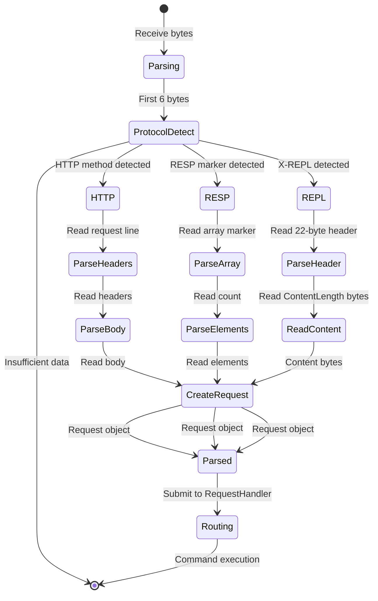

# Velo Protocol Decoding Design

## Table of Contents
- [Overview](#overview)
- [Unified Decoder Architecture](#unified-decoder-architecture)
- [Protocol Detection](#protocol-detection)
- [RESP Protocol Parsing](#resp-protocol-parsing)
- [HTTP Protocol Parsing](#http-protocol-parsing)
- [Replication Protocol Parsing](#replication-protocol-parsing)
- [Request Object Model](#request-object-model)
- [Pipeline Support](#pipeline-support)
- [Zero-Copy Optimization](#zero-copy-optimization)
- [Error Handling](#error-handling)
- [Related Documentation](#related-documentation)

---

## Overview

Velo supports **three distinct protocols** in a unified decoder:

1. **RESP (Redis Serialization Protocol)** - Primary Redis protocol (v2/v3)
2. **HTTP** - RESTful access (GET, POST, PUT, DELETE)
3. **X-REPL** - Custom replication protocol for master-slave sync

The decoder automatically **detects protocol type**, parses requests, and produces a unified `Request` object for downstream processing.

### Protocols Summary

| Protocol | Port | Use Case | Supported Commands |
|----------|------|----------|-------------------|
| RESP | 7379 (default) | Redis clients | All 290+ Redis commands |
| HTTP | 7379 (default) | REST access | GET/POST for key operations |
| X-REPL | 7379 (replication port) | Master-slave sync | Binlog streaming |

### Decoder Design Goals

- **Unified API**: Single decoder interface for all protocols
- **Zero-copy**: Minimize memory allocations for large payloads
- **Streaming**: Handle partial reads and reassembly
- **Pipeline**: Decode multiple requests from single buffer
- **Error-tolerant**: Graceful handling of malformed data

---

## Unified Decoder Architecture

### Component Hierarchy

```
RequestDecoder (implements ByteBufsDecoder<ArrayList<Request>>)
    │
    ├─> Protocol Detection
    │       ├─> HTTP pattern matching
    │       ├─> RESP pattern detection
    │       └─> X-REPL keyword detection
    │
    ├─> HTTP Path
    │       ├─> HttpHeaderBody (header/body parser)
    │       ├─> URL parameter extraction
    │       └─> Request object construction
    │
    ├─> RESP Path
    │       ├─> RESP (protocol parser)
    │       ├─> NumberProcessor (numeric parsing)
    │       ├─> Line reading (CRLF detection)
    │       └─> Array/header parsing
    │
    └─> X-REPL Path
            ├─> ReplDecoder (custom protocol)
            ├─> Header parsing (bytes 0-21)
            ├─> Content type detection
            └─> Streaming reassembly
```

### Decoder Interface

```java
public interface ByteBufsDecoder<T> {
    /**
     * Try to decode from buffer.
     * @param bufs Input buffers (possibly incomplete)
     * @return Decoded requests, or null if incomplete
     */
    T tryDecode(ByteBufs bufs) throws MalformedDataException;
}

public class RequestDecoder implements ByteBufsDecoder<ArrayList<Request>> {
    private final RESP resp;                  // Thread-local RESP instance
    private final ReplDecoder replDecoder;    // Replication decoder
    private final HttpHeaderBody httpParser;   // HTTP parser

    @Override
    public ArrayList<Request> tryDecode(ByteBufs bufs) throws MalformedDataException {
        ArrayList<Request> requests = new ArrayList<>();

        while (bufs.hasRemaining()) {
            // Detect protocol by inspecting first bytes
            String protocol = detectProtocol(bufs);

            Request request;
            try {
                switch (protocol) {
                    case "HTTP":
                        request = decodeHttp(bufs);
                        break;
                    case "RESP":
                        request = decodeResp(bufs);
                        break;
                    case "REPL":
                        request = decodeRepl(bufs);
                        break;
                    case "UNKNOWN":
                        // Insufficient data, wait for more
                        return requests.size() > 0 ? requests : null;
                    default:
                        throw new MalformedDataException("Unknown protocol");
                }
            } catch (IncompleteDataException e) {
                // Request incomplete, wait for more bytes
                return requests.size() > 0 ? requests : null;
            }

            if (request != null) {
                requests.add(request);
            } else {
                break;
            }
        }

        return requests;
    }
}
```

---

## Protocol Detection

### Detection Strategy

Protocol is detected by **inspecting the first 6 bytes** of the request:

```
Detection Rules (sequential):

1. Check X-REPL keyword (case-sensitive)
   - Bytes: 0x58 0x2D 0x52 0x45 0x50 0x4C
   - Pattern: "X-REPL"
   - → X-REPL protocol

2. Check HTTP method patterns (case-insensitive)
   - "GET " (0x47 0x45 0x54 0x20)
   - "POST " (0x50 0x4F 0x53 0x54 0x20)
   - "PUT " (0x50 0x55 0x54 0x20)
   - "DELETE " (0x44 0x45 0x4C 0x45 0x54 0x45 0x20)
   - → HTTP protocol

3. Check RESP patterns
   - Array marker: '*' (0x2A)
   - Simple string: '+' (0x2B)
   - Error: '-' (0x2D)
   - Integer: ':' (0x3A)
   - Bulk string: '$' (0x24)
   - → RESP protocol

4. Default: RESP (fallback)
   - Assume RESP if no pattern matches
```

### Implementation

```java
private String detectProtocol(ByteBufs bufs) {
    if (bufs.remaining() < 6) {
        return "UNKNOWN"; // Not enough data yet
    }

    byte[] first6 = new byte[6];
    bufs.peek(first6);

    // Check X-REPL
    if (isXReplKeyword(first6)) {
        return "REPL";
    }

    // Check HTTP methods
    String start = new String(first6, StandardCharsets.US_ASCII).toUpperCase();
    if (start.startsWith("GET ") ||
        start.startsWith("POST ") ||
        start.startsWith("PUT ") ||
        start.startsWith("DELETE ")) {
        return "HTTP";
    }

    // Check RESP (default for Redis clients)
    if (first6[0] == '*' || first6[0] == '+' || first6[0] == '-' ||
        first6[0] == ':' || first6[0] == '$') {
        return "RESP";
    }

    return "UNKNOWN";
}

private boolean isXReplKeyword(byte[] bytes) {
    return bytes[0] == 'X' &&
           bytes[1] == '-' &&
           bytes[2] == 'R' &&
           bytes[3] == 'E' &&
           bytes[4] == 'P' &&
           bytes[5] == 'L';
}
```

---

## RESP Protocol Parsing

### RESP Format Overview

RESP (Redis Serialization Protocol) is the **primary protocol** for Redis:

```
Data Types:

1. Simple Strings: "+OK\r\n"
2. Errors: "-Error message\r\n"
3. Integers: ":1000\r\n"
4. Bulk Strings: "$6\r\nfoobar\r\n"
5. Arrays: "*2\r\n$3\r\nfoo\r\n$3\r\nbar\r\n"
6. Nulls: "$-1\r\n" (bulk string null)
        "*-1\r\n" (array null)
```

### RESP Decoder Architecture

```
RESP class
    │
    ├─> NumberProcessor (inner class)
    │       └─> Parse signed integers from bytes
    │
    ├─> readLine() method
    │       ├─> Scan for \r\n sequence
    │       ├─> Return slice without \r\n
    │       └─> Throw on malformed data
    │
    ├─> parseRedisNumber() method
    │       ├─> Parse integer with optional sign
    │       ├─> Max 19 characters + sign
    │       └─> Return long or throw
    │
    └─> decode() method
            ├─> Read first byte (type marker)
            ├─> Switch on type:
            │   ├─> '+' → Simple string
            │   ├─> '-' → Error message
            │   ├─> ':' → Integer
            │   ├─> '$' → Bulk string
            │   └─> '*' → Array (or nested arrays)
            └─> Return byte[][]
```

### Decode Flow

```mermaid
flowchart TB
    Start[Decode bytes] --> ReadFirst[Read first byte]
    ReadFirst --> CheckType{Type marker}

    CheckType -->|''| Simple[Simple string]
    CheckType -->|'-'| Error[Error]
    CheckType -->|':'| Integer[Integer]
    CheckType -->|'$'| Bulk[Bulk string]
    CheckType -->|'*'| Array[Array]

    Simple --> ReadLine[Read line until CRLF]
    Simple --> Return[Return parsed value]

    Error --> ReadLine
    Error --> Return

    Integer --> ReadLine
    Integer --> ParseInt[Parse long integer]
    ParseInt --> Return

    Bulk --> ReadLength[Read length from line]
    Bulk --> CheckNull{Length == -1?}
    CheckNull -->|Yes| ReturnNull[Return null/null byte[]]
    CheckNull -->|No| ReadBytes[Read length + 2 bytes]
    ReadBytes --> VerifyCRLF{Ends with CRLF?}
    VerifyCRLF -->|No| ErrorMalformed[Throw malformed exception]
    VerifyCRLF -->|Yes| ReturnBytes[Return bytes without CRLF]

    Array --> ReadCount[Read count from line]
    Array --> Loop{For i=0 to count}
    Loop --> Nested[Recursive decode]
    Nested --> Loop
    Loop --> ReturnArray[Return byte[][]]

    ErrorMalformed --> End[End]
    ReturnNull --> ReturnArray
    ReturnBytes --> ReturnArray
    Return --> End
```

### Implementation Details

#### Array Parsing

```java
public class RESP {
    public byte[][] decode(ByteBufs bufs) throws IncompleteDataException {
        // Read first byte
        if (!bufs.hasRemaining()) {
            throw new IncompleteDataException();
        }

        byte firstByte = bufs.peek(1)[0];

        switch (firstByte) {
            case '*': return parseArray(bufs);
            case '$': return parseBulkString(bufs);
            case '+': return parseSimpleString(bufs);
            case '-': return parseError(bufs);
            case ':': return parseInteger(bufs);
            default:
                throw new MalformedDataException("Unknown RESP type: " + firstByte);
        }
    }

    private byte[][] parseArray(ByteBufs bufs) throws IncompleteDataException {
        // Read array marker and count
        byte[] line = readLine(bufs);
        long count = parseRedisNumber(line);

        if (count < -1 || count > Integer.MAX_VALUE) {
            throw new MalformedDataException("Invalid array count: " + count);
        }

        if (count == -1) {
            return new byte[0][0]; // Null array
        }

        byte[][] array = new byte[(int)count][];

        // Recursively parse each element
        for (int i = 0; i < count; i++) {
            array[i] = decodeSingleElement(bufs);
        }

        return array;
    }

    private byte[] parseBulkString(ByteBufs bufs) throws IncompleteDataException {
        // Read bulk string length
        byte[] line = readLine(bufs);
        int length = (int) parseRedisNumber(line);

        if (length < -1) {
            throw new MalformedDataException("Invalid bulk string length: " + length);
        }

        if (length == -1) {
            return null; // Null bulk string
        }

        // Check if enough bytes available (length + 2 for CRLF)
        if (bufs.remaining() < length + 2) {
            throw new IncompleteDataException();
        }

        // Read data bytes
        byte[] data = bufs.read(length);
        // Skip CRLF
        bufs.skip(2);

        return data;
    }

    private byte[] readLine(ByteBufs bufs) throws IncompleteDataException {
        // Scan for CRLF
        int pos = 0;
        int crlfPos = -1;
        int maxScan = Math.min(bufs.remaining(), 1024); // Limit scan

        while (pos < maxScan) {
            if (bufs.peek(pos++, 1)[0] == '\r') {
                if (pos < maxScan && bufs.peek(pos, 1)[0] == '\n') {
                    crlfPos = pos - 1;
                    break;
                }
            }
        }

        if (crlfPos == -1) {
            throw new IncompleteDataException();
        }

        // Return line without CRLF
        byte[] line = bufs.read(crlfPos);
        bufs.skip(2); // Skip CRLF
        return line;
    }
}
```

#### Number Processing

```java
class NumberProcessor implements ByteProcessor {
    private long result = 0;
    private boolean negative = false;

    @Override
    public boolean process(byte value) {
        if (value == '-' && result == 0 && !negative) {
            negative = true;
            return true;
        }

        if (value < '0' || value > '9') {
            return false; // Stop on non-digit
        }

        // Check for overflow
        int digit = value - '0';
        if (result > (Long.MAX_VALUE - digit) / 10) {
            throw new ArithmeticException("Integer overflow");
        }

        result = result * 10 + digit;
        return true;
    }

    public long getResult() {
        return negative ? -result : result;
    }
}

private long parseRedisNumber(byte[] line) {
    // Max 19 characters for 64-bit integer
    if (line.length > 19) {
        throw new MalformedDataException("Number too long");
    }

    NumberProcessor np = new NumberProcessor();
    for (byte b : line) {
        if (!np.process(b)) {
            throw new MalformedDataException("Invalid number: " + new String(line));
        }
    }

    return np.getResult();
}
```

---

## HTTP Protocol Parsing

### HTTP Request Format

HTTP/1.1 request format:

```
Method SP URL SP HTTP/Version CRLF
Header: Value CRLF
Header: Value CRLF
...
CRLF
[Body]

Example:
GET /user/12345 HTTP/1.1\r\n
Host: localhost:7379\r\n
Accept: application/json\r\n
\r\n

POST /user/12345 HTTP/1.1\r\n
Host: localhost:7379\r\n
Content-Type: application/json\r\n
Content-Length: 25\r\n
\r\n
{"name": "John Doe"}
```

### HTTP Parser Implementation

```java
public class HttpHeaderBody {
    private String method;
    private String url;
    private String httpVersion;
    private final Map<String, String> headers = new HashMap<>();
    private byte[] body;
    private boolean isFullyRead = false;

    public boolean tryParse(Bytes msg) {
        // Find first CRLF (end of request line)
        int firstCrlf = indexOfCrlf(msg, 0);
        if (firstCrlf == -1) {
            return false; // Incomplete request line
        }

        // Parse request line
        String requestLine = msg.asString(0, firstCrlf);
        String[] parts = requestLine.split(" ");

        if (parts.length != 3) {
            throw new MalformedDataException("Invalid HTTP request line");
        }

        method = parts[0].toUpperCase();
        url = urlDecode(parts[1]);
        httpVersion = parts[2];

        // Parse headers
        int pos = firstCrlf + 2; // Skip CRLF
        int emptyLinePos = -1;

        while (pos < msg.length()) {
            int nextCrlf = indexOfCrlf(msg, pos);
            if (nextCrlf == -1) {
                return false; // Incomplete headers
            }

            // Check for empty line (end of headers)
            if (nextCrlf == pos) {
                emptyLinePos = nextCrlf;
                break;
            }

            // Parse header line
            String headerLine = msg.asString(pos, nextCrlf - pos);
            int separator = headerLine.indexOf(':');

            if (separator != -1) {
                String name = headerLine.substring(0, separator).trim();
                String value = headerLine.substring(separator + 1).trim();
                headers.put(name, value);
            }

            pos = nextCrlf + 2;
        }

        if (emptyLinePos == -1) {
            return false; // No empty line found
        }

        // Parse body if present
        int bodyStart = emptyLinePos + 2; // Skip CRLF
        int contentLength = 0;

        if (headers.containsKey("Content-Length")) {
            contentLength = Integer.parseInt(headers.get("Content-Length"));
        }

        if ("POST".equals(method) || "PUT".equals(method)) {
            if (msg.length() < bodyStart + contentLength) {
                return false; // Incomplete body
            }

            body = Arrays.copyOfRange(msg.buf(), bodyStart, bodyStart + contentLength);
        }

        isFullyRead = true;
        return true;
    }

    private String urlDecode(String url) {
        try {
            return URLDecoder.decode(url, StandardCharsets.UTF_8);
        } catch (Exception e) {
            throw new MalformedDataException("Invalid URL encoding");
        }
    }

    public Map<String, String> getUrlParameters() {
        Map<String, String> params = new HashMap<>();

        int queryStart = url.indexOf('?');
        if (queryStart != -1) {
            String query = url.substring(queryStart + 1);
            String[] pairs = query.split("&");

            for (String pair : pairs) {
                int eqIdx = pair.indexOf('=');
                if (eqIdx != -1) {
                    String key = urlDecode(pair.substring(0, eqIdx));
                    String value = urlDecode(pair.substring(eqIdx + 1));
                    params.put(key, value);
                }
            }
        }

        return params;
    }
}
```

### HTTP to Redis Mapping

HTTP request parameters are extracted from **URL query string** (for GET/DELETE) or **request body** (for POST/PUT) and converted to a `byte[][]` array where:
- First element = Redis command
- Remaining elements = command arguments

**GET/DELETE via Query Parameters:**
```
Format:
   GET/?{command}&arg1&arg2&arg3}

Examples:
    GET /?get&key1                      → data=["get","key1"] → GET key1
    GET /?mget&k1&k2&k3                   → data=["mget","k1","k2","k3"] → MGET k1 k2 k3
    GET /?set&k1&v1                         → data=["set","k1","v1"] → SET k1 v1
    GET /?hget&hash&field            → GET? No, actually returns fallback zzz  (must specify at least one arg)
    GET /?hgetall&myhash               → data=["hgetall","myhash"] → HGETALL myhash
```

**POST/PUT via Body Content:**
```
Format:
   POST/PUT /{ignored_path} HTTP/1.1
   Content-Type: text/plain
   Content-Length: {length}

   {command} arg1 arg2 arg3 ...

   → data[0] = command
   → data[1..n] = arguments

Examples:
   POST / HTTP/1.1
   Content-Type: text/plain
   
   set mykey myvalue
   
   → data=["set","mykey","myvalue"] → SET mykey myvalue

   POST / HTTP/1.1
   Content-Type: text/plain
   
   mget key1 key2 key3
   
   → data=["mget","key1","key2","key3"] → MGET key1 key2 key3
```

**DELETE via Query Parameters:**
```
Format:
   DELETE /?{command}&arg1&arg2&arg3}

Examples:
    DELETE /?del&key1                    → data=["del","key1"] → DEL key1
    DELETE /?unlink&k1&k2                  → data=["unlink","k1","k2"] → UNLINK k1 k2
    DELETE /?lpop&listname              → data=["lpop","listname"] → LPOP listname
    DELETE /?pop&sname member              → data=["pop","sname","member"] → SPOP sname member
```

**Fallback (Invalid/Empty Requests):**
```
If GET/DELETE has no query params: data=["zzz"]
If POST/PUT has no body: data=["zzz"]
  "zzz" is a placeholder meaning command not specified
```

**Key Parsing Logic:**
```java
// From RequestDecoder.java line 101-113
var pos = h.url.indexOf("?");
if (pos != -1) {
    var arr = h.url.substring(pos + 1).split("&");
    data = new byte[arr.length][];
    for (int i = 0; i < arr.length; i++) {
        data[i] = arr[i].getBytes();
    }
}
```

**Summary:**
- First element MUST be the Redis command (e.g., "get", "set", "mget")
- URL path (e.g., "/xxx") is ignored - only query parameters matter
- Parameters separated by "&" in query string
- POST/PUT body separated by spaces

---

## Replication Protocol Parsing

### X-REPL Protocol Format

X-REPL is a **custom binary protocol** for master-slave replication:

```
Header Format (22 bytes):
┌─────────────────────────────────────────────────────────┐
│ Protocol (6 bytes)  │Keyword "X-REPL"                    │
│ Slave UUID (8 bytes)│Slave unique identifier             │
│ Slot (2 bytes)      │Slot number (short)                 │
│ Type (2 bytes)       │ReplType enum (short)              │
│ ContentLength (4)    │Content bytes length (int)         │
└─────────────────────────────────────────────────────────┘

Content (variable):
┌─────────────────────────────────────────────────────────┐
│ Content bytes (length = ContentLength)                  │
└─────────────────────────────────────────────────────────┘
```

### ReplType Enum

```java
public enum ReplType {
    hello(0, "Handshake from slave"),
    hi(1, "Handshake response from master"),

    exists_wal(100, "Fetch existing WAL entries"),
    exists_chunk_segments(101, "Fetch existing chunk segments"),
    exists_big_string(102, "Fetch big string values"),
    exists_dict(103, "Fetch compression dictionaries"),
    exists_all_done(199, "Pre-catchup complete"),

    s_exists_wal(200, "Response: WAL entries"),
    s_exists_chunk_segments(201, "Response: chunk segments"),
    s_exists_big_string(202, "Response: big strings"),
    s_exists_dict(203, "Response: dictionaries"),

    catch_up(300, "Slave requests incremental binlog"),
    s_catch_up(301, "Master sends binlog segment"),

    ping(400, "Keepalive ping"),
    pong(401, "Keepalive pong"),

    bye(500, "Teardown begin"),
    byeBye(501, "Teardown complete");

    private final short code;
    private final String description;

    ReplType(int code, String description) {
        this.code = (short) code;
        this.description = description;
    }

    public static ReplType fromCode(short code) {
        for (ReplType type : values()) {
            if (type.code == code) {
                return type;
            }
        }
        return null;
    }
}
```

### ReplDecoder Implementation

```java
public class ReplDecoder implements ByteBufsDecoder<ArrayList<ReplRequest>> {
    private static final int HEADER_LENGTH = 22;
    private static final byte[] PROTOCOL_KEYWORD = "X-REPL".getBytes();

    private ReplRequest toFullyReadRequest;
    private int bytesRead;
    private ByteArrayOutputStream contentBuffer;

    @Override
    public ArrayList<ReplRequest> tryDecode(ByteBufs bufs) {
        ArrayList<ReplRequest> requests = new ArrayList<>();

        while (bufs.hasRemaining()) {
            if (toFullyReadRequest == null) {
                // Try to parse header
                ReplRequest request = parseHeader(bufs);
                if (request == null) {
                    return requests; // Incomplete header
                }

                // Check if content fits in buffer
                if (bufs.remaining() >= request.contentLength) {
                    // Single-buffer content
                    byte[] content = bufs.read(request.contentLength);
                    request.content = content;
                    requests.add(request);
                } else {
                    // Multi-buffer content: save for next call
                    toFullyReadRequest = request;
                    bytesRead = 0;
                    contentBuffer = new ByteArrayOutputStream(request.contentLength);
                    break;
                }
            } else {
                // Continue reading content from previous call
                int remaining = toFullyReadRequest.contentLength - bytesRead;
                int available = Math.min(bufs.remaining(), remaining);

                byte[] chunk = bufs.read(available);
                contentBuffer.write(chunk);
                bytesRead += available;

                if (bytesRead >= toFullyReadRequest.contentLength) {
                    // Content complete
                    toFullyReadRequest.content = contentBuffer.toByteArray();
                    requests.add(toFullyReadRequest);
                    toFullyReadRequest = null;
                    contentBuffer = null;
                }
            }
        }

        return requests;
    }

    private ReplRequest parseHeader(ByteBufs bufs) {
        if (bufs.remaining() < HEADER_LENGTH) {
            return null; // Incomplete header
        }

        byte[] header = bufs.peek(HEADER_LENGTH);

        // Validate protocol keyword
        for (int i = 0; i < PROTOCOL_KEYWORD.length; i++) {
            if (header[i] != PROTOCOL_KEYWORD[i]) {
                throw new MalformedDataException("Invalid X-REPL protocol");
            }
        }

        // Parse fields
        long slaveUuid = Utils.readLong(header, 6);
        short slot = Utils.readShort(header, 14);
        short typeCode = Utils.readShort(header, 16);
        ReplType type = ReplType.fromCode(typeCode);
        int contentLength = Utils.readInt(header, 18);

        if (type == null) {
            throw new MalformedDataException("Unknown ReplType: " + typeCode);
        }

        if (slot < 0) {
            throw new MalformedDataException("Invalid slot number: " + slot);
        }

        // Skip header in buffer
        bufs.skip(HEADER_LENGTH);

        return new ReplRequest(slaveUuid, slot, type, contentLength);
    }
}

public class ReplRequest {
    public final long slaveUuid;
    public final short slot;
    public final ReplType type;
    public final int contentLength;
    public byte[] content;

    public ReplRequest(long slaveUuid, short slot, ReplType type, int contentLength) {
        this.slaveUuid = slaveUuid;
        this.slot = slot;
        this.type = type;
        this.contentLength = contentLength;
    }
}
```

### Content Types

**Hello/Hi Content:**
```
Hello content (from slave):
┌─────────────────────────────────────────────────────────┐
│ slaveUuid (8 bytes)                                    │
│ listenAddresses (var string)                            │
│ replProperties (ReplProperties record)                  │
└─────────────────────────────────────────────────────────┘

Hi content (from master):
┌─────────────────────────────────────────────────────────┐
│ masterUuid (8 bytes)                                   │
│ replPropertiesMatch (boolean)                          │
└─────────────────────────────────────────────────────────┘
```

**Catch-Up Content:**
```
Binlog segment content:
┌─────────────────────────────────────────────────────────┐
│ segmentIndex (int 4 bytes)                             │
│ segmentBytes (var)                                      │
└─────────────────────────────────────────────────────────┘

slave provides offset (fileIndex, fileOffset)
master responds with segment bytes
```

---

## Request Object Model

### Unified Request Class

All protocol decoders produce a **unified Request** object:

```java
public class Request {
    // Core data (RESP format)
    public byte[][] data;

    // Protocol flags
    public boolean isHttp;
    public boolean isRepl;
    public ReplRequest replRequest;

    // HTTP-specific fields
    public final Map<String, String> httpHeaders = new HashMap<>();

    // Zero-copy reference (for large values)
    public BigStringNoMemoryCopy bigStringNoMemoryCopy;

    // Slot information (computed after parsing)
    public short slotNumber;
    public ArrayList<SlotWithKeyHash> slotWithKeyHashList;

    public Request() {
        this.data = null;
        this.isHttp = false;
        this.isRepl = false;
        this.bigStringNoMemoryCopy = null;
    }

    public Request(byte[][] data) {
        this.data = data;
        this.isHttp = false;
        this.isRepl = false;
    }

    public static Request forHttp(byte[][] data) {
        Request req = new Request(data);
        req.isHttp = true;
        return req;
    }

    public static Request forRepl(ReplRequest replRequest) {
        Request req = new Request();
        req.isRepl = true;
        req.replRequest = replRequest;
        return req;
    }
}
```

### Request Lifecycle



---

## Pipeline Support

### Pipeline Detection

The decoder supports **pipelining** (multiple requests in single buffer):

```
Example Redis Client Pipeline:
  *3\r\n$3\r\nSET\r\n$3\r\nkey\r\n$5\r\nvalue\r\n
  *2\r\n$3\r\nGET\r\n$3\r\nkey\r\n

Decoder returns:
  [Request1: ["SET", "key", "value"],
   Request2: ["GET", "key"]]
```

### Implementation

```java
public ArrayList<Request> tryDecode(ByteBufs bufs) {
    ArrayList<Request> requests = new ArrayList<>();

    while (bufs.hasRemaining()) {
        try {
            Request request = decodeSingleRequest(bufs);
            if (request != null) {
                requests.add(request);
            } else {
                // No more complete requests
                break;
            }
        } catch (IncompleteDataException e) {
            // Need more bytes, stop processing
            break;
        }
    }

    return requests;
}
```

### Performance Considerations

- **Batch decoding**: Process all complete requests in one call
- **Partial read handling**: Return partial results, wait for more bytes
- **No blocking**: Never block waiting for data
- **Efficient skips**: Skip over processed bytes efficiently

---

## Zero-Copy Optimization

### Problem

Large values (>1MB) cause **memory pressure** when copied into byte arrays.

### Solution: `BigStringNoMemoryCopy`

```java
public class BigStringNoMemoryCopy {
    private final ByteBuf buffer;       // Original Netty ByteBuf
    private final int bufferIndex;      // Index in CompositeByteBuf
    private final int offset;           // Start offset within component
    private final int length;           // Length of value

    public BigStringNoMemoryCopy(ByteBuf buffer, int bufferIndex,
                                  int offset, int length) {
        this.buffer = buffer;
        this.bufferIndex = bufferIndex;
        this.offset = offset;
        this.length = length;
    }

    public byte[] copyBytes() {
        // Only copy when actually needed
        if (buffer.hasArray()) {
            // Direct array access
            return Arrays.copyOfRange(buffer.array(), offset, offset + length);
        } else {
            // Fallback: read into new array
            byte[] copy = new byte[length];
            buffer.getBytes(offset, copy, 0, length);
            return copy;
        }
    }
}
```

### Usage in RESP Decoder

```java
class RESP {
    private byte[] parseBulkString(ByteBufs bufs) throws IncompleteDataException {
        byte[] line = readLine(bufs);
        int length = (int) parseRedisNumber(line);

        if (length == -1) {
            return null;
        }

        // Check for zero-copy opportunity
        if (length >= ConfForGlobal.bigStringNoMemoryCopySize && bufs.canSlicedDirect()) {
            // Determine buffer details
            ByteBuf component = bufs.currentComponent();
            int componentOffset = bufs.currentOffset();

            // Create BigStringNoMemoryCopy reference
            BigStringNoMemoryCopy bs = new BigStringNoMemoryCopy(
                component, bufs.bufferIndex(), componentOffset, length
            );

            // Store reference in request (to be copied/used later)
            BigStringNoMemoryCopyRef ref = new BigStringNoMemoryCopyRef(bs);
            // ref will be handled at compression time

            // Skip bytes (don't copy yet)
            bufs.skip(length);
            return null; // Special marker for big string
        }

        // Regular: copy bytes
        byte[] data = bufs.read(length);
        bufs.skip(2); // Skip CRLF
        return data;
    }
}
```

### Benefits

- **Reduced allocations**: Avoid copying large bytes during parsing
- **Lower GC pressure**: Fewer temporary byte arrays
- **Lazy copying**: Only copy when compression executed

---

## Error Handling

### Error Types

```java
class MalformedDataException extends Exception {
    private final byte[] offendingData;

    public MalformedDataException(String message) {
        super(message);
        this.offendingData = null;
    }

    public MalformedDataException(String message, byte[] data) {
        super(message);
        this.offendingData = data;
    }
}

class IncompleteDataException extends Exception {
    // Signals that more bytes are needed
}
```

### Error Responses

**RESP Errors:**
```
Wrong number of arguments:
  -ERR wrong number of arguments

Invalid syntax:
  -ERR syntax error

Invalid data type:
  -WRONGTYPE Operation against a key holding the wrong kind of value

Invalid key:
  -NIL value not found
```

**HTTP Errors:**
```
400 Bad Request:
  {"error": "Invalid method", "code": 400}

404 Not Found:
  {"error": "Key not found", "code": 404}

411 Length Required:
  {"error": "Content-Length required", "code": 411}
```

### Protocol Mismatch Handling

```java
try {
    Request request = decode(bufs);
    // Process request
} catch (MalformedDataException e) {
    // Log error (don't repeat to client)
    log.error("Malformed data from {}: {}", socket, e.getMessage());

    // Send error reply with minimal info
    if (isHttp) {
        sendHttpError(400, "Invalid request");
    } else {
        sendRespError("-ERR " + e.getMessage());
    }
}
```

---

## Related Documentation

### Design Documents
- [Overall Architecture](./01_overall_architecture.md) - System overview
- [Command Processing Design](./04_command_processing_design.md) - Request handling after decoding
- [Replication Design](./09_replication_design.md) - Replication protocol details
- [Response Encoding Design](./06_response_encoding_design.md) - Reply serialization

### Key Source Files
**Decoders:**
- `src/main/java/io/velo/decode/RequestDecoder.java` - Unified decoder
- `src/main/java/io/velo/decode/RESP.java` - RESP protocol parser
- `src/main/java/io/velo/decode/HttpHeaderBody.java` - HTTP parser
- `src/main/java/io/velo/decode/ReplDecoder.java` - X-REPL parser

**Support:**
- `src/main/java/io/velo/decode/Request.java` - Request object model
- `src/main/java/io/velo/decode/BigStringNoMemoryCopy.java` - Zero-copy optimization

**Protocols:**
- `src/main/java/io/velo/repl/ReplType.java` - Replication message types
- `src/main/java/io/velo/repl/ReplRequest.java` - Replication request

---

**Document Version:** 1.0
**Last Updated:** 2025-02-05
**Author:** Velo Architecture Team
