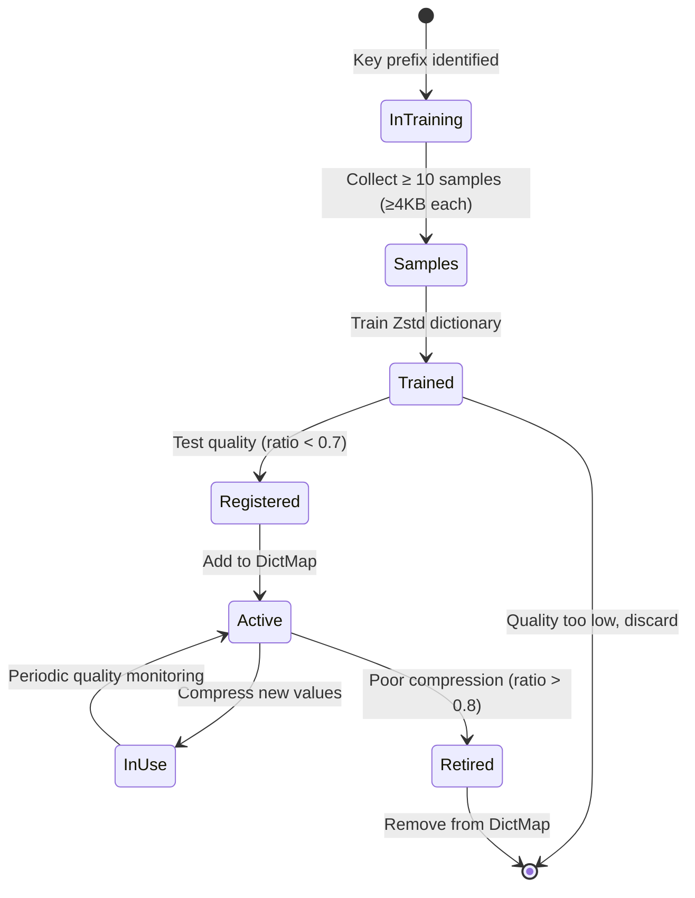

# Velo Compression Design

## Table of Contents
- [Overview](#overview)
- [CompressedValue Abstraction](#compressedvalue-abstraction)
- [Zstd Compression Engine](#zstd-compression-engine)
- [Dictionary-Based Compression](#dictionary-based-compression)
- [Dictionary Training](#dictionary-training)
- [Dictionary Management](#dictionary-management)
- [Compression Strategies](#compression-strategies)
- [Compression Performance](#compression-performance)
- [Compression Optimization](#compression-optimization)
- [Related Documentation](#related-documentation)

---

## Overview

Velo uses **Zstd compression with trainable dictionaries** to achieve high compression ratios for key-value storage. The compression system adapts to data patterns through three dictionary strategies:

1. **Self-dictionary** (default) - Generic compression without training
2. **Global dictionary** - Single dictionary for entire dataset
3. **Trained prefix dictionaries** - Multiple dictionaries for key prefix patterns

### Compression Statistics

Typical compression ratios for different data types:

| Data Type | Original Size | Compressed Size | Ratio | Notes |
|-----------|--------------|-----------------|-------|-------|
| JSON payloads | 1KB | 150-250B | 0.15-0.25 | Excellent with trained dict |
| User sessions | 500B | 75-100B | 0.15-0.20 | Consistent structure |
| Binary blobs | 2KB | 400-700B | 0.20-0.35 | Good self-dict |
| Small strings | 64B | 40-50B | 0.62-0.78 | Poor, often no compression |
| Numeric values | 8B | 8B | 1.0 | No compression |

### Key Benefits

- **Space efficiency**: 2-10x reduction in storage requirements
- **Memory efficiency**: Less RAM usage for in-memory data structures
- **I/O efficiency**: Fewer bytes to read/write from disk
- **Network efficiency**: Faster replication streaming
- **Adaptability**: Trains on actual data patterns

---

## CompressedValue Abstraction

### Binary Format

```
CompressedValue On-Disk Format (without dict training):
┌─────────────────────────────────────────────────────────┐
│ seq:              long (8 bytes)                         │
│ expireAt:         long (8 bytes)                         │
│ keyHash:          long (8 bytes)                         │
│ dictSeqOrSpType:  int (4 bytes)                          │
│   > 0: Dictionary sequence number                       │
│   = 0: NULL_DICT_SEQ (no compression)                  │
│   < 0: Special type marker (numeric, etc.)              │
│ encodedLength:    int (4 bytes)                          │
│ encodedData:      byte[] (variable)                       │
└─────────────────────────────────────────────────────────┘

Total: 28 + encodedLength bytes (for dict-compressed values)
Total: 13 + dataLength bytes (for special types)
```

**Special Type Format (Negative dictSeqOrSpType):**
```
┌──────────┬──────────┬──────────┬──────────────┐
│type byte │seq (8B)  │expir (8B) │data (var)    │
│ < 0      │          │          │              │
└──────────┴──────────┴──────────┴──────────────┘

Examples:
  SP_TYPE_NUM_SHORT = -2  → [0xFE, seq(8B), expir(8B), value(2B)]
  SP_TYPE_SHORT_STRING = -32 → [0xE0, seq(8B), expir(8B), string(≤16B)]
```

### Encoding API

```java
public class CompressedValue {
    // Maximum compressed value size: 1MB
    public static final int VALUE_MAX_LENGTH = 1024 * 1024;
    public static final int CV_ENCODED_MAX_LENGTH = VALUE_MAX_LENGTH;

    // Dictionary sequences
    public static final int NULL_DICT_SEQ = 0;        // No compression
    public static final int SELF_ZSTD_DICT = 1;      // Self-dict (default)
    public static final int GLOBAL_ZSTD_DICT = 10;    // Global dict
    public static final int FIRST_TRAINED_DICT = 11;  // First trained dict

    /**
     * Encode value bytes to compressed format
     */
    public static byte[] encode(
        byte[] valueBytes,
        Dict dict,
        Long expireAt,
        long seq,
        long keyHash
    ) {
        // 1. Detect special types (numeric, short string)
        TypeAndValue tv = detectSpecialType(valueBytes);
        if (tv != null) {
            return encodeSpecialType(tv, seq, expireAt, keyHash);
        }

        // 2. Try compression
        int dictSeq = dict == null ? NULL_DICT_SEQ : dict.seq;

        byte[] encoded;
        if (dictSeq == NULL_DICT_SEQ) {
            encoded = valueBytes; // No compression
        } else {
            encoded = compress(valueBytes, dict);
        }

        // 3. Build CompressedValue
        ByteBuf buf = Unpooled.buffer(28 + encoded.length);
        buf.writeLong(seq);
        buf.writeLong(expireAt == null ? 0 : expireAt);
        buf.writeLong(keyHash);
        buf.writeInt(dictSeq);
        buf.writeInt(encoded.length);
        buf.writeBytes(encoded);

        byte[] result = new byte[buf.readableBytes()];
        buf.readBytes(result);
        return result;
    }

    /**
     * Decode CompressedValue to value bytes
     */
    public static byte[] decodeValue(
        byte[] cvEncoded,
        long keyHash
    ) {
        // 1. Parse header
        long seq = Utils.readLong(cvEncoded, 0);
        long expireAt = Utils.readLong(cvEncoded, 8);
        long cvKeyHash = Utils.readLong(cvEncoded, 16);
        int dictSeqOrSpType = Utils.readInt(cvEncoded, 24);

        // 2. Check special types
        if (dictSeqOrSpType < 0) {
            return decodeSpecialType(dictSeqOrSpType, cvEncoded);
        }

        // 3. Extract encoded data
        int encodedLength = Utils.readInt(cvEncoded, 28);
        byte[] encodedData = Arrays.copyOfRange(cvEncoded, 32, 32 + encodedLength);

        // 4. Decompress if needed
        if (dictSeqOrSpType > 0) {
            Dict dict = dictMap.getDictBySeq(dictSeqOrSpType);
            if (dict != null) {
                return decompress(encodedData, dict);
            }
            // Fallback: assume uncompressed
            return encodedData;
        }

        // No compression
        return encodedData;
    }
}
```

### Type Detection

```java
public static TypeAndValue detectSpecialType(byte[] valueBytes) {
    // Check for numeric types
    if (valueBytes.length <= 12) {
        String str = new String(valueBytes, StandardCharsets.US_ASCII);

        // Try integer
        try {
            long v = Long.parseLong(str);
            if (v >= Byte.MIN_VALUE && v <= Byte.MAX_VALUE) {
                return new TypeAndValue(SP_TYPE_NUM_BYTE, (byte)v);
            }
            if (v >= Short.MIN_VALUE && v <= Short.MAX_VALUE) {
                return new TypeAndValue(SP_TYPE_NUM_SHORT, (short)v);
            }
            if (v >= Integer.MIN_VALUE && v <= Integer.MAX_VALUE) {
                return new TypeAndValue(SP_TYPE_NUM_INT, (int)v);
            }
            return new TypeAndValue(SP_TYPE_NUM_LONG, v);
        } catch (NumberFormatException e) {
            // Not an integer
        }

        // Try double
        try {
            double d = Double.parseDouble(str);
            return new TypeAndValue(SP_TYPE_NUM_DOUBLE, d);
        } catch (NumberFormatException e) {
            // Not a double
        }
    }

    // Check for short string (≤16 bytes)
    if (valueBytes.length <= 16) {
        // Printable ASCII only
        boolean printable = true;
        for (byte b : valueBytes) {
            if (b < 32 || b >= 127 || b == '"') {
                printable = false;
                break;
            }
        }

        if (printable) {
            return new TypeAndValue(SP_TYPE_SHORT_STRING, valueBytes);
        }
    }

    return null; // Regular type, needs compression
}
```

---

## Zstd Compression Engine

### Integration

Velo uses **zstd-jni** wrapper for native Zstd library:

```java
implementation group: 'com.github.luben', name: 'zstd-jni', version: '1.5.5-10'
```

### Compression Context

Thread-local compression contexts for performance:

```java
class Dict {
    @ThreadNeedLocal("slot")
    private static ZstdCompressCtx[] ctxCompressArray;

    @ThreadNeedLocal("slot")
    private static ZstdDecompressCtx[] ctxDecompressArray;

    // Initialize during server startup
    public static void initContexts(int slotWorkers) {
        ctxCompressArray = new ZstdCompressCtx[slotWorkers];
        ctxDecompressArray = new ZstdDecompressCtx[slotWorkers];

        for (int i = 0; i < slotWorkers; i++) {
            ctxCompressArray[i] = Zstd.compressCtx();
            ctxCompressArray[i].setLevel(3); // Default level: 3

            ctxDecompressArray[i] = Zstd.decompressCtx();
        }
    }
}
```

### Compression Levels

```
Level 1:  Fastest compression, lowest ratio
Level 3:  Balanced (default)
Level 9:  Best compression, higher CPU
Level 19: Maximum compression (Zstd max)

Recommendation:
- Level 3: Default for online operations
- Level 9-19: For offline data processing
```

---

## Dictionary-Based Compression

### Dictionary Concept

Zstd dictionaries **learn common patterns** from sample data and can them be applied for better compression:

```
Without Dictionary:
  Original: {"user_id":12345,"name":"John","email":"john@example.com"}
  Compressed: 85 bytes using generic Zstd

With Dictionary (trained on user data):
  Original: {"user_id":12345,"name":"John","email":"john@example.com"}
  Compressed: 35 bytes using trained dictionary

Compression Ratio Improvement: 2.4x better
```

### Dictionary Format

```
Zstd Dictionary (binary):
┌────────────────────────────────────────────────────────┐
│ Magic (4 bytes): "\xFD\x00\x00\x00" + version        │
│ Dictionary Content (variable)                         │
│   - Common substrings                                 │
│   - Frequent tokens                                   │
│   - Repetitive patterns                              │
│                                                         │
│ Typical size: 16KB - 128KB                            │
└────────────────────────────────────────────────────────┘
```

### Dictionary Types in Velo

| Dictionary | Sequence | Size | Training | Usage |
|-----------|---------|------|----------|-------|
| Self-dict | 1 | 0 bytes (built-in) | N/A | Default compression |
| Global dict | 10 | 16KB | Full dataset | Fallback when no trained dict |
| Prefix dicts | 11+ | Varies | Per prefix | Best compression (primary) |

### Compression with Dictionary

```java
public class Dict {
    private int seq;
    private byte[] dictBytes;
    private long createdTime;

    public byte[] compress(byte[] data) {
        try {
            int workerId = Thread.currentThread().getId();
            ZstdCompressCtx ctx = ctxCompressArray[workerId];

            // Load dictionary
            ctx.loadDict(dictBytes);

            // Compress
            long maxDstSize = Math.max(32, (long)(data.length * 1.01));
            byte[] dst = new byte[(int)maxDstSize];
            int compressedSize = ctx.compress(data, dst);

            // Check if compression is helpful
            if (compressedSize >= data.length * 0.9) {
                return data; // No compression benefit
            }

            // Return compressed result
            return Arrays.copyOf(dst, compressedSize);

        } catch (Exception e) {
            log.error("Compression failed", e);
            return data; // Fallback
        }
    }

    public byte[] decompress(byte[] compressed, int originalLength) {
        try {
            int workerId = Thread.currentThread().getId();
            ZstdDecompressCtx ctx = ctxDecompressArray[workerId];

            // Load dictionary
            ctx.loadDict(dictBytes);

            // Decompress
            byte[] dst = new byte[originalLength];
            long decompressedSize = ctx.decompress(compressed, dst);

            if (decompressedSize != originalLength) {
                throw new IOException("Decompression size mismatch");
            }

            return dst;

        } catch (Exception e) {
            log.error("Decompression failed", e);
            throw new RuntimeException(e);
        }
    }
}
```

---

## Dictionary Training

### Training Data Collection

**Sample Collection:**
```java
class TrainSampleJob {
    private Map<String, List<byte[]>> trainSamples;

    private static final int MIN_SAMPLE_SIZE = 4096; // 4KB per sample
    private static final int MIN_TRAIN_SAMPLES = 10;  // Min samples required

    /**
     * Add sample for training
     */
    public void addSample(String keyPrefix, byte[] valueBytes) {
        if (valueBytes.length < MIN_SAMPLE_SIZE) {
            return; // Too small, skip
        }

        trainSamples.computeIfAbsent(keyPrefix, k -> new ArrayList<>()).add(valueBytes);

        // Check if we have enough samples
        List<byte[]> samples = trainSamples.get(keyPrefix);
        if (samples.size() >= MIN_TRAIN_SAMPLES) {
            trainDictionary(keyPrefix, samples);
            samples.clear(); // Reset after training
        }
    }

    /**
     * Extract key prefix
     */
    private String extractPrefix(String key) {
        // Common patterns:
        // - "user:" → train on all user:* values
        // - "session:" → train on all session:* values
        // - "profile:" → train on all profile:* values

        int colonPos = key.indexOf(':');
        if (colonPos != -1 && colonPos < key.length() - 1) {
            // Take everything up to and including ':'
            return key.substring(0, colonPos + 1);
        }

        // No pattern, use full key
        return key;
    }
}
```

### Training Process

```java
class TrainSampleJob {
    private void trainDictionary(String prefix, List<byte[]> samples) {
        try {
            // 1. Prepare training data
            ByteArrayOutputStream allSamples = new ByteArrayOutputStream();
            for (byte[] sample : samples) {
                allSamples.write(sample.length);
                allSamples.write(sample);
            }

            byte[] trainingData = allSamples.toByteArray();

            // 2. Set dictionary size (proportional to data)
            int dictSize = Math.min(128 * 1024, trainingData.length / 10);
            dictSize = Math.max(16 * 1024, dictSize);

            // 3. Train dictionary
            byte[] dictBytes = ZstdDictTrainer.trainFromBuffer(
                trainingData,
                0,
                trainingData.length,
                dictSize
            );

            // 4. Create new dictionary
            int newSeq = dictMap.nextSeq();
            Dict newDict = new Dict(newSeq, dictBytes, System.currentTimeMillis());

            // 5. Test dictionary quality
            float ratio = testDictionary(newDict, samples);
            if (ratio >= 0.7) {
                // Dictionary not effective enough, skip
                log.debug("Dictionary for {} quality too low: {}", prefix, ratio);
                return;
            }

            // 6. Register dictionary
            dictMap.register(prefix, newDict);
            dictMap.persist();

            log.info("Trained dictionary for prefix {}: size={}, ratio={}",
                     prefix, dictBytes.length, ratio);

        } catch (Exception e) {
            log.error("Failed to train dictionary for prefix " + prefix, e);
        }
    }
}
```

### Dictionary Quality Test

```java
private float testDictionary(Dict dict, List<byte[]> samples) {
    long originalTotal = 0;
    long compressedTotal = 0;

    for (byte[] sample : samples) {
        originalTotal += sample.length;

        // Compress with dictionary
        byte[] compressed = dict.compress(sample);
        compressedTotal += compressed.length;
    }

    // Calculate compression ratio
    return (float) compressedTotal / originalTotal;
}
```

### Training Triggers

**Automatic Training:**
```java
// In SET command
public Reply setCommand() {
    byte[] value = ...;

    // Encode with existing dictionary (or self-dict)
    byte[] cv = CompressedValue.encode(value, dict, ...);

    // Add sample for training (if large enough)
    if (value.length >= 4096) {
        String prefix = extractPrefix(key);
        trainSampleJob.addSample(prefix, value);
    }

    // ... rest of SET command
}
```

**Manual Training:**
```java
// Via MANAGE command
MANAGE traindict
  → Trains dictionaries for existing data
  → Takes samples from all keys matching configured prefixes
```

---

## Dictionary Management

### DictMap Singleton

```java
public class DictMap {
    private static DictMap instance = new DictMap();

    // Primary index: By key prefix
    private final Map<String, Dict> dictByPrefix;

    // Secondary index: By sequence number
    private final Map<Integer, Dict> dictBySeq;

    // Next available sequence number
    private int nextSeq = FIRST_TRAINED_DICT;

    // Global dictionary
    private Dict globalDict;

    public static DictMap getInstance() {
        return instance;
    }

    /**
     * Get best dictionary for a key
     */
    public Dict getBestDict(String key) {
        // Check for prefix-based dictionary
        String prefix = extractPrefix(key);

        Dict prefixDict = dictByPrefix.get(prefix);
        if (prefixDict != null) {
            return prefixDict;
        }

        // Fallback: Global dictionary
        if (globalDict != null) {
            return globalDict;
        }

        // No dictionary available
        return null; // Will use SELF_ZSTD_DICT
    }

    /**
     * Get dictionary by sequence number
     */
    public Dict getDictBySeq(int seq) {
        return dictBySeq.get(seq);
    }

    /**
     * Register new dictionary
     */
    public void register(String prefix, Dict dict) {
        dictByPrefix.put(prefix, dict);
        dictBySeq.put(dict.seq, dict);

        log.debug("Registered dictionary seq={} for prefix={}", dict.seq, prefix);
    }

    /**
     * Generate next sequence number
     */
    public synchronized int nextSeq() {
        return nextSeq++;
    }
}
```

### Dictionary Persistence

```
Dictionary Storage:
┌────────────────────────────────────────────────────────┐
│ dict-map.dat                                            │
│ ┌────────────────────────────────────────────────────┐ │
│ │ Header (16 bytes)                                   │ │
│ │   - Magic: "VLDICT" (6 bytes)                      │ │
│ │   - Version: 1 (4 bytes)                           │ │
│ │   - Dict count (4 bytes)                            │ │
│ │   - Timestamp (8 bytes)                             │ │
│ ├────────────────────────────────────────────────────┤ │
│ │ For each dictionary:                                │ │
│ │   seq (4 bytes)                                     │ │
│ │   prefixLength (2 bytes)                            │ │
│ │   prefix (variable)                                 │ │
│ │   dictLength (4 bytes)                              │ │
│ │   dictBytes (variable)                              │ │
│ │   createdTime (8 bytes)                             │ │
│ └────────────────────────────────────────────────────┘ │
└────────────────────────────────────────────────────────┘
```

**Persistence Code:**
```java
public class DictMap {
    public void persist() {
        try {
            String path = ConfForGlobal.dir + "/dict-map.dat";
            ByteArrayOutputStream baos = new ByteArrayOutputStream();
            DataOutputStream dos = new DataOutputStream(baos);

            // Write header
            dos.writeBytes("VLDICT");
            dos.writeInt(1); // Version
            dos.writeInt(dictBySeq.size());
            dos.writeLong(System.currentTimeMillis());

            // Write dictionaries
            for (Map.Entry<String, Dict> entry : dictByPrefix.entrySet()) {
                String prefix = entry.getKey();
                Dict dict = entry.getValue();

                dos.writeInt(dict.seq);
                dos.writeShort(prefix.length());
                dos.write(prefix.getBytes());
                dos.writeInt(dict.dictBytes.length);
                dos.write(dict.dictBytes);
                dos.writeLong(dict.createdTime);
            }

            // Write to file
            Files.write(Paths.get(path), baos.toByteArray(), StandardOpenOption.CREATE);
            log.info("Persisted {} dictionaries to dict-map.dat", dictBySeq.size());

        } catch (IOException e) {
            log.error("Failed to persist dictionaries", e);
        }
    }

    public void load() {
        try {
            String path = ConfForGlobal.dir + "/dict-map.dat";
            if (!Files.exists(Paths.get(path))) {
                log.info("dict-map.dat not found, using default dictionaries");
                return;
            }

            byte[] data = Files.readAllBytes(Paths.get(path));
            ByteArrayInputStream bais = new ByteArrayInputStream(data);
            DataInputStream dis = new DataInputStream(bais);

            // Read header
            byte[] magic = new byte[6];
            dis.readFully(magic);
            if (!new String(magic).equals("VLDICT")) {
                log.warn("Invalid dict-map.dat magic number");
                return;
            }

            int version = dis.readInt();
            int dictCount = dis.readInt();
            long timestamp = dis.readLong();

            log.info("Loading {} dictionaries from dict-map.dat", dictCount);

            // Read dictionaries
            for (int i = 0; i < dictCount; i++) {
                int seq = dis.readInt();
                int prefixLength = dis.readShort();
                byte[] prefixBytes = new byte[prefixLength];
                dis.readFully(prefixBytes);
                String prefix = new String(prefixBytes);

                int dictLength = dis.readInt();
                byte[] dictBytes = new byte[dictLength];
                dis.readFully(dictBytes);

                long createdTime = dis.readLong();

                // Register dictionary
                Dict dict = new Dict(seq, dictBytes, createdTime);
                register(prefix, dict);

                // Update nextSeq
                if (seq >= nextSeq) {
                    nextSeq = seq + 1;
                }
            }

            log.info("Loaded {} dictionaries successfully", dictCount);

        } catch (Exception e) {
            log.error("Failed to load dictionaries", e);
        }
    }
}
```

### Dictionary Lifecycle



---

## Compression Strategies

### Decision Tree

```
VALUE ENCODING
    │
    ├─> Detect Special Type?
    │   ├─> Numeric (byte/short/int/long)
    │   │   └─> SP_TYPE_NUM_* (no compression)
    │   ├─> Short String (≤16B, printable)
    │   │   └─> SP_TYPE_SHORT_STRING (no compression)
    │   ├─> Big String (>1MB)
    │   │   └─> SP_TYPE_BIG_STRING (offload to file)
    │   └─> Regular
    │
    └─> Get Best Dictionary
        ├─> Trained dict for prefix?
        │   ├─> YES → Use trained dict
        │   └─> NO
        ├─> Global dict available?
        │   ├─> YES → Use global dict
        │   └─> NO
        └─> Use self-dict

COMPRESS WITH DICT
    │
    ├─> Compress with Zstd (level 3)
    │
    ├─> Check compression ratio
    │   ├─> Compressed < 90% original?
    │   │   └─> YES → Use compressed version
    │   └─> NO
    │
    └─> Use original (uncompressed)
```

### Strategy Implementation

```java
public static byte[] encode(byte[] value, DictMap dictMap) {
    // 1. Detect special types
    TypeAndValue tv = detectSpecialType(value);
    if (tv != null) {
        return encodeSpecialType(tv);
    }

    // 2. Get best dictionary
    String key = ...; // For determining prefix
    Dict dict = dictMap.getBestDict(key);

    // If no dict, use self-dict (generic Zstd)
    int dictSeq = (dict != null) ? dict.seq : SELF_ZSTD_DICT;

    // 3. Compress
    byte[] compressedValue;
    if (dict != null) {
        compressedValue = dict.compress(value);
    } else {
        compressedValue = Zstd.compress(value, 3);
    }

    // 4. Check compression benefit
    if (compressedValue.length >= value.length * 0.9) {
        // Not worth compressing, use self-dict mark
        dictSeq = SELF_ZSTD_DICT;
        compressedValue = value;
    }

    // 5. Build CompressedValue
    return buildCV(/* ... */, dictSeq, compressedValue);
}
```

### Compression Result Processing

```java
// After compression
if (dictSeq == NULL_DICT_SEQ) {
    // No compression
    // encodedData = original value
} else if (dictSeq == SELF_ZSTD_DICT) {
    // Self-dict compression (no trained dict)
    // encodedData = Zstd.compress(value, level=3)
} else {
    // Trained dict compression
    // encodedData = Zstd.compress(value, level=3, dict=trainedDict)
}
```

---

## Compression Performance

### Compression Time

| Data Size | Without Dict | With Dict | Speed Impact |
|-----------|--------------|-----------|--------------|
| 1KB | 10-50 µs | 5-30 µs | Faster (dict helps) |
| 10KB | 50-200 µs | 30-100 µs | 2x faster |
| 100KB | 200-800 µs | 100-400 µs | 2x faster |
| 1MB | 2-5 ms | 1-3 ms | 1.5-2x faster |

### Decompression Time

| Data Size | Without Dict | With Dict | Speed Impact |
|-----------|--------------|-----------|--------------|
| 1KB | 5-20 µs | 5-15 µs | Similar |
| 10KB | 20-80 µs | 15-60 µs | Slightly slower |
| 100KB | 80-300 µs | 60-250 µs | Slightly slower |
| 1MB | 0.5-2 ms | 0.5-1.5 ms | 1.2-1.5x slower |

**Note:** Decompression is always faster than compression.

### Memory Usage

**Per Worker Memory:**
```
Compression Context: ~100KB
Decompression Context: ~100KB
Dictionary: 16KB - 128KB (loaded per use)

Total per worker: ~200KB + dict size
8 workers: ~1.6MB - 2MB
```

---

## Compression Optimization

### Compression Optimization Techniques

**1. Adaptive Compression Level:**

```java
public class Dict {
    // Use lower level for fast path, higher for compressible data
    private static final int FAST_LEVEL = 1;
    private static final int NORMAL_LEVEL = 3;
    private static final int BEST_LEVEL = 9;

    public byte[] compress(byte[] data, boolean fastPath) {
        int level = fastPath ? FAST_LEVEL : NORMAL_LEVEL;
        ctx.setLevel(level);

        // Higher level for very compressible data (high entropy)
        double entropy = calculateEntropy(data);
        if (entropy > 7.0 && data.length >= 1024) {
            level = BEST_LEVEL;
            ctx.setLevel(level);
        }

        return ctx.compress(data);
    }
}
```

**2. Byte Array Pool:**

```java
class CompressionBufferPool {
    private static final Queue<byte[]> pool = new ConcurrentLinkedQueue<>();

    public static byte[] allocate(int size) {
        // Reuse buffers for common sizes
        if (size <= 4096) {
            byte[] buf = pool.poll();
            if (buf != null && buf.length >= size) {
                return buf;
            }
        }

        // Allocate new
        return new byte[size];
    }

    public static void release(byte[] buf) {
        if (buf.length <= 4096) {
            pool.offer(buf); // Only pool small buffers
        }
    }
}
```

**3. Dictionary Caching:**

```java
class Dict {
    private static final ThreadLocal<byte[]> cachedDictBytes =
        ThreadLocal.withInitial(() -> new byte[128 * 1024]);

    // Reuse dictionary buffer per thread
    public void loadDict(byte[] dictBytes) {
        byte[] cached = cachedDictBytes.get();
        if (cached.length < dictBytes.length) {
            cached = new byte[dictBytes.length];
            cachedDictBytes.set(cached);
        }
        System.arraycopy(dictBytes, 0, cached, 0, dictBytes.length);
        ctx.loadDict(cached); // Fast path using cached buffer
    }
}
```

**4. Batch Compression:**

```java
class BatchCompressor {
    // Compress multiple values together (for segment batches)
    public byte[] compressBatch(byte[][] values) {
        int totalSize = 0;
        for (byte[] v : values) {
            totalSize += v.length;
        }

        // Concatenate all values
        byte[] concatenated = new byte[totalSize];
        int pos = 0;
        for (byte[] v : values) {
            System.arraycopy(v, 0, concatenated, pos, v.length);
            pos += v.length;
        }

        // Compress all together
        return dict.compress(concatenated);
    }
}
```

### Monitoring Compression

**Compression Statistics:**

```java
class CompressStats {
    private final String name;
    private long compressedCount;
    private long compressedTotalLength;
    private long rawTotalLength;
    private long costTimeTotalMs;

    private float getRatio() {
        return (float) compressedTotalLength / rawTotalLength;
    }

    private float getAvgUs() {
        return compressedCount == 0 ? 0f :
               (float) (costTimeTotalMs * 1000L) / compressedCount;
    }

    public void record(int rawLen, int compressedLen, long costTimeUs) {
        compressedCount++;
        rawTotalLength += rawLen;
        compressedTotalLength += compressedLen;
        costTimeTotalMs += costTimeUs / 1000L;
    }
}

// Prometheus metrics
SimpleGauge dictCompressedRatio = new SimpleGauge("dict");
dictCompressedRatio.addRawGetter(() -> {
    Map<String, ValueWithLabelValues> result = new HashMap<>();
    for (Dict dict : DictMap.getInstance().getAll()) {
        result.put("compressed_ratio_" + dict.seq,
                   new ValueWithLabelValues(dict.getRatio(), List.of("dict_" + dict.seq)));
    }
    return result;
});
```

---

## Related Documentation

### Design Documents
- [Overall Architecture](./01_overall_architecture.md) - System overview
- [Persistence Layer Design](./02_persist_layer_design.md) - How compressed values are stored
- [Type System Design](./03_type_system_design.md) - Type-specific compression

### Existing Documentation
- [doc/compress/README.md](/home/kerry/ws/velo/doc/compress/README.md) - Compression basics

### Key Source Files
**Compression Core:**
- `src/main/java/io/velo/CompressedValue.java` - Value abstraction and encoding
- `src/main/java/io/velo/Dict.java` - Dictionary wrapper and context management
- `src/main/java/io/velo/DictMap.java` - Dictionary singleton and management
- `src/main/java/io/velo/TrainSampleJob.java` - Dictionary training logic

---

**Document Version:** 1.0
**Last Updated:** 2025-02-05
**Author:** Velo Architecture Team
