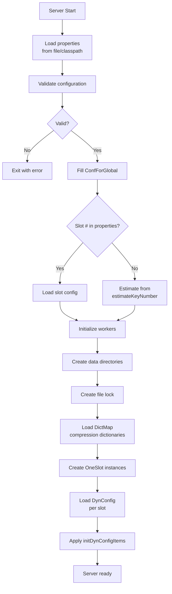

# Velo Configuration Design

## Table of Contents
- [Overview](#overview)
- [Configuration Architecture](#configuration-architecture)
- [Global Configuration (ConfForGlobal)](#global-configuration-conf-for-global)
- [Slot Configuration (ConfForSlot)](#slot-configuration-conf-forslot)
- [Dynamic Configuration (DynConfig)](#dynamic-configuration-dynconfig)
- [Volume Configuration](#volume-configuration)
- [Configuration Loading](#configuration-loading)
- [Configuration Validation](#configuration-validation)
- [Dynamic Updates](#dynamic-updates)
- [Related Documentation](#related-documentation)

---

## Overview

Velo's configuration system manages settings at **three levels**:

1. **Global Configuration** - Server-wide settings via `velo.properties`
2. **Slot Configuration** - Per-slot presets based on data characteristics
3. **Dynamic Configuration** - Runtime-updatable settings per slot

### Configuration Characteristics

| Level | Scope | Persistence | Updates | Use Cases |
|-------|-------|------------|---------|-----------|
| Global | Server-wide | File system | Restart required | Network, threading, storage |
| Slot | Per-slot shard | Enum + file | Restart required | Buckets, chunks, WAL tuning |
| Dynamic | Per-slot | JSON file | Runtime | LRU size, monitoring, limits |

---

## Configuration Architecture

```
Configuration Sources (priority order):
┌─────────────────────────────────────────────────────┐
│ 1. System properties      (-Dvelo.xxx=value)       │
│ 2. File system path        (./velo.properties)       │
│ 3. Classpath resources     (/velo.properties)       │
│ 4. Defaults                (Hardcoded values)       │
└─────────────────────────────────────────────────────┘

                    │
                    ▼
┌─────────────────────────────────────────────────────┐
│              Configuration Loader                    │
│  - Parse properties                                 │
│  - Validate types and ranges                         │
│  - Convert to typed values                           │
└─────────────────────────────────────────────────────┘
                    │
        ┌───────────┴───────────┐
        │                       │
        ▼                       ▼
┌───────────────┐      ┌───────────────┐
│ ConfForGlobal │      │ ConfForSlot  │
│ Static fields │      │ Enum presets  │
└───────────────┘      └───────────────┘
        │                       │
        │                       ▼
        │            ┌─────────────────────┐
        │            │ Initialize slots    │
        │            │ (select preset)      │
        │            └─────────────────────┘
        │                       │
        ▼                       ▼
┌───────────────┐      ┌───────────────┐
│ Server setup  │      │ Per-slot DynConf│
│ (workers, etc) │◄─────┤ (runtime JSON)  │
└───────────────┘      └───────────────┘
```

---

## Global Configuration (ConfForGlobal)

### Configuration File: `velo.properties`

```
# Server
dir=/tmp/velo-data
net.listenAddresses=0.0.0.0:7379

# Performance
estimateKeyNumber=10000000
estimateOneValueLength=200
keyAnalysisNumberPercent=1

# Threading
slotNumber=4
slotWorkers=4
netWorkers=2
indexWorkers=1

# Compression
isValueSetUseCompression=true
isOnDynTrainDictForCompression=true

# Replication
zookeeperConnectString=localhost:2181
zookeeperSessionTimeoutMs=60000
zookeeperConnectionTimeoutMs=15000
zookeeperRootPath=/velo
canBeLeader=true
isAsSlaveOfSlave=false
targetAvailableZone=zone1

# Jedis Pool
jedisPoolMaxTotal=64
jedisPoolMaxIdle=16
jedisPoolMaxWaitMillis=2000

# Other
doubleScale=10.0
bigStringNoMemoryCopySize=512000
bigStringNoCompressMinSize=500000
PASSWORD=my_secret_password
```

### Static Fields Structure

```java
public final class ConfForGlobal implements ConfInterface {
    // ============================================
    // Server Configuration
    // ============================================
    public static String dirPath = "/tmp/velo-data";
    public static String netListenAddresses = "0.0.0.0:7379";

    // ============================================
    // Capacity Planning
    // ============================================
    public static long estimateKeyNumber = 10000;      // Max: 10,000,000
    public static int estimateOneValueLength = 200;
    public static int keyAnalysisNumberPercent = 1;   // 1-100%

    // ============================================
    // Resource Allocation
    // ============================================
    public static short slotNumber = 4;               // Must be power of 2
    public static int slotWorkers = 4;
    public static int netWorkers = 2;
    public static int indexWorkers = 1;

    // ============================================
    // Compression Settings
    // ============================================
    public static boolean isValueSetUseCompression = true;
    public static boolean isOnDynTrainDictForCompression = true;

    // ============================================
    // Replication Configuration
    // ============================================
    public static String zookeeperConnectString = "";
    public static int zookeeperSessionTimeoutMs = 60000;
    public static int zookeeperConnectionTimeoutMs = 15000;
    public static String zookeeperRootPath = "/velo";
    public static boolean canBeLeader = true;
    public static boolean isAsSlaveOfSlave = false;
    public static String targetAvailableZone = "";

    // ============================================
    // Jedis Client Pool
    // ============================================
    public static int jedisPoolMaxTotal = 64;
    public static int jedisPoolMaxIdle = 16;
    public static int jedisPoolMaxWaitMillis = 2000;

    // ============================================
    // Other Settings
    // ============================================
    public static double doubleScale = 10.0;
    public static int bigStringNoMemoryCopySize = 512000;
    public static int bigStringNoCompressMinSize = 500000;
    public static String PASSWORD = "";

    // ============================================
    // Runtime Configuration Items
    // ============================================
    public static final Map<String, Object> initDynConfigItems = new HashMap<>();

    /**
     * Check if configuration is valid
     */
    public static boolean checkIfValid() {
        // Check estimateKeyNumber
        if (estimateKeyNumber < 1 || estimateKeyNumber > 10_000_000L) {
            log.error("Invalid estimateKeyNumber: {}", estimateKeyNumber);
            return false;
        }

        // Check keyAnalysisNumberPercent
        if (keyAnalysisNumberPercent < 1 || keyAnalysisNumberPercent > 100) {
            log.error("Invalid keyAnalysisNumberPercent: {}", keyAnalysisNumberPercent);
            return false;
        }

        // Check slotNumber (must be power of 2)
        if (slotNumber < 1 || (slotNumber & (slotNumber - 1)) != 0) {
            log.error("Invalid slotNumber (must be power of 2): {}", slotNumber);
            return false;
        }

        return true;
    }
}
```

### Configuration Loading

```java
void loadConfiguration() {
    // 1. Load from configuration file
    String configPath = System.getProperty("velo.config", "velo.properties");
    String fullPath = Files.exists(Paths.get(configPath)) ?
                        configPath :
                        ConfForGlobal.class.getResource("/velo.properties").getPath();

    // 2. Parse properties using ActiveJ Config
    Config config = Config.create()
        .with("dir", "/tmp/velo-data")
        .with("net.listenAddresses", "0.0.0.0:7379")
        .with("slotNumber", 4)
        .with("slotWorkers", 4)
        .overrideWith(ApplicationSettings.ofProperties(fullPath))
        .overrideWith(ApplicationSettings.ofSystemProperties()); // Highest priority

    // 3. Populate ConfForGlobal static fields
    ConfForGlobal.dirPath = config.get("dir");
    ConfForGlobal.netListenAddresses = config.get("net.listenAddresses");
    ConfForGlobal.estimateKeyNumber = config.get("estimateKeyNumber");
    ConfForGlobal.slotNumber = config.get("slotNumber");
    ConfForGlobal.slotWorkers = config.get("slotWorkers");
    ConfForGlobal.netWorkers = config.get("netWorkers");
    ConfForGlobal.indexWorkers = config.get("indexWorkers");
    // ... and so on

    // 4. Validate
    if (!ConfForGlobal.checkIfValid()) {
        throw new IllegalStateException("Invalid configuration");
    }

    // 5. Setup ACL if PASSWORD configured
    if (!ConfForGlobal.PASSWORD.isEmpty()) {
        setupAclUsers();
    }
}
```

---

## Slot Configuration (ConfForSlot)

### Presets

Velo provides **three configuration presets** based on estimated key count:

| Preset | Key Count | Buckets | Segs per File | Files | Use Case |
|--------|-----------|---------|---------------|-------|-----------|
| debugMode | 100K | 16K | 4K | 2 | Development/testing |
| c1m | 1M | 16K | 16K | 4 | Small production |
| c10m | 10M | 256K | 16K | 8 | Large production |

### Nested Configuration Classes

```java
public enum ConfForSlot implements ConfInterface {
    debugMode, c1m, c10m;

    // ============================================
    // Bucket Configuration
    // ============================================
    public static class ConfBucket implements ConfInterface {
        public int bucketsPerSlot = 16384;
        public int initialSplitNumber = 1;
        public int onceScanMaxLoopCount = 100;
        public LRUConfig lruPerFd = LRUConfig.fromPercent(100);

        @Override
        public boolean checkIfValid() {
            if (bucketsPerSlot <= 0) return false;
            if (bucketsPerSlot > 1024 * 1024) return false;
            if ((bucketsPerSlot & (bucketsPerSlot - 1)) != 0) return false;
            return true;
        }
    }

    // ============================================
    // Chunk Storage Configuration
    // ============================================
    public static class ConfChunk implements ConfInterface {
        public int segmentNumberPerFd = 16384;
        public int fdPerChunk = 2;
        public int segmentLength = 4096;
        public boolean isSegmentUseCompression = true;
        public int onceReadSegmentCountWhenRepl = 2;

        @Override
        public boolean checkIfValid() {
            if (segmentNumberPerFd <= 0) return false;
            if (segmentLength != 4096 && segmentLength != 16384 &&
                segmentLength != 65536 && segmentLength != 262144) return false;
            if (fdPerChunk < 1 || fdPerChunk > 64) return false;
            return true;
        }
    }

    // ============================================
    // WAL Configuration
    // ============================================
    public static class ConfWal implements ConfInterface {
        public int oneChargeBucketNumber = 32;
        public int valueSizeTrigger = 200;
        public int shortValueSizeTrigger = 200;
        public int atLeastDoPersistOnceIntervalMs = 0;

        @Override
        public boolean checkIfValid() {
            if (oneChargeBucketNumber < 16 || oneChargeBucketNumber > 64) return false;
            if (valueSizeTrigger <= 0) return false;
            if (shortValueSizeTrigger < 0 || shortValueSizeTrigger >= valueSizeTrigger) return false;
            return true;
        }
    }

    // ============================================
    // Replication Configuration
    // ============================================
    public static class ConfRepl implements ConfInterface {
        public int binlogOneSegmentLength = 262144;
        public long binlogOneFileMaxLength = 33554432; // 32MB
        public int binlogForReadCacheSegmentMaxCount = 100;
        public long catchUpOffsetMinDiff = 1048576;
        public long catchUpIntervalMillis = 50;

        public ReplProperties generateReplProperties() {
            return new ReplProperties(
                confBucket.bucketsPerSlot,
                confWal.oneChargeBucketNumber,
                confChunk.segmentNumberPerFd,
                confChunk.fdPerChunk,
                confChunk.segmentLength,
                confChunk.isSegmentUseCompression
            );
        }

        @Override
        public boolean checkIfValid() {
            if (binlogOneSegmentLength <= 0) return false;
            if (binlogOneFileMaxLength <= binlogOneSegmentLength) return false;
            if (binlogForReadCacheSegmentMaxCount < 0) return false;
            return true;
        }
    }

    // ============================================
    // Nested Instances
    // ============================================
    public final ConfBucket confBucket = new ConfBucket();
    public final ConfChunk confChunk = new ConfChunk();
    public final ConfWal confWal = new ConfWal();
    public final ConfRepl confRepl = new ConfRepl();
    public final LRUConfig lruMaxSize = LRUConfig.fromMB(500);

    @Override
    public boolean checkIfValid() {
        if (!confBucket.checkIfValid()) return false;
        if (!confChunk.checkIfValid()) return false;
        if (!confWal.checkIfValid()) return false;
        if (!confRepl.checkIfValid()) return false;
        if (lruMaxSize.getSize() <= 0) return false;
        return true;
    }

    public long estimateMemoryBytesPrepare() {
        // Estimate memory preparation for slot
        return confBucket.estimateMemoryBytesPrepare() +
               confChunk.estimateMemoryBytesPrepare() +
               lruMaxSize.getSize();
    }
}
```

### Preset Configurations

```java
// Debug Mode (100K keys)
debugMode {
    confBucket.bucketsPerSlot = 16384;
    confChunk.fdPerChunk = 2;
    confWal.oneChargeBucketNumber = 16;
    lruMaxSize = LRUConfig.fromMB(100);
}

// 1 Million Keys
c1m {
    confBucket.bucketsPerSlot = 16384;
    confChunk.fdPerChunk = 2;
    confChunk.segmentNumberPerFd = 16384;
    confWal.oneChargeBucketNumber = 32;
    lruMaxSize = LRUConfig.fromMB(500);
}

// 10 Million Keys
c10m {
    confBucket.bucketsPerSlot = 262144; // 256K buckets
    confChunk.fdPerChunk = 8;
    confChunk.segmentNumberPerFd = 16384;
    confWal.oneChargeBucketNumber = 32;
    lruMaxSize = LRUConfig.fromMB(1000);
}
```

### Slot Preset Selection

```java
public static ConfForSlot from(long estimateKeyNumber) {
    if (estimateKeyNumber <= 100_000) {
        return debugMode;
    } else if (estimateKeyNumber <= 1_000_000) {
        return c1m;
    } else {
        return c10m;
    }
}
```

### Runtime Override

Slot configuration can be **overridden from properties**:

```properties
# Override bucket settings
bucket.bucketsPerSlot=65536
bucket.initialSplitNumber=1
bucket.lruPerFd.percent=50

# Override chunk settings
chunk.segmentNumberPerFd=32768
chunk.fdPerChunk=4
chunk.isSegmentUseCompression=false

# Override WAL settings
wal.oneChargeBucketNumber=16
wal.valueSizeTrigger=400
```

---

## Dynamic Configuration (DynConfig)

### Per-Slot JSON File

```
slot-N/dyn_config.json

{
  "masterUuid": null,
  "readonly": false,
  "canRead": true,
  "canWrite": true,
  "binlogOn": false,
  "maxConnections": 0,
  "dict_key_prefix_groups": [],
  "monitor_big_key_top_k": 0,
  "type_zset_member_max_length": 255,
  "type_set_member_max_length": 255,
  "type_zset_max_size": 4096,
  "type_hash_max_size": 4096,
  "type_list_max_size": 32767
}
```

### DynConfig Implementation

```java
public class DynConfig {
    private final short slotIndex;
    private final String slotDir;
    private final String configFilePath;

    // ============================================
    // Replication Settings
    // ============================================
    @JsonProperty("masterUuid")
    private String masterUuid;

    @JsonProperty("readonly")
    private boolean readonly;

    @JsonProperty("canRead")
    private boolean canRead;

    @JsonProperty("canWrite")
    private boolean canWrite;

    // ============================================
    // Binlog Settings
    // ============================================
    @JsonProperty("binlogOn")
    private boolean binlogOn;

    // ============================================
    // Global Limits
    // ============================================
    @JsonProperty("maxConnections")
    private int maxConnections;

    // ============================================
    // Compression Settings
    // ============================================
    @JsonProperty("dict_key_prefix_groups")
    private List<String> dictKeyPrefixGroups;

    // ============================================
    // Monitoring Settings
    // ============================================
    @JsonProperty("monitor_big_key_top_k")
    private int monitorBigKeyTopK;

    // ============================================
    // Type Limits
    // ============================================
    @JsonProperty("type_zset_member_max_length")
    private int typeZsetMemberMaxLength;

    @JsonProperty("type_set_member_max_length")
    private int typeSetMemberMaxLength;

    @JsonProperty("type_zset_max_size")
    private int typeZSetMaxSize;

    @JsonProperty("type_hash_max_size")
    private int typeHashMaxSize;

    @JsonProperty("type_list_max_size")
    private int typeListMaxSize;

    // Callbacks for runtime updates
    private final Map<String, List<AfterUpdateCallback>> callbacks;

    public DynConfig(short slotIndex) {
        this.slotIndex = slotIndex;
        this.slotDir = ConfForGlobal.dir + "/slot-" + slotIndex;
        this.configFilePath = slotDir + "/dyn_config.json";
        this.callbacks = new HashMap<>();

        // Initialize callbacks
        initCallbacks();

        // Load configuration from file
        load();
    }

    private void initCallbacks() {
        registerCallback("maxConnections", this::onMaxConnectionsUpdate);
        registerCallback("dict_key_prefix_groups", this::onDictPrefixUpdate);
        registerCallback("monitor_big_key_top_k", this::onBigKeyMonitorUpdate);
        registerCallback("type_zset_max_size", this::onTypeLimitUpdate);
        registerCallback("type_hash_max_size", this::onTypeLimitUpdate);
        registerCallback("readonly", this::onPermissionUpdate);
        registerCallback("canRead", this::onPermissionUpdate);
        registerCallback("canWrite", this::onPermissionUpdate);
        registerCallback("binlogOn", this::onBinlogUpdate);
    }

    private void load() {
        try {
            if (!Files.exists(Paths.get(configFilePath))) {
                log.info("dyn_config.json not found for slot {}, using defaults", slotIndex);
                return;
            }

            byte[] bytes = Files.readAllBytes(Paths.get(configFilePath));
            ObjectMapper mapper = new ObjectMapper();
            DynConfig loaded = mapper.readValue(bytes, DynConfig.class);

            // Copy values
            copyFrom(loaded);

        } catch (Exception e) {
            log.error("Failed to load dyn_config for slot " + slotIndex, e);
        }
    }

    private void save() {
        try {
            ObjectMapper mapper = new ObjectMapper();
            mapper.setSerializationInclusion(JsonInclude.Include.NON_NULL);
            String json = mapper.writerWithDefaultPrettyPrinter().writeValueAsString(this);

            Files.write(Paths.get(configFilePath), json.getBytes(),
                       StandardOpenOption.CREATE, StandardOpenOption.TRUNCATE_EXISTING);

        } catch (Exception e) {
            log.error("Failed to save dyn_config for slot " + slotIndex, e);
        }
    }

    public void update(String key, Object value) {
        // Update field via reflection
        try {
            Field field = this.getClass().getDeclaredField(key);
            field.set(this, value);
        } catch (Exception e) {
            log.error("Failed to update dyn_config field: " + key, e);
            return;
        }

        // Save to file
        save();

        // Trigger callbacks
        List<AfterUpdateCallback> cbList = callbacks.get(key);
        if (cbList != null) {
            for (AfterUpdateCallback cb : cbList) {
                cb.afterUpdate(this);
            }
        }
    }

    public void registerCallback(String key, AfterUpdateCallback callback) {
        callbacks.computeIfAbsent(key, k -> new ArrayList<>()).add(callback);
    }
}

interface AfterUpdateCallback {
    void afterUpdate(DynConfig config);
}
```

### Callback Implementations

```java
// Max connections update callback
private void onMaxConnectionsUpdate(DynConfig config) {
    if (config.maxConnections > 0) {
        SocketInspector.setMaxGlobalConnections(config.maxConnections);
    }
}

// Dict prefix update callback
private void onDictPrefixUpdate(DynConfig config) {
    if (config.dictKeyPrefixGroups != null) {
        TrainSampleJob.updateKeyPrefixes(config.dictKeyPrefixGroups);
    }
}

// Big key monitoring update callback
private void onBigKeyMonitorUpdate(DynConfig config) {
    if (config.monitorBigKeyTopK > 0) {
        BigKeyTopK.setTopK(config.monitorBigKeyTopK);
    }
}

// Type limit update callback
private void onTypeLimitUpdate(DynConfig config) {
    RedisZSet.MAX_SIZE = config.typeZsetMaxSize;
    RedisHH.MAX_SIZE = config.typeHashMaxSize;
    RedisList.MAX_SIZE = config.typeListMaxSize;
}
```

---

## Volume Configuration

### Multi-Volume Support

Distribution of slots across multiple disks:

```
Configuration:
  persist.volumeDirsBySlot=/mnt/data0:0-32,/mnt/data1:33-64,/mnt/data2:65-96,/mnt/data3:97-128

Layout:
  Slot 0-31:   /mnt/data0/slot-0 /slot-1 ... /slot-31
  Slot 32-63:  /mnt/data1/slot-32 /slot-33 ... /slot-63
  Slot 64-95:  /mnt/data2/slot-64 /slot-65 ... /slot-95
  Slot 96-127: /mnt/data3/slot-96 /slot-97 ... /slot-127
```

### Implementation

```java
public class ConfVolumeDirsForSlot {
    private static final Map<Short, String> slotToVolumeDir = new HashMap<>();

    public static void initFromConfig(Config persistConfig, short slotNumber) {
        String volumeDirsConfig = persistConfig.get("volumeDirsBySlot");
        if (volumeDirsConfig == null) {
            // Use global dir
            return;
        }

        // Parse "volume:slot-range,volume:slot-range,..."
        String[] volumes = volumeDirsConfig.split(",");
        for (String volumeStr : volumes) {
            String[] parts = volumeStr.trim().split(":");
            if (parts.length != 2) continue;

            String volumeDir = parts[0].trim();
            String rangeStr = parts[1].trim();

            // Parse range "start-end"
            String[] rangeParts = rangeStr.split("-");
            if (rangeParts.length != 2) continue;

            int start = Integer.parseInt(rangeParts[0].trim());
            int end = Integer.parseInt(rangeParts[1].trim());

            // Register each slot in range
            for (short slot = (short)start; slot <= end; slot++) {
                slotToVolumeDir.put(slot, volumeDir);
            }
        }
    }

    public static String getVolumeDirBySlot(short slot) {
        return slotToVolumeDir.getOrDefault(slot, "");
    }
}
```

---

## Configuration Loading Sequence



### ApplicationSettings Integration

```java
// Using ActiveJ Config framework
Config config = Config.create()
    // Defaults
    .with("dir", "/tmp/velo-data")
    .with("net.listenAddresses", "0.0.0.0:7379")
    .with("slotNumber", 4)

    // Classpath resources (lowest priority)
    .with(ofClassPathProperties("velo.properties", true))

    // File system override (medium priority)
    .with(ofProperties("/path/to/velo.properties", true))

    // System properties override (highest priority)
    .with(ofSystemProperties("velo-config"));
```

---

## Configuration Validation

### Validation Rules

**ConfForGlobal:**
```java
checkIfValid() {
    // estimateKeyNumber
    assert estimateKeyNumber >= 1 && estimateKeyNumber <= 10_000_000L;

    // keyAnalysisNumberPercent
    assert keyAnalysisNumberPercent >= 1 && keyAnalysisNumberPercent <= 100;

    // slotNumber (must be power of 2)
    assert slotNumber >= 1;
    assert (slotNumber & (slotNumber - 1)) == 0;

    // slotWorkers
    assert slotWorkers >= 1 && slotWorkers <= 32;

    // netWorkers
    assert netWorkers >= 1 && netWorkers <= 32;

    // indexWorkers
    assert indexWorkers >= 0 && indexWorkers <= 16;

    // bigStringNoMemoryCopySize
    assert bigStringNoMemoryCopySize >= 0;

    // zookeeper (if provided)
    if (zookeeperConnectString != null && !zookeeperConnectString.isEmpty()) {
        assert zookeeperSessionTimeoutMs > 0;
        assert zookeeperConnectionTimeoutMs > 0;
    }
}
```

**ConfForSlot:**
```java
checkIfValid() {
    // Bucket
    assert confBucket.bucketsPerSlot > 0;
    assert (confBucket.bucketsPerSlot & (confBucket.bucketsPerSlot - 1)) == 0;

    // Chunk
    assert confChunk.segmentNumberPerFd > 0;
    assert confChunk.segmentLength in [4096, 16384, 65536, 262144];
    assert confChunk.fdPerChunk >= 1 && confChunk.fdPerChunk <= 64;

    // WAL
    assert confWal.oneChargeBucketNumber >= 16 && confWal.oneChargeBucketNumber <= 64;
    assert confWal.valueSizeTrigger > 0;
    assert confWal.shortValueSizeTrigger >= 0;

    // Replication
    assert confRepl.binlogOneSegmentLength > 0;
    assert confRepl.binlogOneFileMaxLength > confRepl.binlogOneSegmentLength;

    // LRU
    assert lruMaxSize.getSize() >= 0;
}
```

---

## Dynamic Updates

### MANAGE Command Updates

```
# Update max connections (slot-0 only)
MANAGE slot 0 update_dyn_config max_connections 1000

→ Updates slot-0/dyn_config.json
→ Triggers SocketInspector.setMaxGlobalConnections()

# Update LRU cache size
MANAGE slot 0 update_dyn_config lru_max_size_mb 1024

→ Updates slot-0/dyn_config.json
→ Resizes LRU cache for slot-0

# Enable big key monitoring
MANAGE slot 0 update_dyn_config monitor_big_key_top_k 100

→ Updates slot-0/dyn_config.json
→ Initializes BigKeyTopK with top K = 100
```

### Update Flow

```
Client: MANAGE slot 3 update_dyn_config key value
    │
    ├─> Parse command
    ├─> Validate slot index
    ├─> Load DynConfig for slot 3
    ├─> Update key to value
    ├─> Save to slot-3/dyn_config.json
    └─> Trigger callbacks → Apply changes
```

### Runtime Configuration Items

```java
public class ConfForGlobal {
    // Key: Configuration item name
    // Value: Default or override value
    public static final Map<String, Object> initDynConfigItems = new HashMap<>();

    static {
        initDynConfigItems.put("global_net_workers", netWorkers);
        initDynConfigItems.put("global_slot_workers", slotWorkers);
        initDynConfigItems.put("global_slot_number", (int) slotNumber);
        initDynConfigItems.put("global_estimate_key_number", estimateKeyNumber);
        // ... and so on
    }
}
```

---

## Related Documentation

### Design Documents
- [Overall Architecture](./01_overall_architecture.md) - System overview
- [Persistence Layer Design](./02_persist_layer_design.md) - Storage configuration
- [Server Bootstrap Design](./12_server_bootstrap_design.md) - Configuration loading

### Existing Documentation
- [doc/config/README.md](/home/kerry/ws/velo/doc/config/README.md) - Configuration notes

### Key Source Files
**Configuration:**
- `src/main/java/io/velo/ConfForGlobal.java` - Global configuration
- `src/main/java/io/velo/ConfForSlot.java` - Slot presets
- `src/main/java/io/velo/ConfVolumeDirsForSlot.java` - Volume distribution
- `src/main/java/io/velo/persist/DynConfig.java` - Dynamic configuration

**Support:**
- `src/main/resources/velo.properties` - Global config file

---

**Document Version:** 1.0
**Last Updated:** 2025-02-05
**Author:** Velo Architecture Team
