# Velo Server Bootstrap Design

## Overview

Velo server initialization follows a **phased approach** for reliable startup and graceful shutdown.

## Architecture

```
┌──────────────────────────────────────────────────────┐
│                    Main Thread                         │
├──────────────────────────────────────────────────────┤
│  1. Load configuration                                │
│  2. Validate configuration                             │
│  3. Create data directory & lock                      │
│  4. Initialize DictMap                               │
│  5. Create worker pools                               │
│  6. Initialize slots                                 │
│  7. Start network listeners                           │
│  8. Start primary tasks (groovy reload, repl)          │
└───────────┬──────────────────────────────────────────┘
            │
            ▼
┌──────────────────────────────────────────────────────┐
│              Worker Threads Created                   │
├──────────────────────────────────────────────────────┤
│  Network Workers (N):                               │
│    - Accept TCP connections                          │
│    - Decode requests                                │
│    - Send replies                                   │
│                                                      │
│  Slot Workers (M):                                  │
│    - Command groups (A-Z)                           │
│    - RequestHandler per thread                       │
│    - Persistence operations                          │
│                                                      │
│  Index Workers (K):                                  │
│    - Background tasks                               │
│    - LRU, merge, statistics                          │
└──────────────────────────────────────────────────────┘
```

## Initialization Sequence

### Phase 1: Configuration Loading

```java
public static void main(String[] args) {
    // 1. Read config path from arguments
    String configPath = args.length > 0 ? args[0] : "velo.properties";

    // 2. Load ActiveJ configuration
    Config config = loadActiveJConfig(configPath);

    // 3. Populate ConfForGlobal static fields
    populateConfForGlobal(config);

    // 4. Validate configuration
    if (!ConfForGlobal.checkIfValid()) {
        System.err.println("Invalid configuration");
        System.exit(1);
    }
}
```

### Phase 2: Directory Setup

```java
private void setupDirectories() {
    String dirPath = ConfForGlobal.dirPath;

    // Create data directory
    Files.createDirectories(Paths.get(dirPath));

    // Create file lock
    String pidFile = dirPath + "/velo.pid";
    if (!createFileLock(pidFile)) {
        System.err.println("Another instance is running");
        System.exit(1);
    }
}
```

### Phase 3: Initialize Global Components

```java
private void initializeGlobalComponents() {
    // 1. Initialize DictMap
    DictMap.getInstance().initContexts(ConfForGlobal.slotWorkers);
    DictMap.getInstance().load();

    // 2. Initialize AclUsers (if PASSWORD set)
    if (!ConfForGlobal.PASSWORD.isEmpty()) {
        AclUsers.getInstance().setupDefaultPassword();
    }

    // 3. Initialize LocalPersist
    LocalPersist localPersist = LocalPersist.getInstance();
    localPersist.init(
        ConfForGlobal.slotNumber,
        ConfForGlobal.slotWorkers,
        ConfForGlobal.indexWorkers
    );
}
```

### Phase 4: Create Worker Pools

```java
private void createWorkers(Injector injector) {
    int netWorkers = ConfForGlobal.netWorkers;
    int slotWorkers = ConfForGlobal.slotWorkers;
    int indexWorkers = ConfForGlobal.indexWorkers;

    // Create network workers
    for (int i = 0; i < netWorkers; i++) {
        Eventloop eventloop = createEventLoop(i);
        netWorkersList.add(eventloop);
    }

    // Create slot workers
    for (int i = 0; i < slotWorkers; i++) {
        Eventloop eventloop = createEventLoop(netWorkers + i);
        RequestHandler rh = injector.getInstance(RequestHandler.class);
        rh.initWorker(i);
        slotWorkersList.add(eventloop);
    }

    // Create index workers
    for (int i = 0; i < indexWorkers; i++) {
        Eventloop eventloop = createEventLoop(netWorkers + slotWorkers + i);
        indexWorkersList.add(eventloop);
    }
}
```

### Phase 5: Initialize Slots

```java
private void initializeSlots() {
    int slotNumber = ConfForGlobal.slotNumber;
    long estimateKeyNumber = ConfForGlobal.estimateKeyNumber;

    // Select appropriate preset
    ConfForSlot preset = ConfForSlot.from(estimateKeyNumber);

    // Create slots
    for (short i = 0; i < slotNumber; i++) {
        OneSlot slot = LocalPersist.getInstance().oneSlot(i);
        slot.init(preset, i);
    }
}
```

### Phase 6: Start Network Listeners

```java
private void startNetworkListeners(Injector injector) {
    String listenAddresses = ConfForGlobal.netListenAddresses;
    String[] addresses = listenAddresses.split(",");

    for (String addr : addresses) {
        String[] parts = addr.trim().split(":");
        String host = parts[0];
        int port = Integer.parseInt(parts[1]);

        // Create server socket
        ServerSocket serverSocket = createServerSocket(host, port);

        // Submit to network workers
        for (Eventloop netWorker : netWorkersList) {
            netWorker.submit(() -> {
                while (!shutdown) {
                    Socket socket = serverSocket.accept();
                    processConnection(socket);
                }
            });
        }
    }
}
```

## Graceful Shutdown

### Shutdown Hook

```java
Runtime.getRuntime().addShutdownHook(new Thread(() -> {
    log.info("Shutdown initiated");

    // 1. Stop accepting new connections
    shutdown = true;

    // 2. Complete inflight requests
    waitForRequestsComplete();

    // 3. Persist WAL
    for (OneSlot slot : LocalPersist.getInstance().oneSlots) {
       .slot.persistAllWal();
    }

    // 4. Stop workers
    stopWorkers();

    // 5. Release file lock
    releaseFileLock();

    log.info("Shutdown complete");
}));
```

## Startup Order

```mermaid
gantt
    title Velo Server Startup Sequence
    dateFormat  HH:mm:ss
    axisFormat  %s

    section Configuration
    Load config          :a1, 0, 100
    Validate config      :after a1, 0, 50

    section Setup
    Create directories    :after a1, 0, 200
    Create file lock      :after a1, 0, 50

    section Initialization
    Init DictMap         :after a1, 0, 300
    Init LocalPersist    :after a1, 0, 200
    Create workers       :after a1, 0, 500
    Init slots           :after a1, 0, 1000

    section Network
    Start listeners      :after a1, 0, 300
    Start primary tasks   :after a1, 0, 200
```



## Error Handling

### Critical Failures

```
Configuration invalid → Exit with error
File lock conflict → Exit with error
Port already in use → Exit with error
Directory permission → Exit with error
Memory insufficient → Exit with error
```

## Related Documentation

- [Configuration Design](./08_configuration_design.md) - Configuration loading
- [Multithreading Design](./11_multithreading_design.md) - Worker creation
- [Persistence Layer](./02_persist_layer_design.md) - Slot initialization

## Key Source Files

- `src/main/java/io/velo/MultiWorkerServer.java` - Main entry point
- `src/main/java/io/velo/LocalPersist.java` - Singleton initialization
- `src/main/java/io/velo/RequestHandler.java` - Per-worker setup

---

**Version:** 1.0  
**Last Updated:** 2025-02-05  
