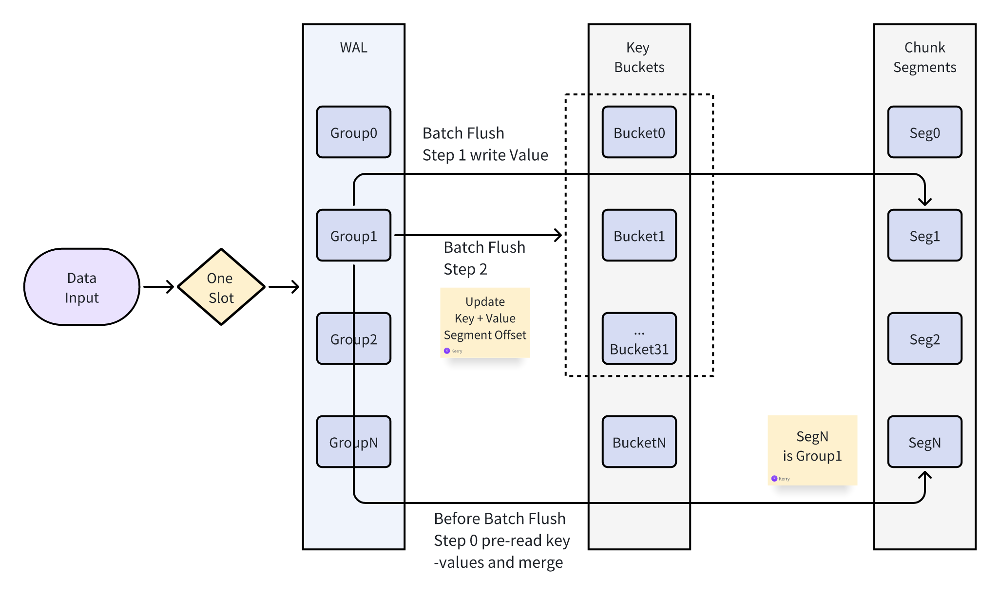

# Velo use hash buckets to store data

## overview

## key buckets

- one sharding data use a single slot
- one slot is supposed to store about 1000w key / values (need not do rehash)
- one slot use n (65536 or 256K) key buckets for different estimated count of keys
- one key bucket use 4K bytes to store keys, max 48 keys
- key buckets only store key bytes, key hash (long type), expire time (long) type, and value offset
- key buckets will store small value bytes directly if the value bytes size is less than 32 bytes or 64 bytes by config
- one key bucket can split to 3 key buckets if the key count is more than about 48, max 2 splits, 1 -> 9 key buckets, max 9 *
  48 = 432 keys, when key bucket split, it will rehash all keys to new key buckets, performance is not good
- so one slot can store max 256K * 48 * 9 = 108M keys
- when one key bucket find one key, it will iterate all keys to find the key, compare the key hash and key bytes, if
  expired, return not found

## chunk segments

- chunk segments store key and value bytes, and crc
- one slot use a chunk, one chunk use more than one files to store value bytes, file number can be 1 / 2 / 4 / 8 / 16 /
  64, depends on the value bytes size and compress ratio
- one file max size is 2G, so one chunk max size is 128G, usually can store one slot max 108M key / values
- one chunk file has many segments, one segment length can be 4K / 16K / 64K / 256K, depends on the value bytes size and
  compress ratio
- one segment is optionally (by global config) compressed by zstd, use self trained dictionary, and use default zstd compression level 3
- when do compress, one segment has 1-4 sub-segments, one sub-segment has a batch of value bytes, and value bytes are compressed by zstd
  using a trained dictionary

## wal groups

- 16 or 32 key buckets are in one wal group logically
- one slot has max 256K / 16 = 16K wal groups, all wal groups are in one wal file
- one slot has 2 wal files, one is for short values (a value length is less than 32 bytes or 64 bytes), one is for long
  values
- when delete one key, it will write a delete record to wal file, use short value wal file
- when one wal group is full, ether by key count or key + value bytes size, it will cause a flush to chunk segments
- after chunk segments flush, the key buckets will batch update the value offset in chunk segments
- when short value wal group is full, only update the key buckets, need not flush chunk segments
- after key buckets update, the slot will reset the wal group, and continue to write new records, at the same time, it will clear this wal group lru cache
- when do read, wal groups can optionally (by slot config) use lru cache for performance
- all value bytes saved in wal groups temporarily ares already compressed by zstd using a trained dictionary
- when restart the server, it will read all wal files to recover same of the slot data
- when chunk segments flush, begin with a new file if one chunk file available segments count is less then need write
  segments count

## merge chunk segments

- before new records flush to chunk segments when one wal group is full, it will pre-read 1-2 chunk segments with the same wal group
  to do merge, and compare the keys with key buckets together, valid key / values will flush to chunk segments with new records,
  so actually, the merge job is not so heavy, this is designed for performance / low latency
- write chunk segments are always group by wal group, for performance

## meta data

### key buckets: by bucket index, split number + saved key count

### chunk segments: by segment index, available flag + lsn + wal group index

- one chunk segment available flag can be init / new_write / reuse_new / merged_and_persisted
- only init / merged_and_persisted can be reused to write new value bytes